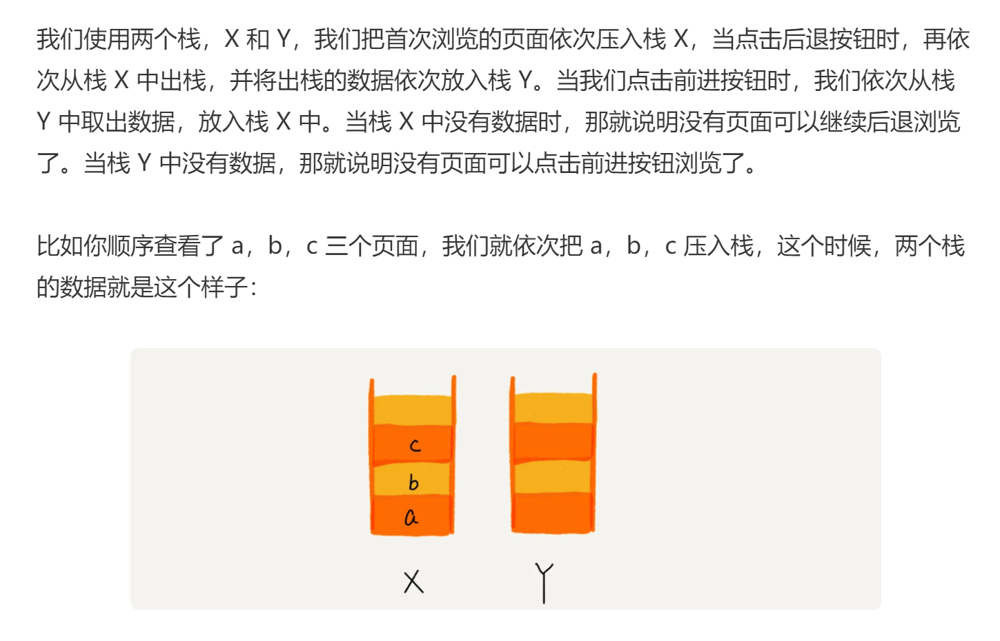
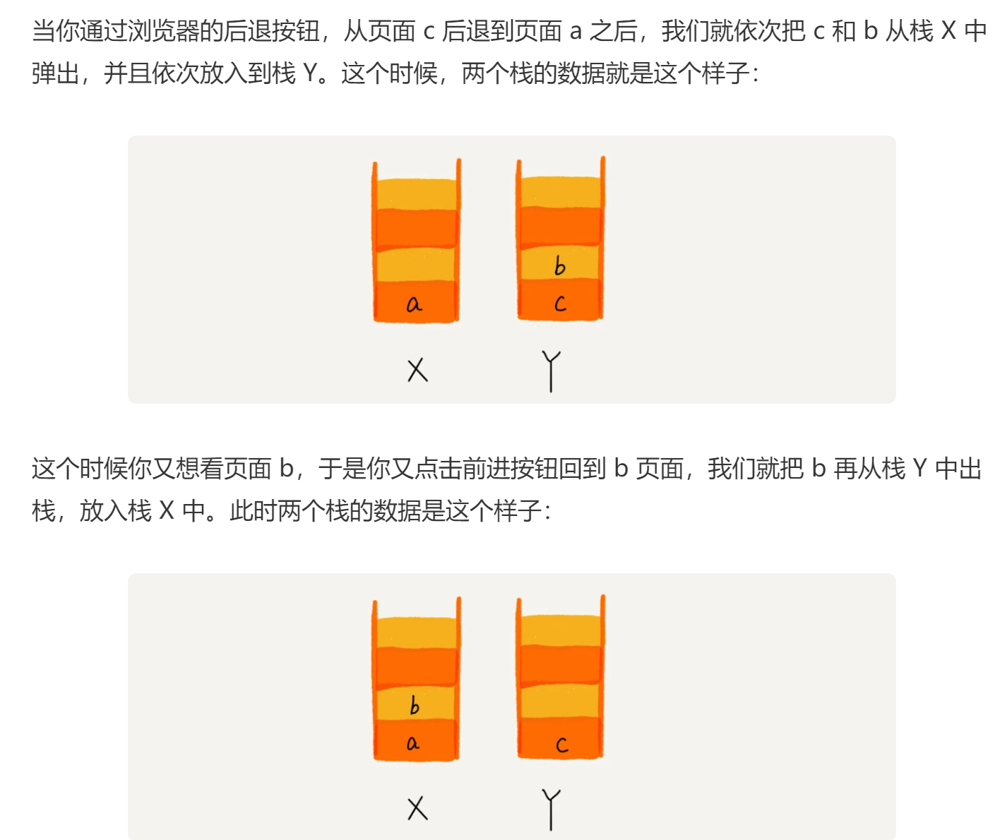
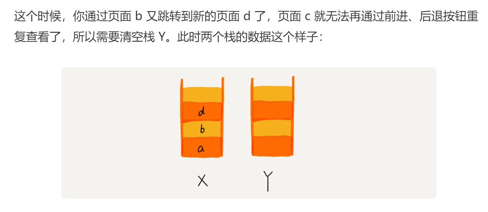

## 栈
后进者先出，先进者后出，这就是典型的“栈”结构。

从栈的操作特性上来看，**栈是一种“操作受限”的线性表**，只允许在一端插入和删除数据。

当某个数据集合只涉及在一端插入和删除数据，并且满足后进先出、先进后出的特性，这时我们就应该首选“栈”这种数据结构。

动态扩容的栈：

案例：浏览器 的前进 后退

    内存中的堆栈和数据结构堆栈不是一个概念，可以说内存中的堆栈是真实存在的物理区，数据结构中的堆栈是抽象的数据存储结构。
    内存空间在逻辑上分为三部分：代码区、静态数据区和动态数据区，动态数据区又分为栈区和堆区。
    代码区：存储方法体的二进制代码。高级调度（作业调度）、中级调度（内存调度）、低级调度（进程调度）控制代码区执行代码的切换。
    静态数据区：存储全局变量、静态变量、常量，常量包括final修饰的常量和String常量。系统自动分配和回收。
    栈区：存储运行方法的形参、局部变量、返回值。由系统自动分配和回收。
    堆区：new一个对象的引用或地址存储在栈区，指向该对象存储在堆区中的真实数据。

## 队列
先进者先出，这就是典型的“队列”，队列跟栈一样，也是一种**操作受限的线性表数据结构**。

用数组实现的队列叫作**顺序队列**，用链表实现的队列叫作**链式队列**。

**循环队列**，顾名思义，它长得像一个环。确定好队空和队满的判定条件

所以总结一下规律就是：(3+1)%8=4。多画几张队满的图，你就会发现，当队满时，**(tail+1)%n=head**。

**阻塞队列**其实就是在队列基础上增加了阻塞操作。简单来说，就是在队列为空的时候，从队头取数据会被阻塞。因为此时还没有数据可取，直到队列中有了数据才能返回；如果队列已经满了，那么插入数据的操作就会被阻塞，直到队列中有空闲位置后再插入数据，然后再返回。

线程安全的队列我们叫作**并发队列**

队列最大的特点就是**先进先出**，主要的两个操作是入队和出队。跟栈一样，它既可以用数组来实现，也可以用链表来实现。用数组实现的叫顺序队列，用链表实现的叫链式队列。特别是长得像一个环的循环队列。在数组实现队列的时候，会有数据搬移操作，要想解决数据搬移的问题，我们就需要像环一样的循环队列。

