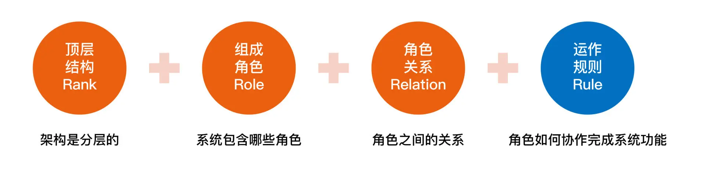
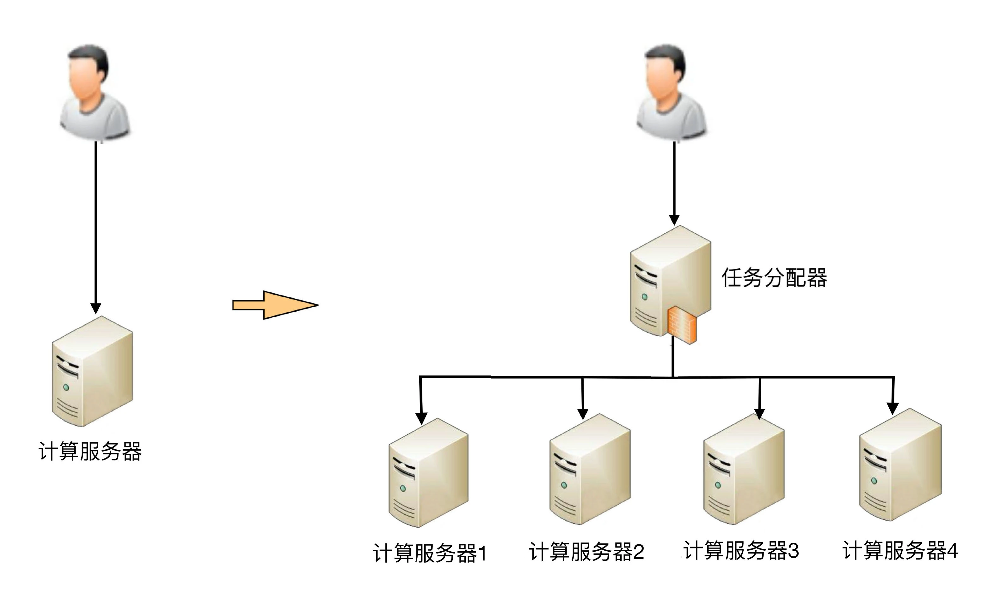

# 什么是架构
软件框架（Software framework）通常指的是为了实现某个业界标准或完成特定基本任务的软件组件规范，也指为了实现某个软件组件规范时，提供规范所要求之基础功能的软件产品。

软件架构指软件系统的“基础结构”，创造这些基础结构的准则，以及对这些结构的描述。

框架和架构的区别还是比较明显的：框架关注的是“规范”，架构关注的是“结构”。

软件架构指软件系统的顶层（Rank）结构，它定义了系统由哪些角色（Role）组成，角色之间的关系（Relation）和运作规则（Rule）。

第一个 R，Rank。它是指软件架构是分层的，对应“系统”和“子系统”的分层关系。通常情况下，我们只需要关注某一层的架构，最多展示相邻两层的架构，而不需要把每一层的架构全部糅杂在一起。无论是架构设计还是画架构图，都应该采取“自顶向下，逐步细化”的方式

第二个 R，Role。它是指软件系统包含哪些角色，每个角色都会负责系统的一部分功能。架构设计最重要的工作之一就是将系统拆分为多个角色。最常见的微服务拆分其实就是将整体复杂的业务系统按照业务领域的方式，拆分为多个微服务，每个微服务就是系统的一个角色。

第三个 R，Relation。它是指软件系统的角色之间的关系，对应到架构图中其实就是连接线，角色之间的关系不能乱连，任何关系最后都需要代码来实现，包括连接方式（HTTP、TCP、UDP 和串口等）、数据协议（JSON、XML 和二进制等）以及具体的接口等。

第四个 R，Rule。它是指软件系统角色之间如何协作来完成系统功能。我们在前面解读什么是“系统”的时候提到过：系统能力不是个体能力之和，而是产生了新的能力。那么这个新能力具体如何完成的呢？具体哪些角色参与了这个新能力呢？这就是 Rule 所要表达的内容。在架构设计的时候，核心的业务场景都需要设计 Rule。

架构是顶层设计；框架是面向编程或配置的半成品；组件是从技术维度上的复用；模块是从业务维度上职责的划分；系统是相互协同可运行的实体。

**架构的目的：**架构设计的主要目的是为了**解决软件系统复杂度带来的问题**。

# 架构复杂度

## 高性能
  
  软件系统中高性能带来的复杂度主要体现在两方面，**一方面是单台计算机内部为了高性能带来的复杂度；另一方面是多台计算机集群为了高性能带来的复杂度**。
  
1) **单机复杂度**
   
   计算机内部复杂度最关键的地方就是操作系统。计算机性能的发展本质上是由硬件发展驱动的，尤其是 CPU 的性能发展。著名的“摩尔定律”表明了 CPU 的处理能力每隔 18 个月就翻一番；而将硬件性能充分发挥出来的关键就是操作系统，所以操作系统本身其实也是跟随硬件的发展而发展的，操作系统是软件系统的运行环境，操作系统的复杂度直接决定了软件系统的复杂度。

操作系统和性能最相关的就是**进程和线程**.

在做架构设计的时候，需要花费很大的精力来结合业务进行分析、判断、选择、组合，这个过程同样很复杂。

2) **集群的复杂度**

   1. 任务分配
   
   任务分配的意思是指每台机器都可以处理完整的业务任务，不同的任务分配到不同的机器上执行。
   
    2. 任务分解
   
   通过任务分解的方式，能够把原来大一统但复杂的业务系统，拆分成小而简单但需要多个系统配合的业务系统。从业务的角度来看，任务分解既不会减少功能，也不会减少代码量。

主要有几方面的因素：
* 简单的系统更加容易做到高性能

系统的功能越简单，影响性能的点就越少，就更加容易进行有针对性的优化。而系统很复杂的情况下，首先是比较难以找到关键性能点，因为需要考虑和验证的点太多；其次是即使花费很大力气找到了，修改起来也不容易，因为可能将 A 关键性能点提升了，但却无意中将 B 点的性能降低了，整个系统的性能不但没有提升，还有可能会下降。

* 可以针对单个任务进行扩展

当各个逻辑任务分解到独立的子系统后，整个系统的性能瓶颈更加容易发现，而且发现后只需要针对有瓶颈的子系统进行性能优化或者提升，不需要改动整个系统，风险会小很多。

3) 总结

**1 WHAT 对高性能的理解?**
   
   性能是软件的一个重要质量属性。衡量软件性能包括了响应时间、TPS、服务器资源利用率等客观指标，也可以是用户的主观感受（从程序员、业务用户、终端用户/客户不同的视角，可能会得出不同的结论）。

**2 WHY 为什么需要高性能？**

追求良好的用户体验；
满足业务增长的需要。

**3 HOW 如何做好高性能？**

可以从垂直与水平两个维度来考虑。垂直维度主要是针对单台计算机，通过升级软、硬件能力实现性能提升；水平维度则主要针对集群系统，利用合理的任务分配与任务分解实现性能的提升。

垂直维度可包括以下措施：

    增大内存减少I/O操作
    更换为固态硬盘（SSD）提升I/O访问速度
    使用RAID增加I/O吞吐能力
    置换服务器获得更多的处理器或分配更多的虚拟核
    升级网络接口或增加网络接口

水平维度可包括以下措施：

    功能分解：基于功能将系统分解为更小的子系统
    多实例副本：同一组件重复部署到多台不同的服务器
    数据分割：在每台机器上都只部署一部分数据

垂直维度方案比较适合业务阶段早期和成本可接受的阶段，该方案是提升性能最简单直接的方式，但是受成本与硬件能力天花板的限制。

水平维度方案所带来的好处要在业务发展的后期才能体现出来。起初，该方案会花费更多的硬件成本，另外一方面对技术团队也提出了更高的要求；但是，没有垂直方案的天花板问题。一旦达到一定的业务阶段，水平维度是技术发展的必由之路。因此，作为技术部门，需要提前布局 ，未雨绸缪，不要被业务抛的太远。

## 高可用
本质上都是通过“冗余”来实现高可用。

高性能增加机器目的在于“扩展”处理性能；高可用增加机器目的在于“冗余”处理单元。

1) 计算高可用

      需要增加一个任务分配器，选择合适的任务分配器也是一件复杂的事情，需要综合考虑性能、成本、可维护性、可用性等各方面因素。
      任务分配器和真正的业务服务器之间有连接和交互，需要选择合适的连接方式，并且对连接进行管理。例如，连接建立、连接检测、连接中断后如何处理等。
      任务分配器需要增加分配算法。例如，常见的双机算法有主备、主主，主备方案又可以细分为冷备、温备、热备。
      

2) 存储高可用

对于需要存储数据的系统来说，整个系统的高可用设计关键点和难点就在于“存储高可用”。存储与计算相比，有一个本质上的区别：将数据从一台机器搬到到另一台机器，需要经过线路进行传输。

存储高可用的难点不在于如何备份数据，而在于如何减少或者规避数据不一致对业务造成的影响。

## 可扩展性
可扩展性是指，系统为了应对将来需求变化而提供的一种扩展能力，当有新的需求出现时，系统不需要或者仅需要少量修改就可以支持，无须整个系统重构或者重建。

在软件开发领域，面向对象思想的提出，就是为了解决可扩展性带来的问题；后来的设计模式，更是将可扩展性做到了极致

设计具备良好可扩展性的系统，有两个基本条件：**正确预测变化、完美应对变化**

## 低成本、安全、规模
低成本给架构设计带来的主要复杂度体现在，往往只有“创新”才能达到低成本目标。

功能安全其实就是“防小偷”

架构安全就是“防强盗”

规模带来复杂度的主要原因就是“量变引起质变”，当数量超过一定的阈值后，复杂度会发生质的变化。

复杂度的主要原因是“**量变引起质变**“

# 架构设计三原则
**合适原则、简单原则、演化原则**，架构设计时遵循这几个原则，有助于你做出最好的选择。

合适原则宣言：“合适优于业界领先”。

简单原则宣言：“简单优于复杂”

演化原则宣言：“演化优于一步到位”

软件架构设计同样是类似的过程：
* 首先，设计出来的架构要满足当时的业务需要。
* 其次，架构要不断地在实际应用过程中迭代，保留优秀的设计，修复有缺陷的设计，改正错误的设计，去掉无用的设计，使得架构逐渐完善。
* 第三，当业务发生变化时，架构要扩展、重构，甚至重写；代码也许会重写，但有价值的经验、教训、逻辑、设计等（类似生物体内的基因）却可以在新架构中延续。

