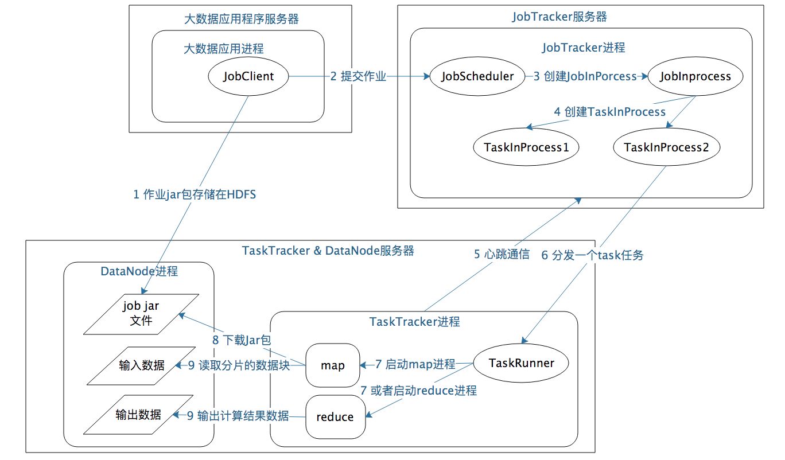
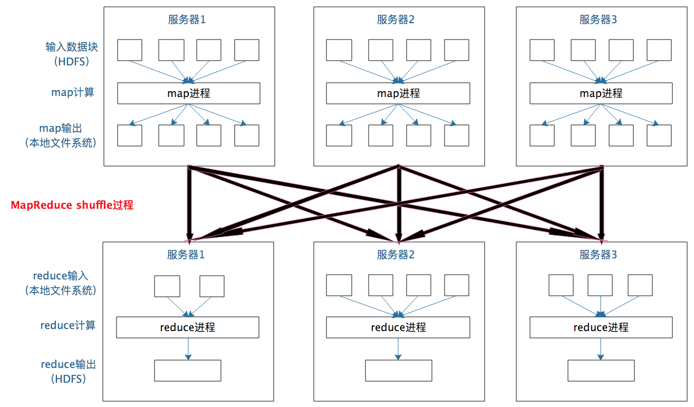
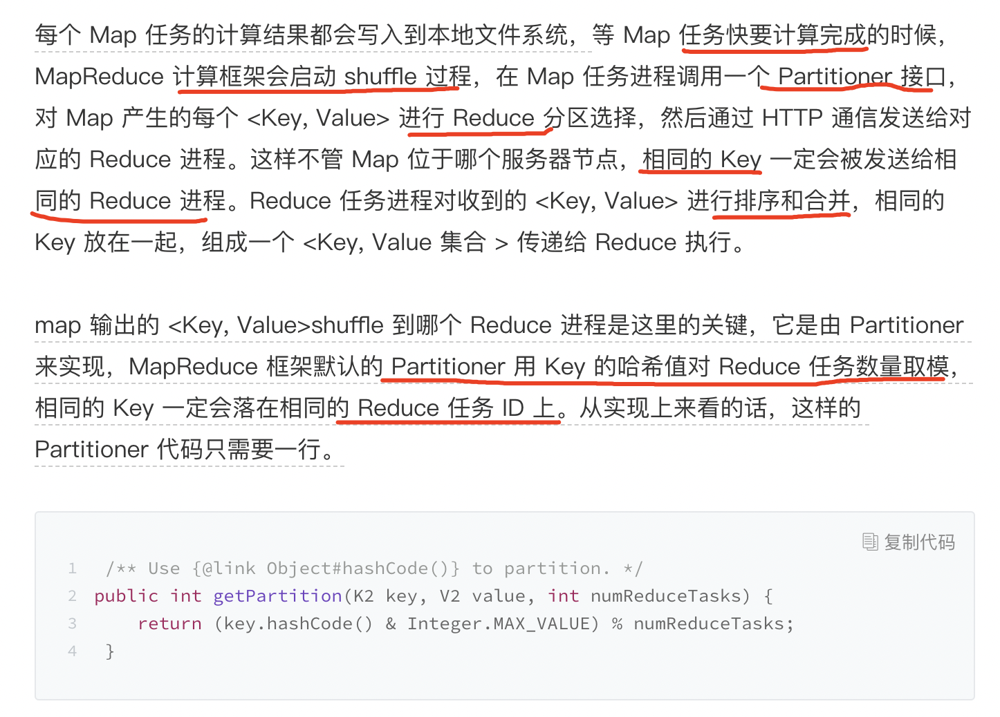

## MapReduce 模型
MapReduce 既是一个编程模型，又是一个计算框架

其编程模型只包含 **Map 和 Reduce** 两个过程，map 的主要输入是一对 <Key, Value> 值，经过 map 计算后输出一对 <Key, Value> 值；然后将相同 Key 合并，形成 <Key, Value 集合 >；再将这个 <Key, Value 集合 > 输入 reduce，经过计算输出零个或多个 <Key, Value> 对。

示例图；

以上就是 MapReduce 编程模型的主要计算过程和原理，但是这样一个 MapReduce 程序要想在分布式环境中执行，并处理海量的大规模数据，还需要一个计算框架，能够调度执行这个 MapReduce 程序，使它在分布式的集群中并行运行，而这个计算框架也叫 MapReduce。

## MapReduce 作业启动和运行机制
MapReduce 运行过程涉及三类关键进程：
* 1.大数据应用进程。这类进程是启动 MapReduce 程序的主入口，主要是指定 Map 和 Reduce 类、输入输出文件路径等，并提交作业给 Hadoop 集群，也就是下面提到的 JobTracker 进程。
* 2.JobTracker 进程。这类进程根据要处理的输入数据量，命令下面提到的 TaskTracker 进程启动相应数量的 Map 和 Reduce 进程任务，并管理整个作业生命周期的任务调度和监控。这是 Hadoop 集群的常驻进程，需要注意的是，JobTracker 进程在整个 Hadoop 集群全局唯一。
* 3.TaskTracker 进程。这个进程负责启动和管理 Map 进程以及 Reduce 进程。因为需要每个数据块都有对应的 map 函数，TaskTracker 进程通常和 HDFS 的 DataNode 进程启动在同一个服务器。也就是说，Hadoop 集群中绝大多数服务器同时运行 DataNode 进程和 TaskTracker 进程。

**JobTracker 进程和 TaskTracker 进程是主从关系**，主服务器通常只有一台（或者另有一台备机提供高可用服务，但运行时只有一台服务器对外提供服务，真正起作用的只有一台），从服务器可能有几百上千台，所有的从服务器听从主服务器的控制和调度安排。主服务器负责为应用程序分配服务器资源以及作业执行的调度，而具体的计算操作则在从服务器上完成。

可重复使用的架构方案叫作**架构模式**，一主多从可谓是大数据领域的最主要的架构模式。主服务器只有一台，掌控全局；从服务器有很多台，负责具体的事情。

MapReduce 的启动和运行机制图：

MapReduce 计算真正产生奇迹的地方是**数据的合并与连接**。

在 map 输出与 reduce 输入之间，MapReduce 计算框架处理数据合并与连接操作，这个操作有个专门的词汇叫 **shuffle**

过程解释图：

