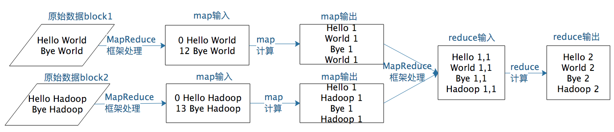

## MapReduce 模型
MapReduce 既是一个编程模型，又是一个计算框架

其编程模型只包含 **Map 和 Reduce** 两个过程，map 的主要输入是一对 <Key, Value> 值，经过 map 计算后输出一对 <Key, Value> 值；然后将相同 Key 合并，形成 <Key, Value 集合 >；再将这个 <Key, Value 集合 > 输入 reduce，经过计算输出零个或多个 <Key, Value> 对。

示例图；

以上就是 MapReduce 编程模型的主要计算过程和原理，但是这样一个 MapReduce 程序要想在分布式环境中执行，并处理海量的大规模数据，还需要一个计算框架，能够调度执行这个 MapReduce 程序，使它在分布式的集群中并行运行，而这个计算框架也叫 MapReduce。

