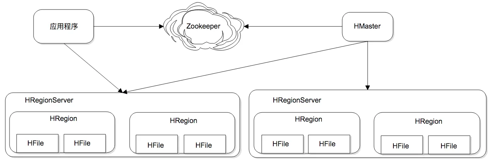
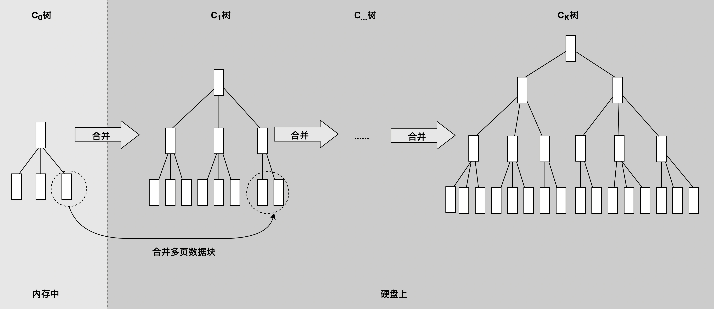

## hbase架构
HBase 为可伸缩海量数据储存而设计，实现面向在线业务的实时数据访问延迟。HBase 的伸缩性主要依赖其可分裂的 HRegion 及可伸缩的分布式文件系统 HDFS 实现。

HRegion 是 HBase 负责数据存储的主要进程，应用程序对数据的读写操作都是通过和 HRegion 通信完成。上面是 HBase 架构图，我们可以看到在 HBase 中，数据以 HRegion 为单位进行管理，也就是说应用程序如果想要访问一个数据，必须先找到 HRegion，然后将数据读写操作提交给 HRegion，由 HRegion 完成存储层面的数据操作

HRegionServer 是物理服务器，每个 HRegionServer 上可以启动多个 HRegion 实例。当一个 HRegion 中写入的数据太多，达到配置的阈值时，一个 HRegion 会分裂成两个 HRegion，并将 HRegion 在整个集群中进行迁移，以使 HRegionServer 的负载均衡。

每个 HRegion 中存储一段 Key 值区间[key1, key2) 的数据，所有 HRegion 的信息，包括存储的 Key 值区间、所在 HRegionServer 地址、访问端口号等，都记录在 HMaster 服务器上。为了保证 HMaster 的高可用，HBase 会启动多个 HMaster，并通过 ZooKeeper 选举出一个主服务器。

为了提高数据写入速度，HBase 使用了一种叫作 LSM 树的数据结构进行数据存储。LSM 树的全名是 Log Structed Merge Tree，翻译过来就是 Log 结构合并树。数据写入的时候以 Log 方式连续写入，然后异步对磁盘上的多个 LSM 树进行合并。

