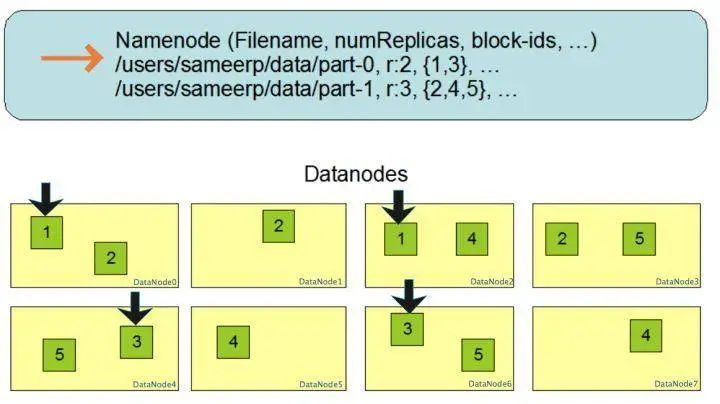
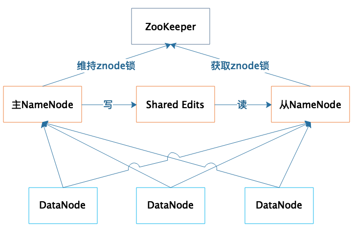

# HDFS组件
## 架构图

HDFS 的关键组件有两个，一个是 DataNode，一个是 NameNode。

DataNode 负责文件数据的存储和读写操作，HDFS 将文件数据分割成若干数据块（Block），每个 DataNode 存储一部分数据块，这样文件就分布存储在整个 HDFS 服务器集群中。
应用程序客户端（Client）可以并行对这些数据块进行访问，从而使得 HDFS 可以在服务器集群规模上实现数据并行访问，极大地提高了访问速度。

NameNode 负责整个分布式文件系统的元数据（MetaData）管理，也就是文件路径名、数据块的 ID 以及存储位置等信息，相当于操作系统中文件分配表（FAT）的角色。

HDFS 为了保证数据的高可用，会将一个数据块复制为多份（缺省情况为 3 份），并将多份相同的数据块存储在不同的服务器上，甚至不同的机架上。这样当有磁盘损坏，或者某个 DataNode 服务器宕机，甚至某个交换机宕机，导致其存储的数据块不能访问的时候，客户端会查找其备份的数据块进行访问。

## 备份

数据块多份复制存储的示意，图中对于文件 /users/sameerp/data/part-0，其**复制备份数**设置为 2，存储的 BlockID 分别为 1、3。
Block1 的两个备份存储在 **DataNode0 和 DataNode2** 两个服务器上，Block3 的两个备份存储 **DataNode4 和 DataNode6** 两个服务器上，上述任何一台服务器宕机后，
每个数据块都至少还有一个备份存在，不会影响对文件 /users/sameerp/data/part-0 的访问。

简单来说：数据存储的时候设置两个备份数，存储的时候会备份到备份存储节点，不会因为宕机影响访问。

## HDFS 的高可用设计

* 1.数据存储故障容错

磁盘介质在存储过程中受环境或者老化影响，其存储的数据可能会出现错乱。HDFS 的应对措施是，对于存储在 DataNode 上的数据块，计算并存储校验和（CheckSum）。在读取数据的时候，重新计算读取出来的数据的校验和，如果校验不正确就抛出异常，应用程序捕获异常后就到其他 DataNode 上读取备份数据。

* 2.磁盘故障容错

如果 DataNode 监测到本机的某块磁盘损坏，就将该块磁盘上存储的所有 BlockID 报告给 NameNode，NameNode 检查这些数据块还在哪些 DataNode 上有备份，通知相应的 DataNode 服务器将对应的数据块复制到其他服务器上，以保证数据块的备份数满足要求。

* 3.DataNode 故障容错

DataNode 会通过心跳和 NameNode 保持通信，如果 DataNode 超时未发送心跳，NameNode 就会认为这个 DataNode 已经宕机失效，立即查找这个 DataNode 上存储的数据块有哪些，以及这些数据块还存储在哪些服务器上，随后通知这些服务器再复制一份数据块到其他服务器上，保证 HDFS 存储的数据块备份数符合用户设置的数目，即使再出现服务器宕机，也不会丢失数据。

* 4.NameNode 故障容错

NameNode 是整个 HDFS 的核心，记录着 HDFS 文件分配表信息，所有的**文件路径和数据块存储信息**都保存在 NameNode，如果 NameNode 故障，整个 HDFS 系统集群都无法使用；如果 NameNode 上记录的数据丢失，整个集群所有 DataNode 存储的数据也就没用了。

集群部署两台 NameNode 服务器，一台作为主服务器提供服务，一台作为从服务器进行热备，两台服务器通过 ZooKeeper 选举，主要是通过争夺 znode 锁资源，决定谁是主服务器。
而 DataNode 则会向两个 NameNode 同时发送心跳数据，但是只有**主 NameNode 才能向 DataNode 返回控制信息**。

正常运行期间，主从 NameNode 之间通过一个共享存储系统 shared edits 来同步文件系统的元数据信息。当主 NameNode 服务器宕机，从 NameNode 会通过 ZooKeeper 升级成为主服务器，
并保证 HDFS 集群的元数据信息，也就是文件分配表信息完整一致。

常用的保证系统可用性的策略有**冗余备份、失效转移和降级限流。**

* 冗余备份，任何程序、任何数据，都至少要有一个备份，也就是说程序至少要部署到两台服务器，数据至少要备份到另一台服务器上。
* 失效转移 :当要访问的程序或者数据无法访问时，需要将访问请求转移到备份的程序或者数据所在的服务器上.
* 限流、降级：当大量的用户请求或者数据处理请求到达的时候，由于计算资源有限，可能无法处理如此大量的请求，进而导致资源耗尽，系统崩溃。这种情况下，可以拒绝部分请求，即进行**限流**；也可以关闭部分功能，降低资源消耗，即进行**降级**。

## HDFS 是如何通过大规模分布式服务器集群实现数据的大容量、高速、可靠存储、访问的。
1. 文件数据以数据块的方式进行切分，数据块可以存储在集群任意 DataNode 服务器上，所以 HDFS 存储的文件可以非常大，一个文件理论上可以占据整个 HDFS 服务器集群上的所有磁盘，实现了大容量存储。

2.HDFS 一般的访问模式是通过 MapReduce 程序在计算时读取，MapReduce 对输入数据进行分片读取，通常一个分片就是一个数据块，每个数据块分配一个计算进程，这样就可以同时启动很多进程对一个 HDFS 文件的多个数据块进行并发访问，从而实现数据的高速访问。

3.DataNode 存储的数据块会进行复制，使每个数据块在集群里有多个备份，保证了数据的可靠性，并通过一系列的故障容错手段实现 HDFS 系统中主要组件的高可用，进而保证数据和整个系统的高可用。

