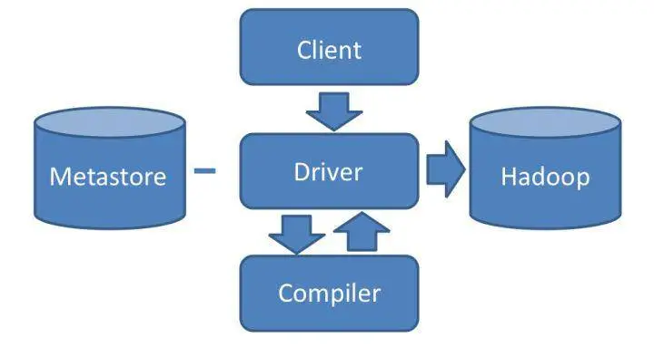

## hive架构

我们通过 Hive 的 Client（Hive 的命令行工具，JDBC 等）向 Hive 提交 SQL 命令。如果是创建数据表的 DDL（数据定义语言），Hive 就会通过执行引擎 Driver 将数据表的信息记录在 Metastore 元数据组件中，这个组件通常用一个关系数据库实现，记录表名、字段名、字段类型、关联 HDFS 文件路径等这些数据库的 Meta 信息（元信息）。

