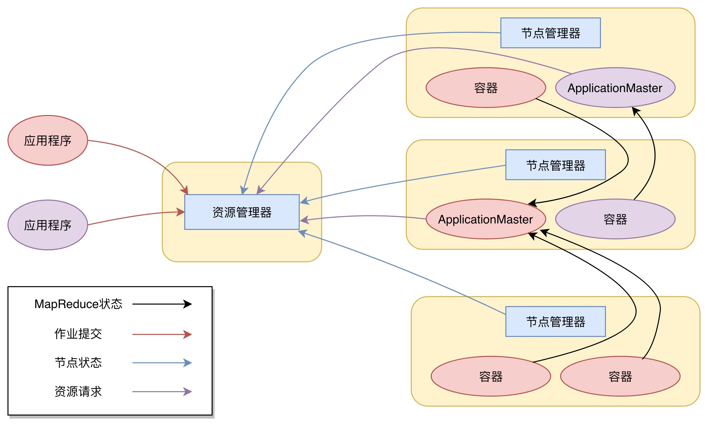

## Yarn 的架构

Yarn 包括两个部分：一个是资源管理器（Resource Manager），一个是节点管理器（Node Manager）。这也是 Yarn 的两种主要进程：ResourceManager 进程负责整个集群的资源调度管理，通常部署在独立的服务器上；NodeManager 进程负责具体服务器上的资源和任务管理，在集群的每一台计算服务器上都会启动，基本上跟 HDFS 的 DataNode 进程一起出现。

资源管理器又包括两个主要组件：调度器和应用程序管理器。

**调度器**其实就是一个资源分配算法，根据应用程序（Client）提交的资源申请和当前服务器集群的资源状况进行资源分配。Yarn 内置了几种资源调度算法，包括 Fair Scheduler、Capacity Scheduler 等，你也可以开发自己的资源调度算法供 Yarn 调用。

Yarn 进行资源分配的单位是容器（Container），每个容器包含了一定量的内存、CPU 等计算资源，默认配置下，每个容器包含一个 CPU 核心。容器由 NodeManager 进程启动和管理，NodeManger 进程会监控本节点上容器的运行状况并向 ResourceManger 进程汇报。

**应用程序管理器**负责应用程序的提交、监控应用程序运行状态等。应用程序启动后需要在集群中运行一个 ApplicationMaster，ApplicationMaster 也需要运行在容器里面。每个应用程序启动后都会先启动自己的 ApplicationMaster，由 ApplicationMaster 根据应用程序的资源需求进一步向 ResourceManager 进程申请容器资源，得到容器以后就会分发自己的应用程序代码到容器上启动，进而开始分布式计算。

