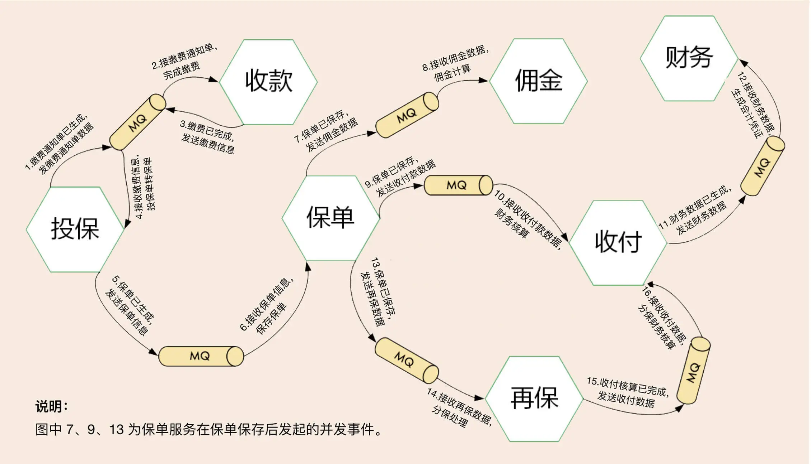
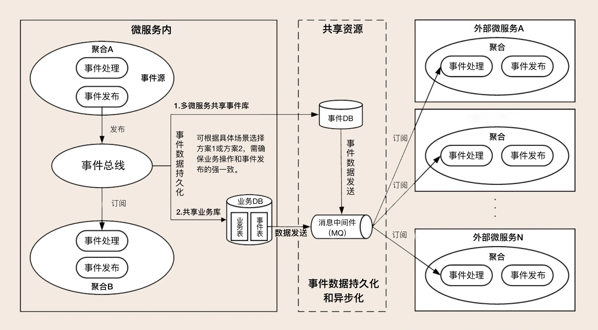
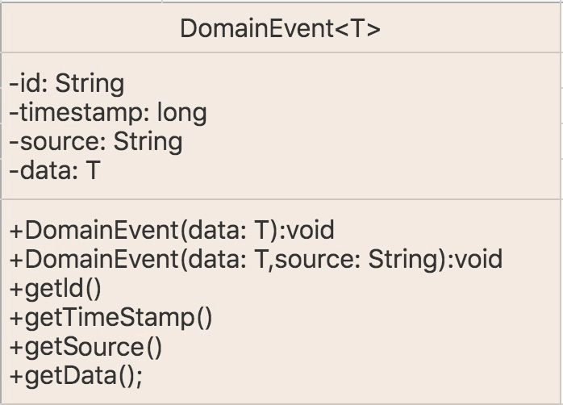
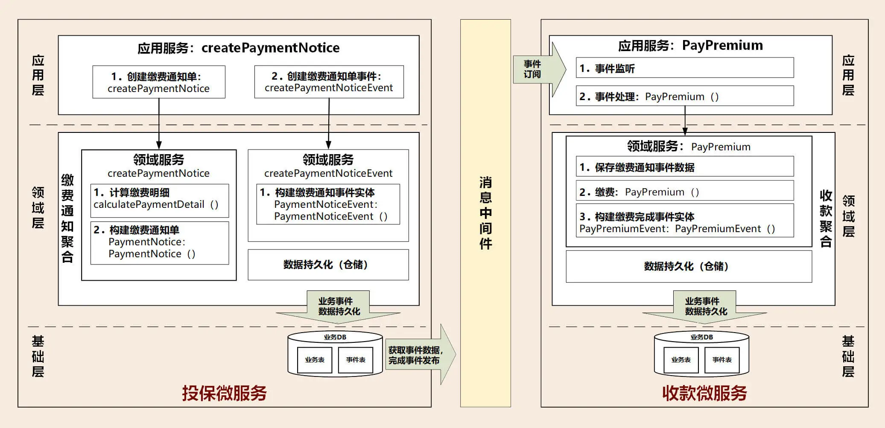
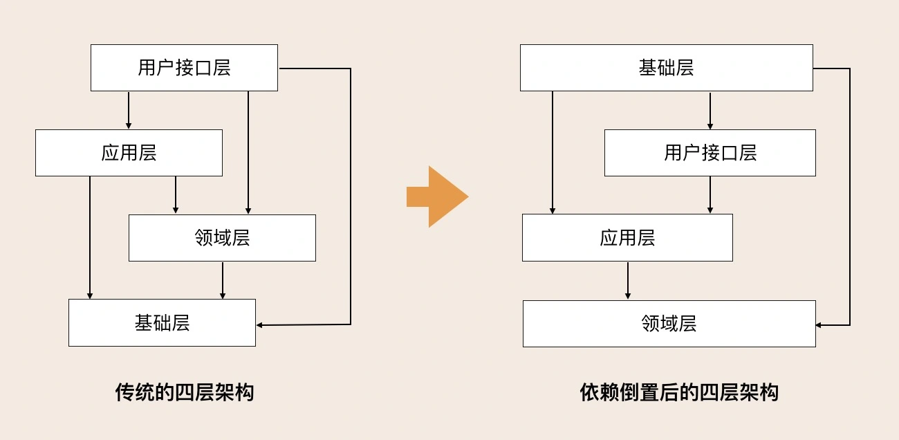
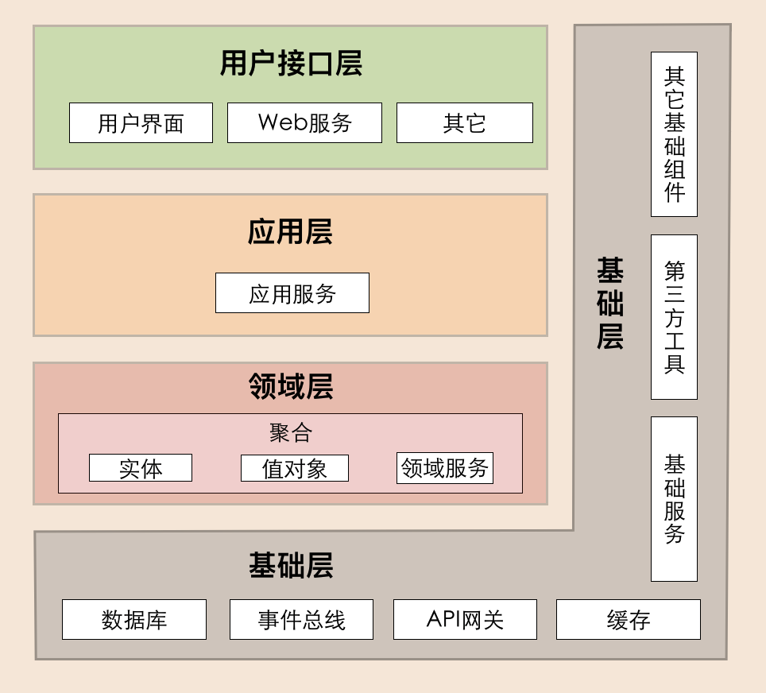
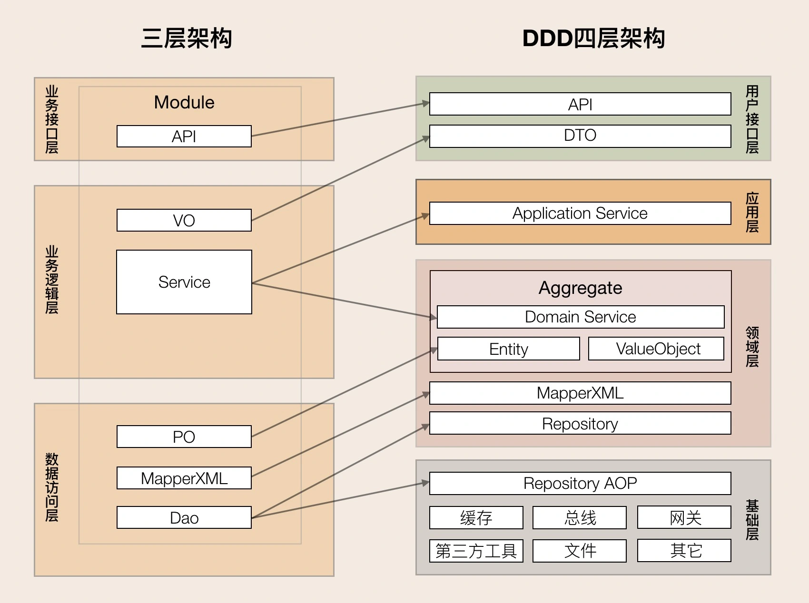

##  领域事件：解耦微服务的关键
在事件风暴（Event Storming）时，我们发现除了命令和操作等业务行为以外，还有一种非常重要的事件，**这种事件发生后通常会导致进一步的业务操作**，在 DDD 中这种事件被称为领域事件。

* 领域事件
  
  领域事件是领域模型中非常重要的一部分，用来表示领域中发生的事件。一个领域事件将导致进一步的业务操作，在实现业务解耦的同时，还有助于形成完整的业务闭环。

领域事件可以是业务流程的一个步骤，比如投保业务缴费完成后，触发投保单转保单的动作；也可能是定时批处理过程中发生的事件，比如批处理生成季缴保费通知单，触发发送缴费邮件通知操作；或者一个事件发生后触发的后续动作，比如密码连续输错三次，触发锁定账户的动作。

* 那如何识别领域事件呢？

**关键词：** “如果发生……，则……”“当做完……的时候，请通知……”“发生……时，则……”等。在这些场景中，如果发生某种事件后，会触发进一步的操作，那么这个事件很可能就是领域事件

一次事务最多只能更改一个聚合的状态。如果一次业务操作涉及多个聚合状态的更改，应采用领域事件的最终一致性。

领域事件驱动设计可以切断领域模型之间的强依赖关系，事件发布完成后，发布方不必关心后续订阅方事件处理是否成功，这样可以实现领域模型的解耦，维护领域模型的独立性和数据的一致性。在领域模型映射到微服务系统架构时，领域事件可以解耦微服务，微服务之间的数据不必要求强一致性，而是基于事件的最终一致性。

### 1. 微服务内的领域事件
当领域事件发生在微服务内的聚合之间，领域事件发生后完成事件实体构建和事件数据持久化，发布方聚合将事件发布到事件总线，订阅方接收事件数据完成后续业务操作。

微服务内大部分事件的集成，都发生在同一个进程内，进程自身可以很好地控制事务，因此不一定需要引入消息中间件。但一个事件如果同时更新多个聚合，按照 DDD“一次事务只更新一个聚合”的原则，你就要考虑是否引入事件总线。但微服务内的事件总线，可能会增加开发的复杂度，因此你需要结合应用复杂度和收益进行综合考虑。

微服务内应用服务，可以通过跨聚合的服务编排和组合，以服务调用的方式完成跨聚合的访问，这种方式通常应用于实时性和数据一致性要求高的场景。这个过程会用到分布式事务，以保证发布方和订阅方的数据同时更新成功。
### 2. 微服务之间的领域事件
跨微服务的领域事件会在不同的限界上下文或领域模型之间实现业务协作，其主要目的是实现微服务解耦，减轻微服务之间实时服务访问的压力。

领域事件发生在微服务之间的场景比较多，事件处理的机制也更加复杂。跨微服务的事件可以推动业务流程或者数据在不同的子域或微服务间直接流转。

跨微服务的事件机制要总体考虑事件构建、发布和订阅、事件数据持久化、消息中间件，甚至事件数据持久化时还可能需要考虑引入分布式事务机制等。

微服务之间的访问也可以采用应用服务直接调用的方式，实现数据和服务的实时访问，弊端就是跨微服务的数据同时变更需要引入分布式事务，以确保数据的一致性。分布式事务机制会影响系统性能，增加微服务之间的耦合，所以我们还是要尽量避免使用分布式事务。

### 领域事件相关案例

事件起点：客户购买保险 - 业务人员完成保单录入 - 生成投保单 - 启动缴费动作。

通过领域事件驱动的异步化机制，可以推动业务流程和数据在各个不同微服务之间的流转，实现微服务的解耦，减轻微服务之间服务调用的压力，提升用户体验。

### 领域事件总体架构
领域事件的执行需要一系列的组件和技术来支撑。我们来看一下这个领域事件总体技术架构图，领域事件处理包括：事件构建和发布、事件数据持久化、事件总线、消息中间件、事件接收和处理等。

* 1. 事件构建和发布

事件基本属性至少包括：事件唯一标识、发生时间、事件类型和事件源，其中事件唯一标识应该是全局唯一的，以便事件能够无歧义地在多个限界上下文中传递。事件基本属性主要记录事件自身以及事件发生背景的数据。

另外事件中还有一项更重要，那就是**业务属性**，用于记录事件发生那一刻的业务数据，这些数据会随事件传输到订阅方，以开展下一步的业务操作。

事件基本属性和业务属性一起构成事件实体，事件实体依赖聚合根。领域事件发生后，事件中的业务数据不再修改，因此业务数据可以以序列化值对象的形式保存，这种存储格式在消息中间件中也比较容易解析和获取。

为了保证事件结构的统一，我们还会创建事件基类 DomainEvent（参考下图），子类可以扩充属性和方法。由于事件没有太多的业务行为，实现方法一般比较简单。

事件发布之前需要先构建事件实体并持久化。事件发布的方式有很多种，你可以通过应用服务或者领域服务发布到事件总线或者消息中间件，也可以从事件表中利用定时程序或数据库日志捕获技术获取增量事件数据，发布到消息中间件。

* 2. 事件数据持久化

事件数据持久化可用于系统之间的数据对账，或者实现发布方和订阅方事件数据的审计。当遇到消息中间件、订阅方系统宕机或者网络中断，在问题解决后仍可继续后续业务流转，保证数据的一致性。

事件数据持久化有两种方案，在实施过程中你可以根据自己的业务场景进行选择。
* 持久化到本地业务数据库的事件表中，利用本地事务保证业务和事件数据的一致性。
* 持久化到共享的事件数据库中。这里需要注意的是：业务数据库和事件数据库不在一个数据库中，它们的数据持久化操作会跨数据库，因此需要分布式事务机制来保证业务和事件数据的强一致性，结果就是会对系统性能造成一定的影响。

* 3. 事件总线 (EventBus)

事件总线是实现微服务内聚合之间领域事件的重要组件，它提供事件分发和接收等服务。事件总线是进程内模型，它会在微服务内聚合之间遍历订阅者列表，采取同步或异步的模式传递数据。事件分发流程大致如下：

* 如果是微服务内的订阅者（其它聚合），则直接分发到指定订阅者；
* 如果是微服务外的订阅者，将事件数据保存到事件库（表）并异步发送到消息中间件；
* 如果同时存在微服务内和外订阅者，则先分发到内部订阅者，将事件消息保存到事件库（表），再异步发送到消息中间件。

* 4. 消息中间件

跨微服务的领域事件大多会用到消息中间件，实现跨微服务的事件发布和订阅。消息中间件的产品非常成熟，市场上可选的技术也非常多，比如 Kafka，RabbitMQ 等。

* 5. 事件接收和处理

微服务订阅方在应用层采用监听机制，接收消息队列中的事件数据，完成事件数据的持久化后，就可以开始进一步的业务处理。领域事件处理可在领域服务中实现。

### 领域事件运行机制相关案例

事件起点：出单员生成投保单，核保通过后，发起生成缴费通知单的操作。

## DDD分层架构：有效降低层与层之间的依赖

在最早的传统四层架构中，基础层是被其它层依赖的，它位于最核心的位置，那按照分层架构的思想，它应该就是核心，但实际上领域层才是软件的核心，所以这种依赖是有问题的。后来我们采用了依赖倒置（Dependency inversion principle,DIP）的设计，优化了传统的四层架构，实现了各层对基础层的解耦。

### 四层架构及职责

* 1.用户接口层

用户接口层负责向用户显示信息和解释用户指令。这里的用户可能是：用户、程序、自动化测试和批处理脚本等等。

* 2.应用层

应用层是很薄的一层，理论上不应该有业务规则或逻辑，主要面向用例和流程相关的操作。但应用层又位于领域层之上，因为领域层包含多个聚合，所以它可以协调多个聚合的服务和领域对象完成服务编排和组合，协作完成业务操作。

此外，应用层也是微服务之间交互的通道，它可以调用其它微服务的应用服务，完成微服务之间的服务组合和编排。

在设计和开发时，不要将本该放在领域层的业务逻辑放到应用层中实现。因为庞大的应用层会使领域模型失焦，时间一长你的微服务就会演化为传统的三层架构，业务逻辑会变得混乱。

另外，应用服务是在应用层的，它负责服务的组合、编排和转发，负责处理业务用例的执行顺序以及结果的拼装，以粗粒度的服务通过 API 网关向前端发布。还有，应用服务还可以进行安全认证、权限校验、事务控制、发送或订阅领域事件等。

* 3.领域层

领域层的作用是实现企业核心业务逻辑，通过各种校验手段保证业务的正确性。领域层主要体现领域模型的业务能力，它用来表达业务概念、业务状态和业务规则。

领域层包含聚合根、实体、值对象、领域服务等领域模型中的领域对象

首先，领域模型的业务逻辑主要是由**实体和领域服务来实现的**，其中实体会采用充血模型来实现所有与之相关的业务功能。其次，你要知道，实体和领域服务在实现业务逻辑上不是同级的，当领域中的某些功能，单一实体（或者值对象）不能实现时，领域服务就会出马，它可以组合聚合内的多个实体（或者值对象），实现复杂的业务逻辑。

* 4.基础层

基础层是贯穿所有层的，它的作用就是为其它各层提供通用的技术和基础服务，包括第三方工具、驱动、消息中间件、网关、文件、缓存以及数据库等。比较常见的功能还是提供数据库持久化。

基础层包含基础服务，它采用依赖倒置设计，封装基础资源服务，实现应用层、领域层与基础层的解耦，降低外部资源变化对应用的影响。

### DDD 分层架构最重要的原则
DDD 分层架构有一个重要的原则：**每层只能与位于其下方的层发生耦合。**

而架构根据耦合的紧密程度又可以分为两种：严格分层架构和松散分层架构。优化后的 DDD 分层架构模型就属于严格分层架构，任何层只能对位于其直接下方的层产生依赖。而传统的 DDD 分层架构则属于松散分层架构，它允许某层与其任意下方的层发生依赖。

在严格分层架构中，领域服务只能被应用服务调用，而应用服务只能被用户接口层调用，服务是逐层对外封装或组合的，依赖关系清晰。而在松散分层架构中，领域服务可以同时被应用层或用户接口层调用，服务的依赖关系比较复杂且难管理，甚至容易使核心业务逻辑外泄。

### 三层架构转化四层架构

DDD 分层架构对三层架构的业务逻辑层进行了更清晰的划分，改善了三层架构核心业务逻辑混乱，代码改动相互影响大的情况。DDD 分层架构将业务逻辑层的服务拆分到了应用层和领域层。应用层快速响应前端的变化，领域层实现领域模型的能力。

另外一个重要的变化发生在数据访问层和基础层之间。三层架构数据访问采用 DAO 方式；DDD 分层架构的数据库等基础资源访问，采用了仓储（Repository）设计模式，通过依赖倒置实现各层对基础资源的解耦。

仓储又分为两部分：**仓储接口和仓储实现**。仓储接口放在领域层中，仓储实现放在基础层。原来三层架构通用的第三方工具包、驱动、Common、Utility、Config 等通用的公共的资源类统一放到了基础层。

### VO、DO、DTO、PO、POJO、Entity、model含义
在传统的三层架构里面可能没有这么多的对象。而在DDD中增加这些对象主要是为了实现各层以及领域模型中DO对象与前端VO或传输对象DTO和后端数据库PO的解耦。
DDD中主要有一下几类对象。

数据持久化对象 (Persistent Object， PO)，与数据库结构一一映射，它是数据持久化过程中的数据载体。

领域对象（ Domain Object， DO），微服务运行时核心业务对象的载体， DO 一般包括实体或值对象。

数据传输对象（ Data Transfer Object， DTO），用于前端应用与微服务应用层或者微服务之间的数据组装和传输，是应用之间数据传输的载体。

视图对象（View Object， VO），用于封装展示层指定页面或组件的数据。

微服务基础层的主要数据对象是PO。在设计时，我们需要先建立DO和PO的映射关系。大多数情况下DO和PO是一一对应的。但也有DO和PO多对多的情况。在DO和PO数据转换时，需要进行数据重组。对于DO对象较多复杂的数据转换操作，你可以在聚合用工厂模式来实现。
当DO数据需要持久化时，先将DO转换为PO对象，由仓储实现服务完成数据库持久化操作。
当DO需要构建和数据初始化时，仓储实现服务先从数据库获取PO对象，将PO转换为DO后，完成DO数据构建和初始化。

领域层主要是DO对象。DO是实体和值对象的数据和业务行为载体，承载着基础的核心业务逻辑，多个依赖紧密的DO对象构成聚合。领域层DO对象在持久化时需要转换为PO对象。

应用层主要对象有DO对象，但也可能会有DTO对象。应用层在进行不同聚合的领域服务编排时，一般建议采用聚合根ID的引用方式，应尽量避免不同聚合之间的DO对象直接引用，避免聚合之间产生依赖。

在涉及跨微服务的应用服务调用时，在调用其他微服务的应用服务前，DO会被转换为DTO，完成跨微服务的DTO数据组装，因此会有DTO对象。

在前端调用后端应用服务时，用户接口层先完成DTO到DO的转换，然后DO作为应用服务的参数，传导到领域层完成业务逻辑处理。

用户接口层主要完成DO和DTO的互转，完成微服务与前端应用数据交互和转换。

facade接口服务在完成后端应用服务封装后，会对多个DO对象进行组装，转换为DTO对象，向前端应用完成数据转换和传输。

facade接口服务在接收到前端应用传入的DTO后，完成DTO向多个DO对象的转换，调用后端应用服务完成业务逻辑处理。

前端应用主要是VO对象。展现层使用VO进行界面展示，通过用户接口层与应用层采用DTO对象进行数据交互。
