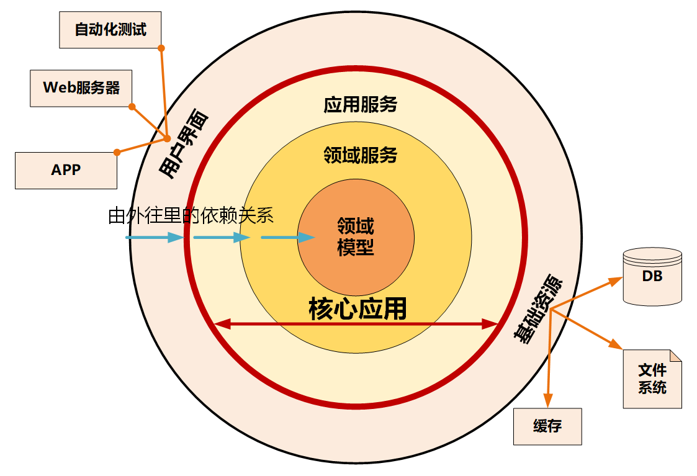
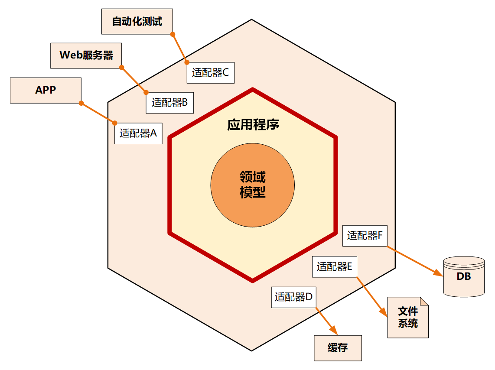
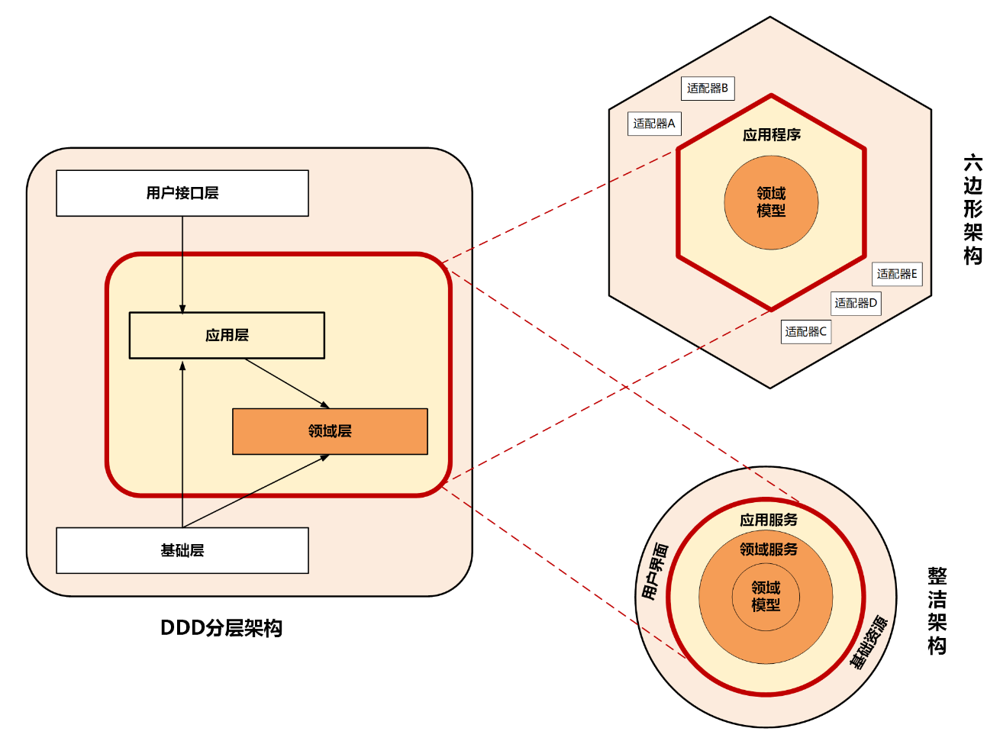
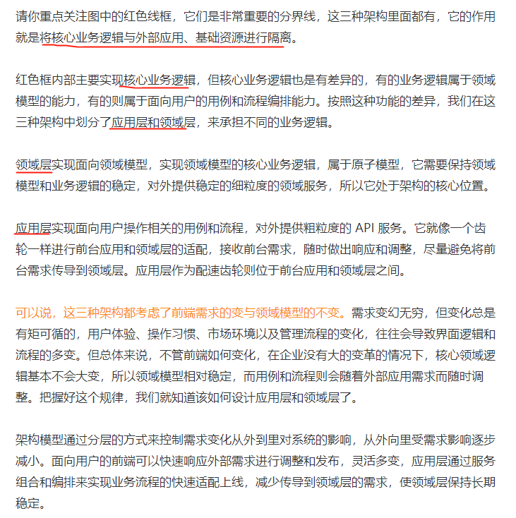

## 整洁架构
在整洁架构里，同心圆代表应用软件的不同部分，从里到外依次是领域模型、领域服务、应用服务和最外围的容易变化的内容，比如用户界面和基础设施

整洁架构最主要的原则是依赖原则，它定义了各层的依赖关系，越往里依赖越低，代码级别越高，越是核心能力。外圆代码依赖只能指向内圆，内圆不需要知道外圆的任何情况。

在洋葱架构中，各层的职能是这样划分的：
* 领域模型实现领域内核心业务逻辑，它封装了企业级的业务规则。领域模型的主体是实体，一个实体可以是一个带方法的对象，也可以是一个数据结构和方法集合。
* 领域服务实现涉及多个实体的复杂业务逻辑。
* 应用服务实现与用户操作相关的服务组合与编排，它包含了应用特有的业务流程规则，封装和实现了系统所有用例。
* 最外层主要提供适配的能力，适配能力分为主动适配和被动适配。主动适配主要实现外部用户、网页、批处理和自动化测试等对内层业务逻辑访问适配。被动适配主要是实现核心业务逻辑对基础资源访问的适配，比如数据库、缓存、文件系统和消息中间件等。
* 红圈内的领域模型、领域服务和应用服务一起组成软件核心业务能力。

## 六边形架构
六边形架构又名“端口适配器架构”。追溯微服务架构的渊源，一般都会涉及到六边形架构。六边形架构的核心理念是：**应用是通过端口与外部进行交互的**。我想这也是微服务架构下 API 网关盛行的主要原因吧。

在下图的六边形架构中，红圈内的核心业务逻辑（应用程序和领域模型）与外部资源（包括 APP、Web 应用以及数据库资源等）完全隔离，仅通过适配器进行交互。它解决了业务逻辑与用户界面的代码交错问题，很好地实现了前后端分离。六边形架构各层的依赖关系与整洁架构一样，都是由外向内依赖。

六边形架构将系统分为内六边形和外六边形两层，这两层的职能划分如下：
* 红圈内的六边形实现应用的核心业务逻辑；
* 外六边形完成外部应用、驱动和基础资源等的交互和访问，对前端应用以 API 主动适配的方式提供服务，对基础资源以依赖倒置被动适配的方式实现资源访问。

六边形架构的一个端口可能对应多个外部系统，不同的外部系统也可能会使用不同的适配器，由适配器负责协议转换。这就使得应用程序能够以一致的方式被用户、程序、自动化测试和批处理脚本使用。

## 三种微服务架构模型的对比和分析
虽然 DDD 分层架构、整洁架构、六边形架构的架构模型表现形式不一样，但你不要被它们的表象所迷惑，这三种架构模型的设计思想正是微服务架构**高内聚低耦合原则**的完美体现，而它们身上闪耀的正是以领域模型为中心的设计思想。

那关于代码模型我还需要强调两点内容。

第一点：聚合之间的代码边界一定要清晰。聚合之间的服务调用和数据关联应该是尽可能的松耦合和低关联，聚合之间的服务调用应该通过上层的应用层组合实现调用，原则上不允许聚合之间直接调用领域服务。这种松耦合的代码关联，在以后业务发展和需求变更时，可以很方便地实现业务功能和聚合代码的重组，在微服务架构演进中将会起到非常重要的作用。

第二点：你一定要有代码分层的概念。写代码时一定要搞清楚代码的职责，将它放在职责对应的代码目录内。应用层代码主要完成服务组合和编排，以及聚合之间的协作，它是很薄的一层，不应该有核心领域逻辑代码。领域层是业务的核心，领域模型的核心逻辑代码一定要在领域层实现。如果将核心领域逻辑代码放到应用层，你的基于 DDD 分层架构模型的微服务慢慢就会演变成传统的三层架构模型了。

