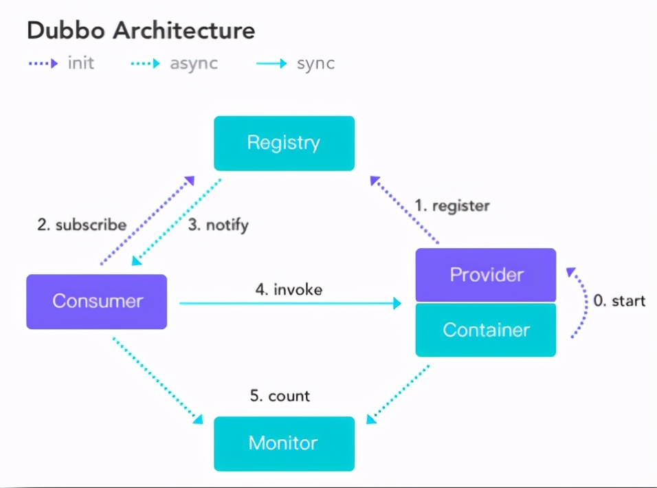
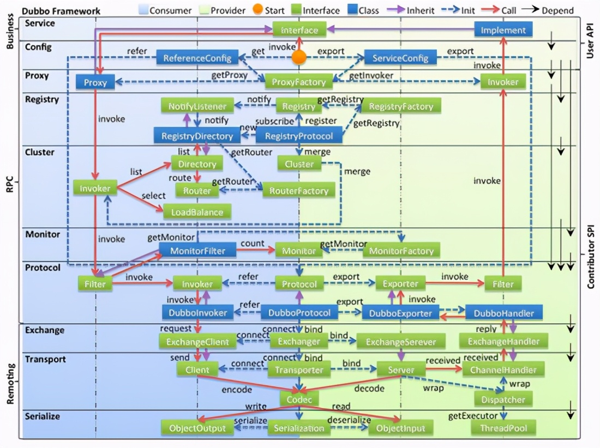
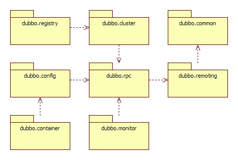

## 1、Dubbo是什么？
  Dubbo是一个分布式服务框架，致力于提供高性能和透明化的RPC远程服务调用方案，以及SOA服务治理方案。简单的说，dubbo就是个服务框架，如果没有分布式的需求，其实是不需要用的，
  只有在分布式的时候，才有dubbo这样的分布式服务框架的需求，并且本质上是个服务调用的东东，说白了就是个远程服务调用的分布式框架
  
  其核心部分包含:
  * 1》远程通讯: 提供对多种基于长连接的NIO框架抽象封装，包括多种线程模型，序列化，以及“请求-响应”模式的信息交换方式。
  * 2》集群容错: 提供基于接口方法的透明远程过程调用，包括多协议支持，以及软负载均衡，失败容错，地址路由，动态配置等集群支持。
  * 3》自动发现: 基于注册中心目录服务，使服务消费方能动态的查找服务提供方，使地址透明，使服务提供方可以平滑增加或减少机器。

## 2. Dubbo能做什么？
  * 1.透明化的远程方法调用，就像调用本地方法一样调用远程方法，只需简单配置，没有任何API侵入。
  * 2.软负载均衡及容错机制，可在内网替代F5等硬件负载均衡器，降低成本，减少单点。
  * 3.服务自动注册与发现，不再需要写死服务提供方地址，注册中心基于接口名查询服务提供者的IP地址，并且能够平滑添加或删除服务提供者。
  
## 3. dubbo的架构

  
  节点角色说明：
  * Provider: 暴露服务的服务提供方。
  * Consumer: 调用远程服务的服务消费方。
  * Registry: 服务注册与发现的注册中心。
  * Monitor: 统计服务的调用次数和调用时间的监控中心。
  * Container: 服务运行容器。
  
  对于这些角色来说，其他都还好，Monitor可能猿友们前期使用会把它忽略，但是后期会发现它的作用十分明显哦，如服务的调用量越来越大，服务的容量问题就暴露出来，这个服务需要多少机器支撑？
  什么时候该加机器？为了解决这个问题，第一步，要将服务现在每天的调用量，响应时间，都统计出来，作为容量规划的参考指标。其次，要可以动态调整权重，在线上，将某台机器的权重一直加大，
  并在加大的过程中记录响应时间的变化，直到响应时间到达阀值，记录此时的访问量，再以此访问量乘以机器数反推总容量。
  
  调用关系说明：
  * 0 服务容器负责启动，加载，运行服务提供者。
  * 1 服务提供者在启动时，向注册中心注册自己提供的服务。
  * 2 服务消费者在启动时，向注册中心订阅自己所需的服务。
  * 3 注册中心返回服务提供者地址列表给消费者，如果有变更，注册中心将基于长连接推送变更数据给消费者。
  * 4 服务消费者，从提供者地址列表中，基于软负载均衡算法，选一台提供者进行调用，如果调用失败，再选另一台调用。
  * 5 服务消费者和提供者，在内存中累计调用次数和调用时间，定时每分钟发送一次统计数据到监控中心。
  
  总体架构:

  框架分层架构中，各个层次的设计要点：
  
  * 服务接口层（Service）：该层是与实际业务逻辑相关的，根据服务提供方和服务消费方的业务设计对应的接口和实现。
  * 配置层（Config）：对外配置接口，以ServiceConfig和ReferenceConfig为中心，可以直接new配置类，也可以通过spring解析配置生成配置类。
  * 服务代理层（Proxy）：服务接口透明代理，生成服务的客户端Stub和服务器端Skeleton，以ServiceProxy为中心，扩展接口为ProxyFactory。
  * 服务注册层（Registry）：封装服务地址的注册与发现，以服务URL为中心，扩展接口为RegistryFactory、Registry和RegistryService。可能没有服务注册中心，此时服务提供方直接暴露服务。
  * 集群层（Cluster）：封装多个提供者的路由及负载均衡，并桥接注册中心，以Invoker为中心，扩展接口为Cluster、Directory、Router和LoadBalance。将多个服务提供方组合为一个服务提供方，实现对服务消费方来透明，只需要与一个服务提供方进行交互。
  * 监控层（Monitor）：RPC调用次数和调用时间监控，以Statistics为中心，扩展接口为MonitorFactory、Monitor和MonitorService。
  * 远程调用层（Protocol）：封将RPC调用，以Invocation和Result为中心，扩展接口为Protocol、Invoker和Exporter。Protocol是服务域，它是Invoker暴露和引用的主功能入口，它负责Invoker的生命周期管理。Invoker是实体域，它是Dubbo的核心模型，其它模型都向它靠扰，或转换成它，它代表一个可执行体，可向它发起invoke调用，它有可能是一个本地的实现，也可能是一个远程的实现，也可能一个集群实现。
  * 信息交换层（Exchange）：封装请求响应模式，同步转异步，以Request和Response为中心，扩展接口为Exchanger、ExchangeChannel、ExchangeClient和ExchangeServer。
  * 网络传输层（Transport）：抽象mina和netty为统一接口，以Message为中心，扩展接口为Channel、Transporter、Client、Server和Codec。
  * 数据序列化层（Serialize）：可复用的一些工具，扩展接口为Serialization、 ObjectInput、ObjectOutput和ThreadPool。
  
## 4. dubbo使用方法
  Dubbo采用全Spring配置方式，透明化接入应用，对应用没有任何API侵入，只需用Spring加载Dubbo的配置即可，Dubbo基于Spring的Schema扩展进行加载。如果不想使用Spring配置，而希望通过API的方式进行调用（不推荐）

## 5、Dubbo的底层实现
  （1）协议支持
  
  Dubbo支持多种协议，如下所示：
  
  * Dubbo协议 
  * Hessian协议
  * HTTP协议 
  * RMI协议
  * WebService协议
  * Thrift协议 
  * Memcached协议 
  * Redis协议
  
  在通信过程中，不同的服务等级一般对应着不同的服务质量，那么选择合适的协议便是一件非常重要的事情。你可以根据你应用的创建来选择。例如，使用RMI协议，一般会受到防火墙的限制，
  所以对于外部与内部进行通信的场景，就不要使用RMI协议，而是基于HTTP协议或者Hessian协议。
  
  （2）默认使用Dubbo协议
  
  * 连接个数：单连接
  * 连接方式：长连接
  * 传输协议：TCP
  * 传输方式：NIO异步传输
  * 序列化：Hessian二进制序列化
  * 适用范围：传入传出参数数据包较小（建议小于100K），消费者比提供者个数多，单一消费者无法压满提供者，尽量不要使用dubbo协议传输大文件或超大字符串
  * 使用场景：常规远程服务方法调用
  从上面的适用范围总结，dubbo适合**小数据量大并发**的服务调用，以及消费者机器远大于生产者机器数的情况，不适合传输大数据量的服务比如文件、视频等，除非请求量很低。
  
  （3）Dubbo源码模块图
  
  Dubbo以包结构来组织各个模块，各个模块及其关系，如图所示：
  
  
  
  可以通过Dubbo的代码（使用Maven管理）组织，与上面的模块进行比较。简单说明各个包的情况：
  * dubbo-common 公共逻辑模块，包括Util类和通用模型。
  * dubbo-remoting 远程通讯模块，相当于Dubbo协议的实现，如果RPC用RMI协议则不需要使用此包。
  * dubbo-rpc 远程调用模块，抽象各种协议，以及动态代理，只包含一对一的调用，不关心集群的管理。
  * dubbo-cluster 集群模块，将多个服务提供方伪装为一个提供方，包括：负载均衡、容错、路由等，集群的地址列表可以是静态配置的，也可以是由注册中心下发。
  * dubbo-registry 注册中心模块，基于注册中心下发地址的集群方式，以及对各种注册中心的抽象。
  * dubbo-monitor 监控模块，统计服务调用次数，调用时间的，调用链跟踪的服务。
  * dubbo-config 配置模块，是Dubbo对外的API，用户通过Config使用Dubbo，隐藏Dubbo所有细节。
  * dubbo-container 容器模块，是一个Standalone的容器，以简单的Main加载Spring启动，因为服务通常不需要Tomcat/JBoss等Web容器的特性，没必要用Web容器去加载服务。