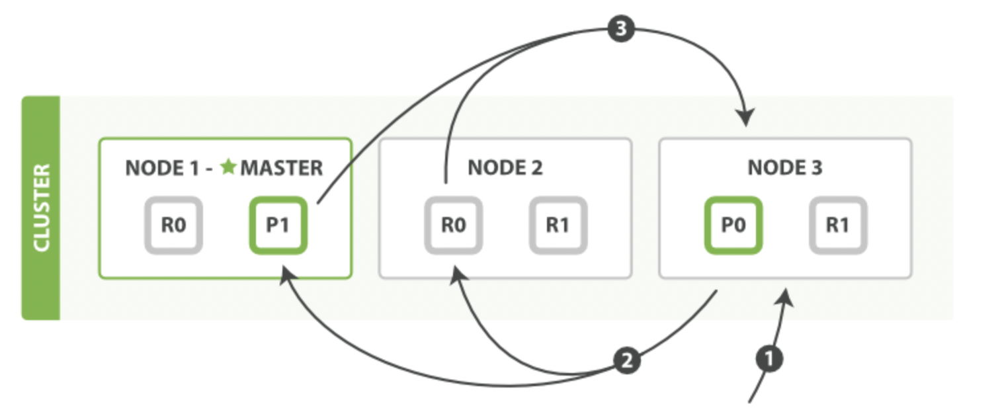
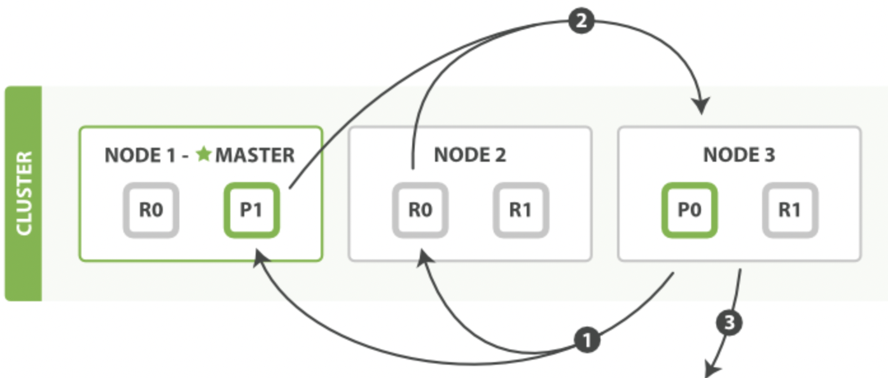
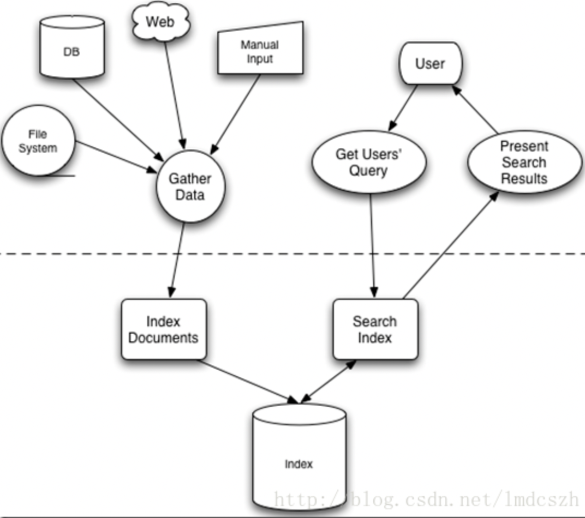

## 1. 详细描述一下Elasticsearch索引文档的过程。
协调节点默认使用文档ID参与计算（也支持通过routing），以便为路由提供合适的分片。

shard = hash(document_id) % (num_of_primary_shards)

1、当分片所在的节点接收到来自协调节点的请求后，会将请求写入到Memory Buffer，然后定时（默认是每隔1秒）写入到Filesystem Cache，这个从Momery Buffer到Filesystem Cache的过程就叫做refresh；

2、当然在某些情况下，存在Momery Buffer和Filesystem Cache的数据可能会丢失，ES是通过translog的机制来保证数据的可靠性的。

  其实现机制是接收到请求后，同时也会写入到translog中，当Filesystem cache中的数据写入到磁盘中时，才会清除掉，这个过程叫做flush；

3、在flush过程中，内存中的缓冲将被清除，内容被写入一个新段，段的fsync将创建一个新的提交点，并将内容刷新到磁盘，旧的translog将被删除并开始一个新的translog。

4、flush触发的时机是定时触发（默认30分钟）或者translog变得太大（默认为512M）时。

https://www.cnblogs.com/duanqibo/articles/12686377.html

## 2. 详细描述一下Elasticsearch搜索的过程。
1、搜索被执行成一个两阶段过程，我们称之为 Query Then Fetch；

2、在**初始查询阶段**时，查询会广播到索引中每一个分片拷贝（主分片或者副本分片）。 
每个分片在本地执行搜索并构建一个匹配文档的大小为 from + size 的优先队列。

PS：在搜索的时候是会查询 Filesystem Cache 的，但是有部分数据还在 Memory Buffer，所以搜索是近实时的。

3、每个分片返回各自优先队列中所有文档的 ID 和排序值 给协调节点，它合并这些值到自己的优先队列中来产生一个全局排序后的结果列表。

    1，客户端发送一个search请求到Node 3上，然后Node 3会创建一个优先级队列它的大小=from+size
    2，接着Node 3转发这个search请求到索引里面每一个主shard或者副本shard上，每个shard会在本地查询然后添加结果到本地的排序好的优先级队列里面。
    3，每个shard返回docId和所有参与排序字段的值例如_score到优先级队列里面，然后再返回给coordinating节点也就是Node 3，
    然后Node 3负责将所有shard里面的数据给合并到一个全局的排序的列表。

4、接下来就是 **取回阶段**，协调节点辨别出哪些文档需要被取回并向相关的分片提交多个 GET 请求。
每个分片加载并丰富文档，如果有需要的话，接着返回文档给协调节点。一旦所有的文档都被取回了，协调节点返回结果给客户端。

5、补充：Query Then Fetch 的搜索类型在文档相关性打分的时候参考的是本分
片的数据，这样在文档数量较少的时候可能不够准确，DFS Query Then Fetch 增
加了一个预查询的处理，询问 Term 和 Document frequency，这个评分更准确，但是性能会变差。

    1，coordinating 节点标识了那些document需要被拉取出来，并发送一个批量的mutil get请求到相关的shard上
    2，每个shard加载相关document，如果需要他们将会被返回到coordinating 节点上
    3，一旦所有的document被拉取回来，coordinating节点将会返回结果集到客户端上。

https://blog.csdn.net/qq_41489540/article/details/113817238

https://www.cnblogs.com/programb/p/13020703.html

## 3. Elasticsearch 的倒排索引是什么。
https://www.cnblogs.com/cjsblog/p/10327673.html

## 4. Elasticsearch是如何实现master选举的。
1、Elasticsearch 的选主是 ZenDiscovery 模块负责的，主要包含 Ping（节点之
间通过这个 RPC 来发现彼此）和 Unicast（单播模块包含一个主机列表以控制哪些节点需要 ping 通）这两部分；

2、对所有可以成为 master 的节点（node.master: true）根据 nodeId 字典排
序，每次选举每个节点都把自己所知道节点排一次序，然后选出第一个（第 0 位）节点，暂且认为它是 master 节点。

    对所有可以成为master的节点根据nodeId排序，每次选举每个节点都把自己所知道节点排一次序，然后选出第一个（第0位）节点，
    暂且认为它是master节点。
    如果对某个节点的投票数达到一定的值（可以成为master节点数n/2+1）并且该节点自己也选举自己，那这个节点就是master。否则重新选举。

3、如果对某个节点的投票数达到一定的值（可以成为 master 节点数 n/2+1）并
且该节点自己也选举自己，那这个节点就是 master。否则重新选举一直到满足上述条件。

4、补充：master 节点的职责主要包括集群、节点和索引的管理，不负责文档级
别的管理；data 节点可以关闭 http 功能*。

https://www.cnblogs.com/programb/p/13019987.html

## 5. lucence内部结构是什么。
Lucene是有索引和搜索的两个过程，包含索引创建，索引，搜索三个要点

**索引(Index)：** 在Lucene中一个索引是放在一个文件夹中的。

**段(Segment)：** 一个索引可以包含多个段，段与段之间是独立的，添加新文档可以生成新的段，不同的段可以合并。
segments.gen和segments_X是段的元数据文件，也即它们保存了段的属性信息。

**文档(Document)：** 文档是我们建索引的基本单位，不同的文档是保存在不同的段中的，一个段可以包含多篇文档。 新添加的文档是单独保存在一个新生成的段中，随着段的合并，不同的文档合并到同一个段中。

**域(Field)：** 一篇文档包含不同类型的信息，可以分开索引，比如标题，时间，正文，作者等，都可以保存在不同的域里。 不同域的索引方式可以不同，在真正解析域的存储的时候，我们会详细解读。

**词(Term)：** 词是索引的最小单位，是经过词法分析和语言处理后的字符串。

https://developer.aliyun.com/ask/263768

https://blog.csdn.net/lmdcszh/article/details/27705185

## 6. Lucene全文搜索的原理
https://www.cnblogs.com/forfuture1978/archive/2009/12/14/1623594.html

## 7. 在并发情况下，Elasticsearch 如何保证读写一致呢？
可以通过版本号使用乐观并发控制，以确保新版本不会被旧版本覆盖，由应用层来处理具体的冲突；

另外对于**写操作**，一致性级别支持**quorum/one/all**，**默认为quorum**，即只有当大多数分片可用时才允许写操作。

但即使大多数可用，也可能存在因为网络等原因导致写入副本失败，这样该副本被认为故障，分片将会在一个不同的节点上重建。

对于读操作，可以设置replication为sync(默认)，这使得操作在主分片和副本分片都完成后才会返回；

如果设置replication为async时，也可以通过设置搜索请求参数_preference为primary来查询主分片，确保文档是最新版本。

https://www.cnblogs.com/duanqibo/articles/12686420.html

## 8. Elasticsearch 索引数据多了怎么办呢，如何调优，部署
解答：索引数据的规划，应在前期做好规划，正所谓“**设计先行，编码在后**”，
这样才能有效的避免突如其来的数据激增导致集群处理能力不足引发的线上客户检索或者其他业务受到影响。

如何调优，正如问题 1 所说，这里细化一下：

* **动态索引层面**

基于模板+时间+rollover api 滚动创建索引，举例：设计阶段定义：blog 索引的模板格式为：blog_index_时间戳的形式，每天递增数据。
这样做的好处：不至于数据量激增导致单个索引数据量非常大，接近于上线 2 的32 次幂-1，索引存储达到了 TB+甚至更大。

一旦单个索引很大，存储等各种风险也随之而来，所以要提前考虑+及早避免。

* **存储层面**

冷热数据分离存储，热数据（比如最近 3 天或者一周的数据），其余为冷数据。对于冷数据不会再写入新数据，可以考虑定期 force_merge 加 shrink **压缩操作**，节省存储空间和检索效率。

* **部署层面**

一旦之前没有规划，这里就属于应急策略。

结合 ES 自身的支持动态扩展的特点，动态新增机器的方式可以缓解集群压力，注意：如果之前主节点等规划合理，不需要重启集群也能完成动态新增的。

https://www.cnblogs.com/programb/p/13020692.html
## 9. Elasticsearch 对于大数据量（上亿量级）的聚合如何实现？
Elasticsearch 提供的首个近似聚合是 cardinality 度量。它提供一个字段的基数，
即该字段的 distinct 或者unique 值的数目。它是基于 HLL 算法的。HLL 会先对我们的输入作哈希运算，
然后根据哈希运算的结果中的 bits 做概率估算从而得到基数。

其特点是：可配置的精度，用来控制内存的使用（更精确 ＝ 更多内存）；小的数据集精度是非常高的；
我们可以通过配置参数，来设置去重需要的固定内存使用量。无论数千还是数十亿的唯一值，内存使用量只与你配置的精确度相关。

https://blog.csdn.net/inet_ygssoftware/article/details/117155195

