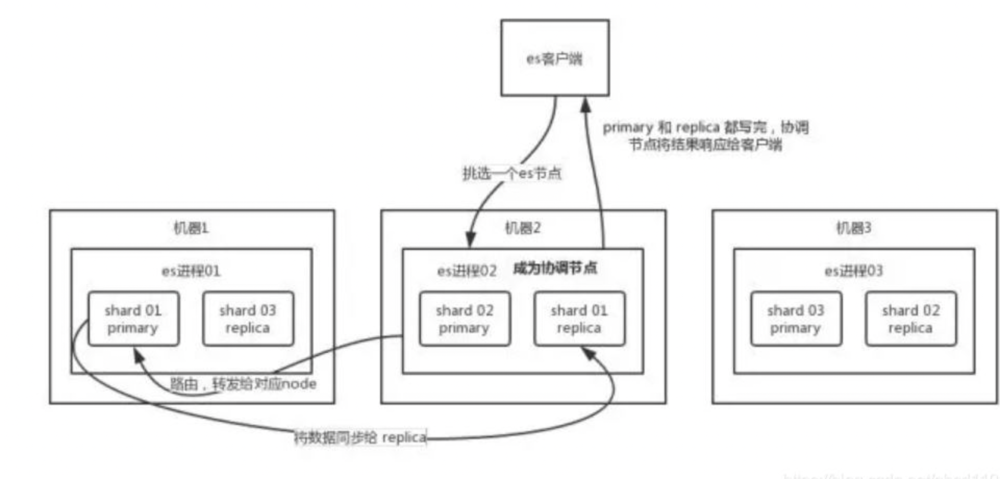
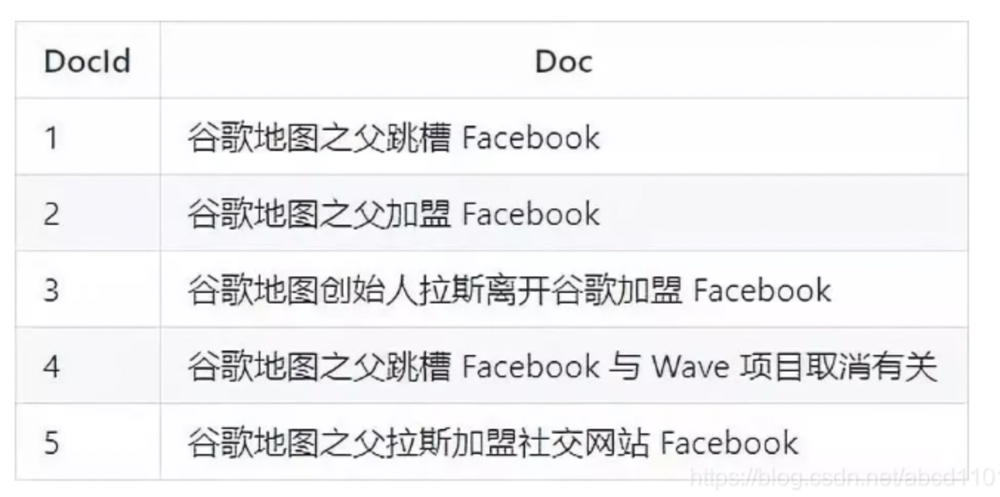

## es 写入数据的工作原理是什么啊？es 查询数据的工作原理是什么啊？底层的 lucene 介绍一下呗？倒排索引了解吗？
### es 写数据过程
客户端选择一个 node 发送请求过去，这个 node 就是 coordinating node（协调节点）。

coordinating node 对 document 进行路由，将请求转发给对应的 node（有 primary shard）。[路由的算法是？]

实际的 node 上的 primary shard 处理请求，然后将数据同步到 replica node。

coordinating node 如果发现 primary node 和所有 replica node 都搞定之后，就返回响应结果给客户端。

### es 读数据过程
可以通过 doc id 来查询，会根据 doc id 进行 hash，判断出来当时把 doc id 分配到了哪个 shard 上面去，从那个 shard 去查询。

客户端发送请求到任意一个 node，成为 coordinate node。

coordinate node 对 doc id 进行哈希路由，将请求转发到对应的 node，此时会使用 round-robin随机轮询算法，在 primary shard 以及其所有 replica 中随机选择一个，让读请求负载均衡。

接收请求的 node 返回 document 给 coordinate node。

coordinate node 返回 document 给客户端。

写请求是写入 primary shard，然后同步给所有的 replica shard；读请求可以从 primary shard 或 replica shard 读取，采用的是随机轮询算法。

### es 搜索数据过程[是指search?search和普通docid get的背后逻辑不一样？]
es 最强大的是做全文检索，就是比如你有三条数据：

    java真好玩儿啊
    java好难学啊
    j2ee特别牛

你根据 java 关键词来搜索，将包含 java的 document 给搜索出来。es 就会给你返回：java真好玩儿啊，java好难学啊。

客户端发送请求到一个 coordinate node。

协调节点将搜索请求转发到所有的 shard 对应的 primary shard 或 replica shard，都可以。

query phase：每个 shard 将自己的搜索结果（其实就是一些 doc id）返回给协调节点，由协调节点进行数据的合并、排序、分页等操作，产出最终结果。

fetch phase：接着由协调节点根据 doc id 去各个节点上拉取实际的 document 数据，最终返回给客户端。

### 写数据底层原理
1）document先写入导内存buffer中，同时写translog日志

2)）https://www.elastic.co/guide/cn/elasticsearch/guide/current/near-real-time.html

refresh操作所以近实时搜索：写入和打开一个新段(一个追加的倒排索引)的轻量的过程叫做 refresh 。每隔一秒钟把buffer中的数据创建一个新的segment，这里新段会被先写入到文件系统缓存--
这一步代价会比较低，稍后再被刷新到磁盘--这一步代价比较高。不过只要文件已经在缓存中， 就可以像其它文件一样被打开和读取了，内存buffer被清空。
此时，新segment 中的文件就可以被搜索了，这就意味着document从被写入到可以被搜索需要一秒种，如果要更改这个属性，可以执行以下操作

     PUT /my_index
     {
       "settings": {
         "refresh_interval": "30s" 
       }
     }
3）https://www.elastic.co/guide/cn/elasticsearch/guide/current/translog.html

flush操作导致持久化变更：执行一个提交并且截断 translog 的行为在 Elasticsearch 被称作一次 flush。刷新（refresh）完成后, 缓存被清空但是事务日志不会。
translog日志也会越来越多，当translog日志大小大于一个阀值时候或30分钟，会出发flush操作。

    所有在内存缓冲区的文档都被写入一个新的段。
    缓冲区被清空。
    一个提交点被写入硬盘。（表明有哪些segment commit了）
    文件系统缓存通过 fsync 到磁盘。
    老的 translog 被删除。

分片每30分钟被自动刷新（flush），或者在 translog 太大的时候也会刷新。也可以用_flush命令手动执行。

translog每隔5秒会被写入磁盘（所以如果这5s，数据在cache而且log没持久化会丢失）。在一次增删改操作之后translog只有在replica和primary shard都成功才会成功，如果要提高操作速度，可以设置成异步的

    PUT /my_index
    {
      "settings": {
        "index.translog.durability": "async" ,
    
        "index.translog.sync_interval":"5s"
      }
    }
所以总结是有三个批次操作，一秒做一次refresh保证近实时搜索，5秒做一次translog持久化保证数据未持久化前留底，30分钟做一次数据持久化。

2.基于translog和commit point的数据恢复

在磁盘上会有一个上次持久化的commit point，translog上有一个commit point，根据这两个commit point，会把translog中的变更记录进行回放，重新执行之前的操作

3.不变形下的删除和更新原理

https://www.elastic.co/guide/cn/elasticsearch/guide/current/dynamic-indices.html#deletes-and-updates

一个文档被 “删除” 时，它实际上只是在 .del 文件中被 标记 删除。一个被标记删除的文档仍然可以被查询匹配到， 但它会在最终结果被返回前从结果集中移除。

文档更新也是类似的操作方式：当一个文档被更新时，旧版本文档被标记删除，文档的新版本被索引到一个新的段中。 可能两个版本的文档都会被一个查询匹配到，但被删除的那个旧版本文档在结果集返回前就已经被移除。

段合并的时候会将那些旧的已删除文档 从文件系统中清除。 被删除的文档（或被更新文档的旧版本）不会被拷贝到新的大段中。

4.merge操作，段合并

https://www.elastic.co/guide/cn/elasticsearch/guide/current/merge-process.html

由于每秒会把buffer刷到segment中，所以segment会很多，为了防止这种情况出现，es内部会不断把一些相似大小的segment合并，并且物理删除del的segment。

当然也可以手动执行

POST /my_index/_optimize?max_num_segments=1，尽量不要手动执行，让它自动默认执行就可以了
 

5.当你正在建立一个大的新索引时（相当于直接全部写入buffer，先不refresh，写完再refresh），可以先关闭自动刷新，待开始使用该索引时，再把它们调回来：

    PUT /my_logs/_settings
    { "refresh_interval": -1 } 
    
    PUT /my_logs/_settings
    { "refresh_interval": "1s" } 
    
## 底层 lucene
简单来说，lucene 就是一个 jar 包，里面包含了封装好的各种建立倒排索引的算法代码。我们用 Java 开发的时候，引入 lucene jar，然后基于 lucene 的 api 去开发就可以了。

通过 lucene，我们可以将已有的数据建立索引，lucene 会在本地磁盘上面，给我们组织索引的数据结构。

**倒排索引**
 
在搜索引擎中，每个文档都有一个对应的文档 ID，文档内容被表示为一系列关键词的集合。例如，文档 1 经过分词，提取了 20 个关键词，每个关键词都会记录它在文档中出现的次数和出现位置。

那么，**倒排索引就是关键词到文档 ID 的映射**，每个关键词都对应着一系列的文件，这些文件中都出现了关键词。

对文档进行分词之后，得到以下倒排索引。

另外，实用的倒排索引还可以记录更多的信息，比如文档频率信息，表示在文档集合中有多少个文档包含某个单词。

那么，有了倒排索引，搜索引擎可以很方便地响应用户的查询。比如用户输入查询 Facebook，搜索系统查找倒排索引，从中读出包含这个单词的文档，这些文档就是提供给用户的搜索结果。

要注意倒排索引的两个重要细节：

倒排索引中的所有词项对应一个或多个文档

倒排索引中的词项根据字典顺序升序排列

上面只是一个简单的栗子，并没有严格按照字典顺序升序排列。

**Translog的详解**

translog是用来**恢复数据**的。Es用“后写”的套路来加快写入速度 — 写入的索引并没有实时落盘到索引文件，而是先双写到内存和translog文件，

下图1中灰色部分（见蓝色箭头）表示数据出于 可搜索 & 未落盘 & 已写日志 的状态。此时如果掉电，es重启后还可以把数据从日志文件中读回来。
