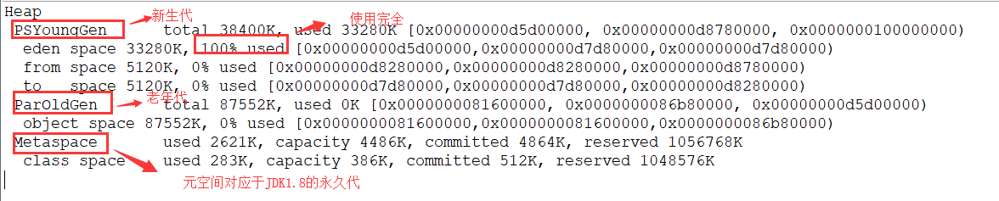

# 垃圾回收算法 #
## 1、“标记–清除”算法
该算法分为“标记”和“清除”阶段：**首先标记出所有不需要回收的对象，在标记完成后统一回收掉所有没有被标记的对象**。它是最基础的收集算法，后续的算法都是对其不足进行改进得到。这种垃圾收集算法会带来两个明显的问题：

**缺点：**

* 效率问题:遍历了两次内存空间（第一次标记，第二次清除）
* 空间问题:容易产生大量内存碎片，当再需要一块比较大的内存时，无法找到一块满足要求的，因而不得不再次出发GC。（标记清除后会产生大量不连续的碎片）

## 2、复制算法
为了解决效率问题，“复制”收集算法出现了。它可以将内存分为大小相同的两块，每次使用其中的一块。当这一块的内存使用完后，就将还存活的对象复制到另一块去，然后再把使用的空间一次清理掉。下次触发GC时将那块中存活的的又复制到这块，然后抹掉那块，循环往复。这样就使每次的内存回收都是对内存区间的一半进行回收。

**优点：**

* 相对于标记–清理算法解决了内存的碎片化问题。
* 效率更高（清理内存时，记住首尾地址，一次性抹掉）。

**缺点：** 内存利用率不高，每次只能使用一半内存。

**改进：**

研究表明，新生代中的对象大都是“朝生夕死”的，即生命周期非常短而且对象活得越久则越难被回收。在发生GC时，需要回收的对象特别多，存活的特别少，因此需要搬移到另一块内存的对象非常少，所以不需要1：1划分内存空间。而是将整个新生代按照8 ： 1 ： 1的比例划分为三块，最大的称为Eden（伊甸园）区，较小的两块分别称为To Survivor和From Survivor。

首次GC时，只需要将Eden存活的对象复制到To。然后将Eden区整体回收。再次GC时，将Eden和To存活的复制到From，循环往复这个过程。这样每次新生代中可用的内存就占整个新生代的90%，大大提高了内存利用率。

但不能保证每次存活的对象就永远少于新生代整体的10%，此时复制过去是存不下的，因此这里会用到另一块内存，称为老年代，进行分配担保，将对象存储到老年代。若还不够，就会抛出OOM。

老年代：存放新生代中经过多次回收仍然存活的对象（默认15次）。
## 3、“标记–整理”算法
根据老年代的特点提出的一种标记算法，标记过程仍然与“标记-清除”算法一样，但后续步骤不是直接对可回收对象回收，而是让所有存活的对象向一端移动，然后直接清理掉端边界以外的内存。

执行步骤：

* 标记：对需要回收的进行标记
* 整理：让存活的对象，向内存的一端移动，然后直接清理掉没有用的内存。

## 4、分代收集算法
当前虚拟机的垃圾收集都采用分代收集算法，这种算法没有什么新的思想，只是根据对象存活周期的不同将内存分为几块。一般将 java 堆分为新生代和老年代，这样我们就可以根据各个年代的特点选择合适的垃圾收集算法。

比如在新生代中，每次收集都会有大量对象死去，所以可以选择复制算法，只需要付出少量对象的复制成本就可以完成每次垃圾收集。而老年代的对象存活几率是比较高的，而且没有额外的空间对它进行分配担保，所以我们必须选择“标记-清除”或“标记-整理”算法进行垃圾收集。

延伸面试问题： HotSpot 为什么要分为新生代和老年代？ （根据上面的对分代收集算法的介绍回答）

**MinorGC和FullGC的区别**

* MinorGC：发生在新生代的垃圾回收，因为新生代的特点，MinorGC非常频繁，且回收速度比较快，每次回收的量也很大。
* FullGC：发生在老年代的垃圾回收，也称MajorGC，速度比较慢，相对于MinorGc慢10倍左右。进行一次FullGC通常会伴有多次多次MinorGC。

# 判断对象是否死亡 #

## 1、引用计数法
给对象中添加一个引用计数器，每当有一个地方引用它，计数器就加 1；当引用失效，计数器就减 1；任何时候计数器为 0 的对象就是不可能再被使用的。

这个方法实现简单，效率高，但是目前主流的虚拟机中并没有选择这个算法来管理内存，其最主要的原因是它很难解决对象之间相互循环引用的问题。 所谓对象之间的相互引用问题，如下面代码所示：除了对象 objA 和 objB 相互引用着对方之外，这两个对象之间再无任何引用。但是他们因为互相引用对方，导致它们的引用计数器都不为 0，于是引用计数算法无法通知 GC 回收器回收他们。

    public class ReferenceCountingGc {
        Object instance = null;
        public static void main(String[] args) {
            ReferenceCountingGc objA = new ReferenceCountingGc();
            ReferenceCountingGc objB = new ReferenceCountingGc();
            objA.instance = objB;
            objB.instance = objA;
            objA = null;
            objB = null;
    
             }
         }

## 2、 可达性分析算法
这个算法的基本思想就是通过一系列的称为 “GC Roots” 的对象作为起点，从这些节点开始向下搜索，节点所走过的路径称为引用链，当一个对象到 GC Roots 没有任何引用链相连的话，则证明此对象是不可用的。

可作为 GC Roots 的对象包括下面几种:

* 虚拟机栈(栈帧中的本地变量表)中引用的对象
* 本地方法栈(Native 方法)中引用的对象
* 方法区中类静态属性引用的对象
* 方法区中常量引用的对象

其中涉及到到引用[强引用、软引用、弱引用、虚引用](JVM四种引用.md) 可以查看这篇文章

## 3、如何判断一个常量是废弃常量?
运行时常量池主要回收的是废弃的常量。那么，我们如何判断一个常量是废弃常量呢？

     JDK1.7 之前运行时常量池逻辑包含字符串常量池存放在方法区, 此时 hotspot 虚拟机对方法区的实现为永久代
     JDK1.7 字符串常量池被从方法区拿到了堆中, 这里没有提到运行时常量池,也就是说字符串常量池被单独拿到堆,运行时常量池剩下的东西还在方法区, 也就是 hotspot 中的永久代 。
     JDK1.8 hotspot 移除了永久代用元空间(Metaspace)取而代之, 这时候字符串常量池还在堆, 运行时常量池还在方法区, 只不过方法区的实现从永久代变成了元空间(Metaspace)

假如在字符串常量池中存在字符串 "abc"，如果当前没有任何 String 对象引用该字符串常量的话，就说明常量 "abc" 就是废弃常量，如果这时发生内存回收的话而且有必要的话，"abc" 就会被系统清理出常量池了。
## 4、如何判断一个类是无用的类?
方法区主要回收的是无用的类，那么如何判断一个类是无用的类的呢？

判定一个常量是否是“废弃常量”比较简单，而要判定一个类是否是“无用的类”的条件则相对苛刻许多。类需要同时满足下面 3 个条件才能算是 “无用的类” ：

* 该类所有的实例都已经被回收，也就是 Java 堆中不存在该类的任何实例。
* 加载该类的 ClassLoader 已经被回收。
* 该类对应的 java.lang.Class 对象没有在任何地方被引用，无法在任何地方通过反射访问该类的方法。

  虚拟机可以对满足上述 3 个条件的无用类进行回收，这里说的仅仅是“可以”，而并不是和对象一样不使用了就会必然被回收。

# 堆内存中对象的分配的基本策略

## 1 对象优先在 eden 区分配
目前主流的垃圾收集器都会采用分代回收算法，因此需要将堆内存分为新生代和老年代，这样我们就可以根据各个年代的特点选择合适的垃圾收集算法。

大多数情况下，对象在新生代中 eden 区分配。当 eden 区没有足够空间进行分配时，虚拟机将发起一次 Minor GC.下面我们来进行实际测试以下。

     public class GCTest {
     
         public static void main(String[] args) {
             byte[] allocation1, allocation2;
             allocation1 = new byte[30900*1024];
             //allocation2 = new byte[900*1024];
         }
     }

通过以下方式运行：

添加的参数：-XX:+PrintGCDetails

运行结果 (红色字体描述有误，应该是对应于 JDK1.7 的永久代)：

从上图我们可以看出 eden 区内存几乎已经被分配完全（即使程序什么也不做，新生代也会使用 2000 多 k 内存）。假如我们再为 allocation2 分配内存会出现什么情况呢？

     allocation2 = new byte[900*1024];

简单解释一下为什么会出现这种情况： 因为给 allocation2 分配内存的时候 eden 区内存几乎已经被分配完了，我们刚刚讲了当 Eden 区没有足够空间进行分配时，虚拟机将发起一次 Minor GC.GC 期间虚拟机又发现 allocation1 无法存入 Survivor 空间，所以只好通过 分配担保机制 把新生代的对象提前转移到老年代中去，老年代上的空间足够存放 allocation1，所以不会出现 Full GC。执行 Minor GC 后，后面分配的对象如果能够存在 eden 区的话，还是会在 eden 区分配内存。可以执行如下代码验证：

     public class GCTest {
     
         public static void main(String[] args) {
             byte[] allocation1, allocation2,allocation3,allocation4,allocation5;
             allocation1 = new byte[32000*1024];
             allocation2 = new byte[1000*1024];
             allocation3 = new byte[1000*1024];
             allocation4 = new byte[1000*1024];
             allocation5 = new byte[1000*1024];
         }
     }

## 2、 大对象直接进入老年代
大对象就是需要大量连续内存空间的对象（比如：字符串、数组）。

为什么要这样呢？ 为了避免为大对象分配内存时由于分配担保机制带来的复制而降低效率。

## 3、长期存活的对象将进入老年代
既然虚拟机采用了分代收集的思想来管理内存，那么内存回收时就必须能识别哪些对象应放在新生代，哪些对象应放在老年代中。为了做到这一点，虚拟机给每个对象一个对象年龄（Age）计数器。

如果对象在 Eden 出生并经过第一次 Minor GC 后仍然能够存活，并且能被 Survivor 容纳的话，将被移动到 Survivor 空间中，并将对象年龄设为 1.对象在 Survivor 中每熬过一次 MinorGC,年龄就增加 1 岁，当它的年龄增加到一定程度（默认为 15 岁），就会被晋升到老年代中。对象晋升到老年代的年龄阈值，可以通过参数 -XX:MaxTenuringThreshold 来设置。
## 4、动态对象年龄判定

虚拟机并不是永远地要求对象的年龄必须达到 MaxTenuringThreshold 才能晋升老年代，如果在 Survivor 区中相同年龄所有对象大小的总和大于 Survivor 空间的一半，则年龄大于或等于该年龄的对象可以直接进入老年代，无需等到 MaxTenuringThreshold 中要求的年龄。

## 5、空间分配担保

在发生 Minor GC 之前，虚拟机先检查老年代最大可用的连续空间是否大于新生代所有对象总空间，如果条件成立的话，那么 Minor GC 可以确认是安全的；如果不成立的话虚拟机会查看 HandlePromotionFailure 设置值是否允许担保失败，如果允许那么就会继续检查老年代最大可用的连续空间是否大于历次晋升到老年代对象的平均大小，如果大于，将尝试着进行一次 Minor GC，尽管这次 Minor GC 是有风险的；如果小于，或者 HandlePromotionFailure 设置不允许冒险，那这时也要改为进行一次 Full GC。

# Full GC 的触发条件
对于 Minor GC，其触发条件非常简单，当 Eden 区空间满时，就将触发一次 Minor GC。而 Full GC 则相对复杂，有以下条件：

**（一）调用 System.gc()**

此方法的调用是建议虚拟机进行 Full GC，虽然只是建议而非一定，但很多情况下它会触发 Full GC，从而增加 Full GC 的频率，也即增加了间歇性停顿的次数。因此强烈建议能不使用此方法就不要使用，让虚拟机自己去管理它的内存。可通过 -XX:DisableExplicitGC 来禁止 RMI 调用 System.gc()。

**（二）老年代空间不足**

老年代空间不足的常见场景为前文所讲的大对象直接进入老年代、长期存活的对象进入老年代等，当执行 Full GC 后空间仍然不足，则抛出 Java.lang.OutOfMemoryError。为避免以上原因引起的 Full GC，调优时应尽量做到让对象在 Minor GC 阶段被回收、让对象在新生代多存活一段时间以及不要创建过大的对象及数组。

**（三）空间分配担保失败**

使用复制算法的 Minor GC 需要老年代的内存空间作担保，如果出现了 HandlePromotionFailure 担保失败，则会触发 Full GC。

**（四）JDK 1.7 及以前的永久代空间不足**

在 JDK 1.7 及以前，HotSpot 虚拟机中的方法区是用永久代实现的，永久代中存放的为一些 Class 的信息、常量、静态变量等数据，当系统中要加载的类、反射的类和调用的方法较多时，永久代可能会被占满，在未配置为采用 CMS GC 的情况下也会执行 Full GC。如果经过 Full GC 仍然回收不了，那么虚拟机会抛出 java.lang.OutOfMemoryError，为避免以上原因引起的 Full GC，可采用的方法为增大永久代空间或转为使用 CMS GC。

**（五）Concurrent Mode Failure**

执行 CMS GC 的过程中同时有对象要放入老年代，而此时老年代空间不足（有时候“空间不足”是 CMS GC 时当前的浮动垃圾过多导致暂时性的空间不足触发 Full GC），便会报 Concurrent Mode Failure 错误，并触发 Full GC。

总结：
    1. 调用的System.gc()
    2. 老年代空间不足
    3. 方法区空间不足
    4. 通过Minor GC后进入老年代的平均大小大于老年代的可用内存
    5. 由Eden区、From Space区向To Space区复制时，对象大小大于To Space可用内存，则把该对象转存到老年代，且老年代的可用内存小于该对象大小。

## 3、主要进行 gc 的区域

总结： 针对 HotSpot VM 的实现，它里面的 GC 其实准确分类只有两大种：

部分收集 (Partial GC)：

* 新生代收集（Minor GC / Young GC）：只对新生代进行垃圾收集；
* 老年代收集（Major GC / Old GC）：只对老年代进行垃圾收集。需要注意的是 Major GC 在有的语境中也用于指代整堆收集；
* 混合收集（Mixed GC）：对整个新生代和部分老年代进行垃圾收集。
* 整堆收集 (Full GC)：收集整个 Java 堆和方法区。