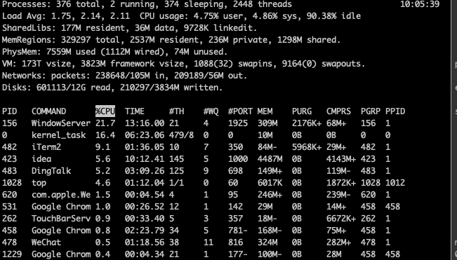
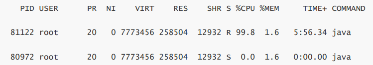
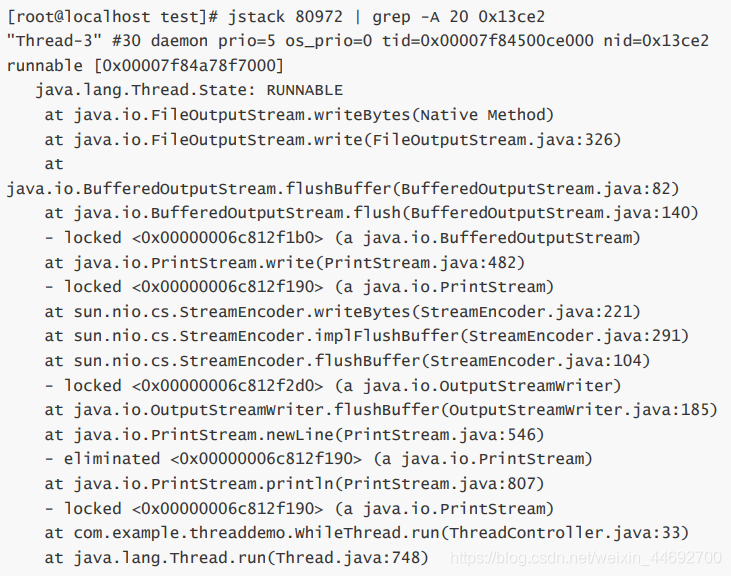

## cpu飙升及响应慢点原因
此处只谈软件的原因，至于硬件及病毒不在此处说明。cpu飙升主要涉及到的是系统问题，比如系统过于臃肿，开启过多程序等都会产生CPU使用率过高，而导致系统速度慢，体现在系统吞吐量低，请求响应慢。

## 解决思路
上面提到的吞吐量、响应慢，系统日志中也看不出问题所在，却发现CPU占用率很高，那么此时我们就需要区查看以下运行中的线程有没有异常情况。

思路：简单说就是先找到CPU飙升的进程，再找到进程中占用CPU资源最多的线程，通过jstack命令打出这个线程的dump文件，找到具体的代码位置。

### 方案一
1、通过top -c 命令可以动态显示进程占用资源排行榜，包括CPU、内存、占用进行ID。关注在 CPU PID COMMAND 的信息，找到进程号PID

2、根据进程号PID，找到对应有哪些线程，通过命令：top -H -p PID，也可以 cd /etc/proc/PID  ,看看这个进程属于哪个服务。此处PID = 80972 为例。

* 通过printf "0x%x\n" 81122命令，把对应线程PID转化为16进制。

      printf "0x%x\n" 81122 -> 0x13ce2

* 查看当前线程的Dump日志，定位到具体有问题的代码。命令 jstack 80972 | grep -A 20 0x13ce2

根据日志找到对应的业务方法（我们写的项目方法），然后调优方法。

3、若是不好在线定位问题，可以将dump日志下载到本地。捕获日志过程如下：

       jstack -l 2626 >> test.log   // 2626 是PID，下载到当前目录到日志文件test.log

4、运用一下现有工具分析dump日志如：mat 、ProcDump、DebugDiag、ADPlus、WinDbg
 
分析工具介绍：https://blog.csdn.net/oTianLe1234/article/details/120355848

### 方案二
方案一主要介绍CPU高、响应慢到一些解决方案，调整后还存在到话此时需要考虑JVM内存调优问题，即是JVM参数调优，可以参考《JV吗调优-配置参数》

## 总结
方案一适合前期项目压测环境，后端在后台捕获日志，不需要测试工程师提问题驱动。当然上了生产，遇到一些卡顿、响应慢、CPU高到问题也适用。

方案二适合在方案一排查之后操作，毕竟JVM默认到一些参数配置已经够大多数项目适用。可以花些时间关注 堆内存、年轻代、老年代身上。

https://blog.csdn.net/weixin_44692700/article/details/116885373
https://blog.csdn.net/baidu_28068985/article/details/108176278
