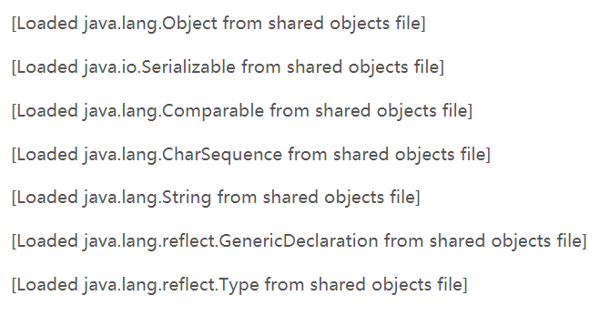

## Trace跟踪参数

### 1、打印GC的简要信息

        -verbose:gc
        -XX:+printGC
        
   打印信息：[GC 4790K->374K(15872K), 0.0001606 secs]
        
   日志的意思是说，GC之前，用了4M左右的内存，GC之后，用了374K内存，一共回收了将近4M。内存大小一共是16M左右。
   
### 2、打印GC的详细信息

    -XX:+PrintGCDetails     解释：打印GC详细信息。
                            
    -XX:+PrintGCTimeStamps   解释：打印CG发生的时间戳。
                             
[GC[DefNew: 4416K->0K(4928K), 0.0001897 secs] 4790K->374K(15872K), 0.0002232 secs] [Times: user=0.00 sys=0.00, real=0.00 secs] 

日志的意思是说：这是一个新生代的GC。方括号内部的“4416K->0K(4928K)”含义是：“GC前该内存区域已使用容量->GC后该内存区域已使用容量（该内存区域总容量）”。
而在方括号之外的“4790K->374K(15872K)”表示“GC前Java堆已使用容量->GC后Java堆已使用容量（Java堆总容量）”。
再往后看，“0.0001897 secs”表示该内存区域GC所占用的时间，单位是秒。

### 3、指定GC log的位置

    -Xloggc:log/gc.log
    
  解释：指定GC log的位置，以文件输出。帮助开发人员分析问题。
  
    -XX:+PrintHeapAtGC

  解释：每一次GC前和GC后，都打印堆信息。
  

上图中，红框部分正好是一次GC，红框部分的前面是GC之前的日志，红框部分的后面是GC之后的日志。

    -XX:+TraceClassLoading
解释：监控类的加载。

   
    -XX:+PrintClassHistogram
    
  解释：按下Ctrl+Break后，打印类的信息。

## 堆的分配参数
### 1、-Xmx –Xms：指定最大堆和最小堆
    -Xmx20m -Xms5m

### 2、-Xmn、-XX:NewRatio、-XX:SurvivorRatio：
* -Xmn

　设置新生代大小

* -XX:NewRatio

　　新生代（eden+2*s）和老年代（不包含永久区）的比值

   例如：4，表示新生代:老年代=1:4，即新生代占整个堆的1/5

* -XX:SurvivorRatio（幸存代）

　　设置两个Survivor区和eden的比值

   例如：8，表示两个Survivor:eden=2:8，即一个Survivor占年轻代的1/10
   
（1）当参数设置为如下时：（设置新生代为1M，很小）

    -Xmx20m -Xms20m -Xmn1m -XX:+PrintGCDetails 
    
 （2）当参数设置为如下时：（设置新生代为15M，足够大）
 
    -Xmx20m -Xms20m -Xmn15m -XX:+PrintGCDetails
    
  （3）当参数设置为如下时：（设置新生代为7M，不大不小）
  
    -Xmx20m -Xms20m –Xmn7m -XX:+PrintGCDetails
    
  （4）当参数设置为如下时：（设置新生代为7M，不大不小；同时，增加幸存代大小）
  
    -Xmx20m -Xms20m -Xmn7m -XX:SurvivorRatio=2 -XX:+PrintGCDetails
    
  （5）当参数设置为如下时：
  
    -Xmx20m -Xms20m -XX:NewRatio=1
  
    -XX:SurvivorRatio=2 -XX:+PrintGCDetails 
    
  （6）当参数设置为如下时： 和上面的（5）相比，适当减小幸存代大小，这样的话，能够减少GC的次数
  
    -Xmx20m -Xms20m -XX:NewRatio=1
    
    -XX:SurvivorRatio=3 -XX:+PrintGCDetails
    
### 3、-XX:+HeapDumpOnOutOfMemoryError、-XX:+HeapDumpPath
* -XX:+HeapDumpOnOutOfMemoryError

　 OOM时导出堆到文件，根据这个文件，我们可以看到系统dump时发生了什么。

* -XX:+HeapDumpPath
　　
导出OOM的路径
 
 设置如下的参数：
 
    -Xmx20m -Xms5m -XX:+HeapDumpOnOutOfMemoryError -XX:HeapDumpPath=d:/a.dump
    
 现在给堆内存最多分配20M的空间。如果发生了OOM异常，那就把dump信息导出到d:/a.dump文件中。可以用**VisualVM打开这个dump文件**。
 
### 4、-XX:OnOutOfMemoryError：
* -XX:OnOutOfMemoryError
　　　
  在OOM时，执行一个脚本。可以在OOM时，发送邮件，甚至是重启程序。

设置如下的参数：

    -XX:OnOutOfMemoryError=D:/tools/jdk1.7_40/bin/printstack.bat %p //p代表的是当前进程的pid ,printstack.bat脚本配置
    
 意思是说，执行printstack.bat脚本，而这个脚本做的事情是：D:/tools/jdk1.7_40/bin/jstack -F %1 > D:/a.txt，即当程序OOM时，在D:/a.txt中将会生成线程的dump。
 
### 5、堆的分配参数总结：
    
 根据实际事情调整新生代和幸存代的大小
 
 官方推荐新生代占堆的3/8
 
 幸存代占新生代的1/10
 
 在OOM时，记得Dump出堆，确保可以排查现场问题
    
### 6、永久区分配参数：
    
* -XX:PermSize  -XX:MaxPermSize

   设置永久区的初始空间和最大空间。也就是说，jvm启动时，永久区一开始就占用了PermSize大小的空间，如果空间还不够，可以继续扩展，但是不能超过MaxPermSize，否则会OOM。
    
   他们表示，一个系统可以容纳多少个类型
   
   总结：如果堆空间没有用完也抛出了OOM，有可能是永久区导致的。堆空间实际占用非常少，但是永久区溢出 一样抛出OOM。
   
## 栈的分配参数
### 1、Xss
   设置栈空间的大小。通常只有几百K;决定了函数调用的深度;每个线程都有独立的栈空间；局部变量、参数 分配在栈上

注：栈空间是每个线程私有的区域。栈里面的主要内容是栈帧，而栈帧存放的是局部变量表，局部变量表的内容是：局部变量、参数。

https://www.cnblogs.com/pony1223/p/8661219.html

    
 
    
