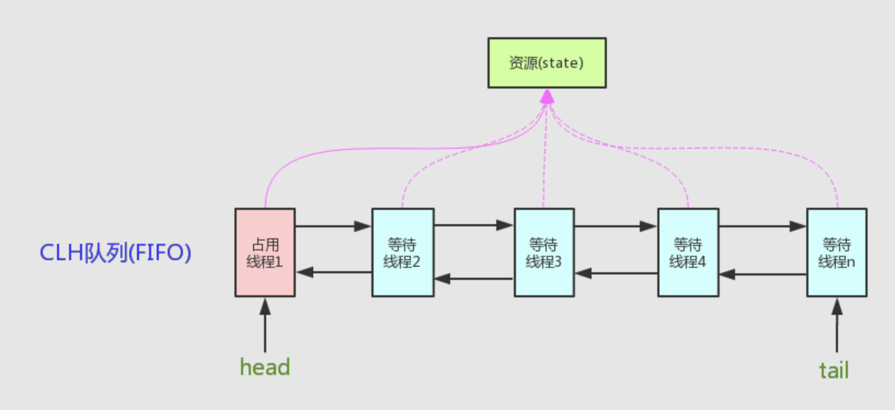

根据 Java-concurrency 学习得Demo，https://github.com/CL0610/Java-concurrency
## AQS 原理
  AQS 核心思想是，如果被请求的共享资源空闲，则将当前请求资源的线程设置为有效的工作线程，并且将共享资源设置为锁定状态。如果被请求的共享资源被占用，那么就需要一套线程阻塞等待以及被唤醒时锁分配的机制，这个机制 AQS 是用 CLH 队列锁实现的，即将暂时获取不到锁的线程加入到队列中。
  
  CLH(Craig,Landin,and Hagersten)队列是一个虚拟的双向队列（虚拟的双向队列即不存在队列实例，仅存在结点之间的关联关系）。AQS 是将每条请求共享资源的线程封装成一个 CLH 锁队列的一个结点（Node）来实现锁的分配。
  
  * AQS(AbstractQueuedSynchronizer)原理图：
  
   
  
  * AQS 定义两种资源共享方式
   
   1)Exclusive（独占）
   
   只有一个线程能执行，如 ReentrantLock。又可分为公平锁和非公平锁,ReentrantLock 同时支持两种锁,下面以 ReentrantLock 对这两种锁的定义做介绍：
   
   公平锁：按照线程在队列中的排队顺序，先到者先拿到锁
   
   非公平锁：当线程要获取锁时，先通过两次 CAS 操作去抢锁，如果没抢到，当前线程再加入到队列中等待唤醒。
   
   总结：公平锁和非公平锁只有两处不同：
   
   非公平锁在调用 lock 后，首先就会调用 CAS 进行一次抢锁，如果这个时候恰巧锁没有被占用，那么直接就获取到锁返回了。

   非公平锁在 CAS 失败后，和公平锁一样都会进入到 tryAcquire 方法，在 tryAcquire 方法中，如果发现锁这个时候被释放了（state == 0），非公平锁会直接 CAS 抢锁，但是公平锁会判断等待队列是否有线程处于等待状态，如果有则不去抢锁，乖乖排到后面。

   公平锁和非公平锁就这两点区别，如果这两次 CAS 都不成功，那么后面非公平锁和公平锁是一样的，都要进入到阻塞队列等待唤醒。
   
   相对来说，非公平锁会有更好的性能，因为它的吞吐量比较大。当然，非公平锁让获取锁的时间变得更加不确定，可能会导致在阻塞队列中的线程长期处于饥饿状态。
   
       公平锁：多个线程按照申请锁的顺序去获得锁，线程会直接进入队列去排队，永远都是队列的第一位才能得到锁。
       优点：所有的线程都能得到资源，不会饿死在队列中。
       缺点：吞吐量会下降很多，队列里面除了第一个线程，其他的线程都会阻塞，cpu唤醒阻塞线程的开销会很大。

       非公平锁：多个线程去获取锁的时候，会直接去尝试获取，获取不到，再去进入等待队列，如果能获取到，就直接获取到锁。
       优点：可以减少CPU唤醒线程的开销，整体的吞吐效率会高点，CPU也不必取唤醒所有线程，会减少唤起线程的数量。
       缺点：你们可能也发现了，这样可能导致队列中间的线程一直获取不到锁或者长时间获取不到锁，导致饿死。
   
   2)Share（共享）
   
   多个线程可同时执行，如 Semaphore/CountDownLatch。Semaphore、CountDownLatCh、 CyclicBarrier、ReadWriteLock 我们都会在后面讲到。
   
   ReentrantReadWriteLock 可以看成是组合式，因为 ReentrantReadWriteLock 也就是读写锁允许多个线程同时对某一资源进行读。
   
   不同的自定义同步器争用共享资源的方式也不同。自定义同步器在实现时只需要实现**共享资源 state 的获取与释放方式**即可，至于具体线程等待队列的维护（如获取资源失败入队/唤醒出队等），AQS 已经在上层已经帮我们实现好了。
   
   3)AQS 提供的模板方法
   
   
        isHeldExclusively()//该线程是否正在独占资源。只有用到condition才需要去实现它。
        tryAcquire(int)//独占方式。尝试获取资源，成功则返回true，失败则返回false。
        tryRelease(int)//独占方式。尝试释放资源，成功则返回true，失败则返回false。
        tryAcquireShared(int)//共享方式。尝试获取资源。负数表示失败；0表示成功，但没有剩余可用资源；正数表示成功，且有剩余资源。
        tryReleaseShared(int)//共享方式。尝试释放资源，成功则返回true，失败则返回false。
        
  4)CountDownLatch 的两种典型用法
  
     1、某一线程在开始运行前等待 n 个线程执行完毕。将 CountDownLatch 的计数器初始化为 n ：new CountDownLatch(n)，
     每当一个任务线程执行完毕，就将计数器减 1 countdownlatch.countDown()，当计数器的值变为 0 时，在CountDownLatch上 await() 的线程就会被唤醒。
    一个典型应用场景就是启动一个服务时，主线程需要等待多个组件加载完毕，之后再继续执行。
     
     2、实现多个线程开始执行任务的最大并行性。注意是并行性，不是并发，强调的是多个线程在某一时刻同时开始执行。
     类似于赛跑，将多个线程放到起点，等待发令枪响，然后同时开跑。做法是初始化一个共享的 CountDownLatch 对象，将其计数器初始化为 1 ：new CountDownLatch(1)，
     多个线程在开始执行任务前首先 coundownlatch.await()，当主线程调用 countDown() 时，计数器变为 0，多个线程同时被唤醒。
     
  5)CyclicBarrier(循环栅栏)
  
  CyclicBarrier 的字面意思是可循环使用（Cyclic）的屏障（Barrier）。它要做的事情是，让一组线程到达一个屏障（也可以叫同步点）时被阻塞，直到最后一个线程到达屏障时，屏障才会开门，所有被屏障拦截的线程才会继续干活。CyclicBarrier 默认的构造方法是 CyclicBarrier(int parties)，其参数表示屏障拦截的线程数量，每个线程调用await方法告诉 CyclicBarrier 我已经到达了屏障，然后当前线程被阻塞。
  
  **应用场景:**
  
  CyclicBarrier 可以用于多线程计算数据，最后合并计算结果的应用场景。比如我们用一个 Excel 保存了用户所有银行流水，每个 Sheet 保存一个帐户近一年的每笔银行流水，现在需要统计用户的日均银行流水，先用多线程处理每个 sheet 里的银行流水，都执行完之后，得到每个 sheet 的日均银行流水，最后，再用 barrierAction 用这些线程的计算结果，计算出整个 Excel 的日均银行流水。
  
  对于 CountDownLatch 来说，重点是“一个线程（多个线程）等待”，而其他的 N 个线程在完成“某件事情”之后，可以终止，也可以等待。而对于 CyclicBarrier，重点是多个线程，在任意一个线程没有完成，所有的线程都必须等待。
  
  CountDownLatch 是计数器，线程完成一个记录一个，只不过计数不是递增而是递减，而 CyclicBarrier 更像是一个阀门，需要所有线程都到达，阀门才能打开，然后继续执行。

## 3. AQS
3.1. **AQS 介绍**

AQS 的全称为（AbstractQueuedSynchronizer），这个类在 java.util.concurrent.locks 包下面。

AQS 是一个用来构建锁和同步器的框架，使用 AQS 能简单且高效地构造出应用广泛的大量的同步器，比如我们提到的 ReentrantLock，Semaphore，其他的诸如 ReentrantReadWriteLock，SynchronousQueue，FutureTask 等等皆是基于 AQS 的。当然，我们自己也能利用 AQS 非常轻松容易地构造出符合我们自己需求的同步器。

3.2. **AQS 原理分析**

AQS 原理这部分参考了部分博客，在 5.2 节末尾放了链接。

在面试中被问到并发知识的时候，大多都会被问到“请你说一下自己对于 AQS 原理的理解”。下面给大家一个示例供大家参加，面试不是背题，大家一定要加入自己的思想，即使加入不了自己的思想也要保证自己能够通俗的讲出来而不是背出来。

下面大部分内容其实在 AQS 类注释上已经给出了，不过是英语看着比较吃力一点，感兴趣的话可以看看源码。

3.2.1. **AQS 原理概览**

AQS **核心思想是**，如果被请求的共享资源空闲，则将当前请求资源的线程设置为有效的工作线程，并且将共享资源设置为锁定状态。如果被请求的共享资源被占用，那么就需要一套线程阻塞等待以及被唤醒时锁分配的机制，这个机制 AQS 是用 CLH 队列锁实现的，即将暂时获取不到锁的线程加入到队列中。

    CLH(Craig,Landin,and Hagersten)队列是一个虚拟的双向队列（虚拟的双向队列即不存在队列实例，仅存在结点之间的关联关系）。
    AQS 是将每条请求共享资源的线程封装成一个 CLH 锁队列的一个结点（Node）来实现锁的分配。

看个 AQS(AbstractQueuedSynchronizer)原理图：

AQS 使用一个 int 成员变量来表示同步状态，通过内置的 FIFO 队列来完成获取资源线程的排队工作。AQS 使用 CAS 对该同步状态进行原子操作实现对其值的修改。

    private volatile int state;//共享变量，使用volatile修饰保证线程可见性

状态信息通过 protected 类型的 getState，setState，compareAndSetState 进行操作

     //返回同步状态的当前值
    protected final int getState() {
    return state;
    }
    // 设置同步状态的值
    protected final void setState(int newState) {
    state = newState;
    }
    //原子地（CAS操作）将同步状态值设置为给定值update如果当前同步状态的值等于expect（期望值）
    protected final boolean compareAndSetState(int expect, int update) {
    return unsafe.compareAndSwapInt(this, stateOffset, expect, update);
    }

3.2.2. **AQS 对资源的共享方式**

AQS 定义两种资源共享方式

* Exclusive（独占）：只有一个线程能执行，如 ReentrantLock。又可分为公平锁和非公平锁：

        公平锁：按照线程在队列中的排队顺序，先到者先拿到锁
        非公平锁：当线程要获取锁时，无视队列顺序直接去抢锁，谁抢到就是谁的

* Share（共享）：多个线程可同时执行，如CountDownLatch、Semaphore、CountDownLatch、 CyclicBarrier、ReadWriteLock 我们都会在后面讲到。

ReentrantReadWriteLock 可以看成是组合式，因为 ReentrantReadWriteLock 也就是读写锁允许多个线程同时对某一资源进行读。

不同的自定义同步器争用共享资源的方式也不同。自定义同步器在实现时只需要实现共享资源 state 的获取与释放方式即可，至于具体线程等待队列的维护（如获取资源失败入队/唤醒出队等），AQS 已经在顶层实现好了。

3.2.3. **AQS 底层使用了模板方法模式**

同步器的设计是基于模板方法模式的，如果需要自定义同步器一般的方式是这样（模板方法模式很经典的一个应用）：

* 使用者继承 AbstractQueuedSynchronizer 并重写指定的方法。（这些重写方法很简单，无非是对于共享资源 state 的获取和释放）
* 将 AQS 组合在自定义同步组件的实现中，并调用其模板方法，而这些模板方法会调用使用者重写的方法。

这和我们以往通过实现接口的方式有很大区别，这是模板方法模式很经典的一个运用。

AQS 使用了模板方法模式，自定义同步器时需要重写下面几个 AQS 提供的模板方法：

    isHeldExclusively()//该线程是否正在独占资源。只有用到condition才需要去实现它。
    tryAcquire(int)//独占方式。尝试获取资源，成功则返回true，失败则返回false。
    tryRelease(int)//独占方式。尝试释放资源，成功则返回true，失败则返回false。
    tryAcquireShared(int)//共享方式。尝试获取资源。负数表示失败；0表示成功，但没有剩余可用资源；正数表示成功，且有剩余资源。
    tryReleaseShared(int)//共享方式。尝试释放资源，成功则返回true，失败则返回false。

默认情况下，每个方法都抛出 UnsupportedOperationException。 这些方法的实现必须是内部线程安全的，并且通常应该简短而不是阻塞。AQS 类中的其他方法都是 final ，所以无法被其他类使用，只有这几个方法可以被其他类使用。

以 ReentrantLock 为例，state 初始化为 0，表示未锁定状态。A 线程 lock()时，会调用 tryAcquire()独占该锁并将 state+1。此后，其他线程再 tryAcquire()时就会失败，直到 A 线程 unlock()到 state=0（即释放锁）为止，其它线程才有机会获取该锁。当然，释放锁之前，A 线程自己是可以重复获取此锁的（state 会累加），这就是可重入的概念。但要注意，获取多少次就要释放多么次，这样才能保证 state 是能回到零态的。

再以 CountDownLatch 以例，任务分为 N 个子线程去执行，state 也初始化为 N（注意 N 要与线程个数一致）。这 N 个子线程是并行执行的，每个子线程执行完后countDown() 一次，state 会 CAS(Compare and Swap)减 1。等到所有子线程都执行完后(即 state=0)，会 unpark()主调用线程，然后主调用线程就会从 await() 函数返回，继续后余动作。

一般来说，自定义同步器要么是独占方法，要么是共享方式，他们也只需实现tryAcquire-tryRelease、tryAcquireShared-tryReleaseShared中的一种即可。但 AQS 也支持自定义同步器同时实现独占和共享两种方式，如ReentrantReadWriteLock。

推荐两篇 AQS 原理和相关源码分析的文章：

* http://www.cnblogs.com/waterystone/p/4920797.html
* https://www.cnblogs.com/chengxiao/archive/2017/07/24/7141160.html

3.3. **AQS 组件总结**

* Semaphore(信号量)-允许多个线程同时访问： synchronized 和 ReentrantLock 都是一次只允许一个线程访问某个资源，Semaphore(信号量)可以指定多个线程同时访问某个资源。
* CountDownLatch （倒计时器）： CountDownLatch 是一个同步工具类，用来协调多个线程之间的同步。这个工具通常用来控制线程等待，它可以让某一个线程等待直到倒计时结束，再开始执行。
* CyclicBarrier(循环栅栏)： CyclicBarrier 和 CountDownLatch 非常类似，它也可以实现线程间的技术等待，但是它的功能比 CountDownLatch 更加复杂和强大。主要应用场景和 CountDownLatch 类似。CyclicBarrier 的字面意思是可循环使用（Cyclic）的屏障（Barrier）。它要做的事情是，让一组线程到达一个屏障（也可以叫同步点）时被阻塞，直到最后一个线程到达屏障时，屏障才会开门，所有被屏障拦截的线程才会继续干活。CyclicBarrier 默认的构造方法是 CyclicBarrier(int parties)，其参数表示屏障拦截的线程数量，每个线程调用 await()方法告诉 CyclicBarrier 我已经到达了屏障，然后当前线程被阻塞。

3.4. **用过 CountDownLatch 么？什么场景下用的？**

CountDownLatch 的作用就是 允许 count 个线程阻塞在一个地方，直至所有线程的任务都执行完毕。之前在项目中，有一个使用多线程读取多个文件处理的场景，我用到了 CountDownLatch 。具体场景是下面这样的：

我们要读取处理 6 个文件，这 6 个任务都是没有执行顺序依赖的任务，但是我们需要返回给用户的时候将这几个文件的处理的结果进行统计整理。

为此我们定义了一个线程池和 count 为 6 的CountDownLatch对象 。使用线程池处理读取任务，每一个线程处理完之后就将 count-1，调用CountDownLatch对象的 await()方法，直到所有文件读取完之后，才会接着执行后面的逻辑。

伪代码是下面这样的：

       public class CountDownLatchExample1 {
    // 处理文件的数量
    private static final int threadCount = 6;
    
    public static void main(String[] args) throws InterruptedException {
    // 创建一个具有固定线程数量的线程池对象（推荐使用构造方法创建）
    ExecutorService threadPool = Executors.newFixedThreadPool(10);
    final CountDownLatch countDownLatch = new CountDownLatch(threadCount);
    for (int i = 0; i < threadCount; i++) {
    final int threadnum = i;
    threadPool.execute(() -> {
    try {
    //处理文件的业务操作
    ......
    } catch (InterruptedException e) {
    e.printStackTrace();
    } finally {
    //表示一个文件已经被完成
    countDownLatch.countDown();
    }
    
          });
        }
        countDownLatch.await();
        threadPool.shutdown();
        System.out.println("finish");
    }
    
    }

有没有可以改进的地方呢？

可以使用 CompletableFuture 类来改进！Java8 的 CompletableFuture 提供了很多对多线程友好的方法，使用它可以很方便地为我们编写多线程程序，什么异步、串行、并行或者等待所有线程执行完任务什么的都非常方便。

    CompletableFuture<Void> task1 =
    CompletableFuture.supplyAsync(()->{
    //自定义业务操作
    });
    ......
    CompletableFuture<Void> task6 =
    CompletableFuture.supplyAsync(()->{
    //自定义业务操作
    });
    ......
    CompletableFuture<Void> headerFuture=CompletableFuture.allOf(task1,.....,task6);
    
    try {
    headerFuture.join();
    } catch (Exception ex) {
    ......
    }
    System.out.println("all done. ");

上面的代码还可以接续优化，当任务过多的时候，把每一个 task 都列出来不太现实，可以考虑通过循环来添加任务。

    //文件夹位置
    List<String> filePaths = Arrays.asList(...)
    // 异步处理所有文件
    List<CompletableFuture<String>> fileFutures = filePaths.stream()
    .map(filePath -> doSomeThing(filePath))
    .collect(Collectors.toList());
    // 将他们合并起来
    CompletableFuture<Void> allFutures = CompletableFuture.allOf(
    fileFutures.toArray(new CompletableFuture[fileFutures.size()])
    );
