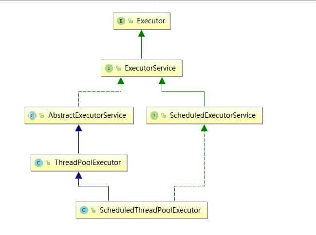
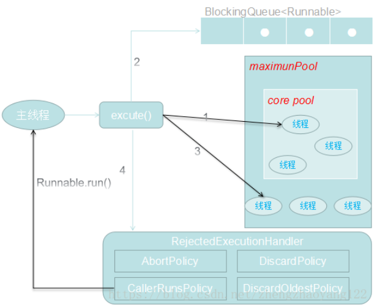

## 为什么要用线程池？

线程池提供了一种限制和管理资源（包括执行一个任务）。 每个线程池还维护一些基本统计信息，例如已完成任务的数量。

这里借用《Java 并发编程的艺术》提到的来说一下使用线程池的好处：

* 降低资源消耗。 通过重复利用已创建的线程降低线程创建和销毁造成的消耗。
* 提高响应速度。 当任务到达时，任务可以不需要的等到线程创建就能立即执行。
* 提高线程的可管理性。 线程是稀缺资源，如果无限制的创建，不仅会消耗系统资源，还会降低系统的稳定性，使用线程池可以进行统一的分配，调优和监控。

## 线程池的设计与实现原理
线程池（Thread Pool）是一种基于池化思想管理线程的工具，经常出现在多线程服务器中，如MySQL。线程过多会带来额外的开销，其中包括创建销毁线程的开销、调度线程的开销等等，同时也降低了计算机的整体性能。线程池维护多个线程，等待监督管理者分配可并发执行的任务。这种做法，一方面避免了处理任务时创建销毁线程开销的代价，另一方面避免了线程数量膨胀导致的过分调度问题，保证了对内核的充分利用。

### 线程池核心设计
* Executor 框架

* Executor 框架的使用示意图:

* 1）主线程首先要创建实现 Runnable 或者 Callable 接口的任务对象。
* 2）把创建完成的实现 Runnable/Callable接口的 对象直接交给 ExecutorService 执行: ExecutorService.execute（Runnable command））或者也可以把 Runnable 对象或Callable 对象提交给 ExecutorService 执行（ExecutorService.submit（Runnable task）或 ExecutorService.submit（Callable <T> task））。
* 3）如果执行 ExecutorService.submit（…），ExecutorService 将返回一个实现Future接口的对象（我们刚刚也提到过了执行 execute()方法和 submit()方法的区别，submit()会返回一个 FutureTask 对象）。由于 FutureTask 实现了 Runnable，我们也可以创建 FutureTask，然后直接交给 ExecutorService 执行。
* 4）最后，主线程可以执行 FutureTask.get()方法来等待任务执行完成。主线程也可以执行 FutureTask.cancel（boolean mayInterruptIfRunning）来取消此任务的执行。

     实现 Runnable 接口和 Callable 接口的区别：
     如果想让线程池执行任务的话需要实现的 Runnable 接口或 Callable 接口。 Runnable 接口或 Callable 接口实现类都可以被 ThreadPoolExecutor 或 ScheduledThreadPoolExecutor 执行。
     两者的区别在于 Runnable 接口不会返回结果但是 Callable 接口可以返回结果。

备注： 工具类Executors可以实现Runnable对象和Callable对象之间的相互转换。（Executors.callable（Runnable task）或Executors.callable（Runnable task，Object resule））。

### 线程池类型
1) 类型
* FixedThreadPool 被称为可重用固定线程数的线程池。该线程池中的线程数量始终不变。当有一个新的任务提交时，线程池中若有空闲线程，则立即执行。若没有，则新的任务会被暂存在一个任务队列中，待有线程空闲时，便处理在任务队列中的任务。。
* SingleThreadExecutor 是只有一个线程的线程池。若多余一个任务被提交到该线程池，任务会被保存在一个任务队列中，待线程空闲，按先入先出的顺序执行队列中的任务。
* CachedThreadPool 是一个会根据需要创建新线程的线程池。线程池的线程数量不确定，但若有空闲线程可以复用，则会优先使用可复用的线程。若所有线程均在工作，又有新的任务提交，则会创建新的线程处理任务。所有线程在当前任务执行完毕后，将返回线程池进行复用。
* ScheduledThreadPoolExecutor 主要用来在给定的延迟后运行任务，或者定期执行任务。
  
注：阿里巴巴 Java 开发手册》中强制线程池不允许使用 Executors 去创建，而是通过 ThreadPoolExecutor 的方式

    Executors 返回线程池对象的弊端如下：

    FixedThreadPool 和 SingleThreadExecutor ： 允许请求的队列长度为 Integer.MAX_VALUE ，可能堆积大量的请求，从而导致 OOM。
    CachedThreadPool 和 ScheduledThreadPool ： 允许创建的线程数量为 Integer.MAX_VALUE ，可能会创建大量线程，从而导致 OOM。
2) 线程池创建

          /**
           * 用给定的初始参数创建一个新的ThreadPoolExecutor。
           */
          public ThreadPoolExecutor(int corePoolSize,//线程池的核心线程数量
                                    int maximumPoolSize,//线程池的最大线程数
                                    long keepAliveTime,//当线程数大于核心线程数时，多余的空闲线程存活的最长时间
                                    TimeUnit unit,//时间单位
                                    BlockingQueue<Runnable> workQueue,//任务队列，用来储存等待执行任务的队列
                                    ThreadFactory threadFactory,//线程工厂，用来创建线程，一般默认即可
                                    RejectedExecutionHandler handler//拒绝策略，当提交的任务过多而不能及时处理时，我们可以定制策略来处理任务
                                     ) {
              if (corePoolSize < 0 ||
                  maximumPoolSize <= 0 ||
                  maximumPoolSize < corePoolSize ||
                  keepAliveTime < 0)
                  throw new IllegalArgumentException();
              if (workQueue == null || threadFactory == null || handler == null)
                  throw new NullPointerException();
              this.corePoolSize = corePoolSize;
              this.maximumPoolSize = maximumPoolSize;
              this.workQueue = workQueue;
              this.keepAliveTime = unit.toNanos(keepAliveTime);
              this.threadFactory = threadFactory;
              this.handler = handler;
          }

重要的参数：

1. corePoolSize：表示核心线程池的大小。当提交一个任务时，如果当前核心线程池的线程个数没有达到corePoolSize，则会创建新的线程来执行所提交的任务，**即使当前核心线程池有空闲的线程**。如果当前核心线程池的线程个数已经达到了corePoolSize，则不再重新创建线程。如果调用了`prestartCoreThread()`或者 `prestartAllCoreThreads()`，线程池创建的时候所有的核心线程都会被创建并且启动。
2. maximumPoolSize：表示线程池能创建线程的最大个数。如果当阻塞队列已满时，并且当前线程池线程个数没有超过maximumPoolSize的话，就会创建新的线程来执行任务。
3. keepAliveTime：空闲线程存活时间。如果当前线程池的线程个数已经超过了corePoolSize，并且线程空闲时间超过了keepAliveTime的话，就会将这些空闲线程销毁，这样可以尽可能降低系统资源消耗。
4. unit：时间单位。为keepAliveTime指定时间单位。
5. workQueue：阻塞队列。用于保存任务的阻塞队列，关于阻塞队列[可以看这篇文章](https://juejin.im/post/5aeebd02518825672f19c546) 。可以使用**ArrayBlockingQueue, LinkedBlockingQueue, SynchronousQueue, PriorityBlockingQueue**。
6. threadFactory：创建线程的工程类。可以通过指定线程工厂为每个创建出来的线程设置更有意义的名字，如果出现并发问题，也方便查找问题原因。
7. handler：饱和策略。当线程池的阻塞队列已满和指定的线程都已经开启，说明当前线程池已经处于饱和状态了，那么就需要采用一种策略来处理这种情况。采用的策略有这几种：
   1. AbortPolicy： 直接拒绝所提交的任务，并抛出**RejectedExecutionException**异常；
   2. CallerRunsPolicy：调用执行自己的线程运行任务，也就是直接在调用execute方法的线程中运行(run)被拒绝的任务，如果执行程序已关闭，则会丢弃该任务。因此这种策略会降低对于新任务提交速度，影响程序的整体性能。如果您的应用程序可以承受此延迟并且你要求任何一个任务请求都要被执行的话，你可以选择这个策略。
   3. DiscardPolicy：不处理直接丢弃掉任务；
   4. DiscardOldestPolicy：丢弃掉阻塞队列中存放时间最久的任务，执行当前任务

3) 线程池图

 

线程池执行原理图：

【从图中可以看出，当提交一个任务到线程池时，线程池处理流程如下】：
* 1）、首先检测线程池运行状态，如果不是RUNNING，则直接拒绝，线程池要保证在 RUNNING的状态下执行任务。
* 2）、线程池判断核心线程池里的线程数是否已达到上限，如果没有，就创建新线程执行任务。如果已达到上限，进入步骤3。
* 3）、线程池判断工作队列是否已满。如果工作队列没满，就将任务存储在队列中。如果队列满了，则进入步骤4。
* 4）、线程池判断线程池中的线程数是否已达上限，没有就创建新线程执行任务，如果已满则根据饱和策略处理此任务。默认的处理方式是直接抛异常。

4) 执行方法execute() 和 submit()

ThreadPoolExecutor 执行 execute() 方法的示意图：

execute方法执行逻辑有这样几种情况：

1. 如果当前运行的线程少于corePoolSize，则会创建新的线程来执行新的任务；
2. 如果运行的线程个数等于或者大于corePoolSize，则会将提交的任务存放到阻塞队列workQueue中；
3. 如果当前workQueue队列已满的话，则会创建新的线程来执行任务；
4. 如果线程个数已经超过了maximumPoolSize，则会使用饱和策略RejectedExecutionHandler来进行处理。

需要注意的是，线程池的设计思想就是使用了**核心线程池corePoolSize，阻塞队列workQueue和线程池maximumPoolSize**，这样的缓存策略来处理任务，实际上这样的设计思想在需要框架中都会使用。

**execute() vs submit()区别：**

  execute()方法用于提交不需要返回值的任务，所以无法判断任务是否被线程池执行成功与否；
  
  submit()方法用于提交需要返回值的任务。线程池会返回一个 Future 类型的对象，通过这个 Future 对象可以判断任务是否执行成功 ，并且可以通过 Future 的 get()方法来获取返回值，get()方法会阻塞当前线程直到任务完成，而使用 get（long timeout，TimeUnit unit）方法则会阻塞当前线程一段时间后立即返回，这时候有可能任务没有执行完。
  
**线程池关闭方法：**
        
        shutdown（） :关闭线程池，线程池的状态变为 SHUTDOWN。线程池不再接受新任务了，但是队列里的任务得执行完毕。
        shutdownNow（） :关闭线程池，线程的状态变为 STOP。线程池会终止当前正在运行的任务，并停止处理排队的任务并返回正在等待执行的 List。
       
        isShutDown 当调用 shutdown() 方法后返回为 true。
        isTerminated 当调用 shutdown() 方法后，并且所有提交的任务完成后返回为 true

5) executor.execute(worker) 来提交一个任务到线程池中去
        
           // 存放线程池的运行状态 (runState) 和线程池内有效线程的数量 (workerCount)
           private final AtomicInteger ctl = new AtomicInteger(ctlOf(RUNNING, 0));
        
            private static int workerCountOf(int c) {
                return c & CAPACITY;
            }
            //任务队列
            private final BlockingQueue<Runnable> workQueue;
        
            public void execute(Runnable command) {
                // 如果任务为null，则抛出异常。
                if (command == null)
                    throw new NullPointerException();
                // ctl 中保存的线程池当前的一些状态信息
                int c = ctl.get();
        
                //  下面会涉及到 3 步 操作
                // 1.首先判断当前线程池中之行的任务数量是否小于 corePoolSize
                // 如果小于的话，通过addWorker(command, true)新建一个线程，并将任务(command)添加到该线程中；然后，启动该线程从而执行任务。
                if (workerCountOf(c) < corePoolSize) {
                    if (addWorker(command, true))
                        return;
                    c = ctl.get();
                }
                // 2.如果当前之行的任务数量大于等于 corePoolSize 的时候就会走到这里
                // 通过 isRunning 方法判断线程池状态，线程池处于 RUNNING 状态才会被并且队列可以加入任务，该任务才会被加入进去
                if (isRunning(c) && workQueue.offer(command)) {
                    int recheck = ctl.get();
                    // 再次获取线程池状态，如果线程池状态不是 RUNNING 状态就需要从任务队列中移除任务，并尝试判断线程是否全部执行完毕。同时执行拒绝策略。
                    if (!isRunning(recheck) && remove(command))
                        reject(command);
                        // 如果当前线程池为空就新创建一个线程并执行。
                    else if (workerCountOf(recheck) == 0)
                        addWorker(null, false);
                }
                //3. 通过addWorker(command, false)新建一个线程，并将任务(command)添加到该线程中；然后，启动该线程从而执行任务。
                //如果addWorker(command, false)执行失败，则通过reject()执行相应的拒绝策略的内容。
                else if (!addWorker(command, false))
                    reject(command);
            }
6) addWorker 这个方法主要用来创建新的工作线程，如果返回true说明创建和启动工作线程成功，否则的话返回的就是false。
        
            // 全局锁，并发操作必备
            private final ReentrantLock mainLock = new ReentrantLock();
            // 跟踪线程池的最大大小，只有在持有全局锁mainLock的前提下才能访问此集合
            private int largestPoolSize;
            // 工作线程集合，存放线程池中所有的（活跃的）工作线程，只有在持有全局锁mainLock的前提下才能访问此集合
            private final HashSet<Worker> workers = new HashSet<>();
            //获取线程池状态
            private static int runStateOf(int c)     { return c & ~CAPACITY; }
            //判断线程池的状态是否为 Running
            private static boolean isRunning(int c) {
                return c < SHUTDOWN;
            }
        
        
            /**
             * 添加新的工作线程到线程池
             * @param firstTask 要执行
             * @param core参数为true的话表示使用线程池的基本大小，为false使用线程池最大大小
             * @return 添加成功就返回true否则返回false
             */
           private boolean addWorker(Runnable firstTask, boolean core) {
                retry:
                for (;;) {
                    //这两句用来获取线程池的状态
                    int c = ctl.get();
                    int rs = runStateOf(c);
        
                    // Check if queue empty only if necessary.
                    if (rs >= SHUTDOWN &&
                        ! (rs == SHUTDOWN &&
                           firstTask == null &&
                           ! workQueue.isEmpty()))
                        return false;
        
                    for (;;) {
                       //获取线程池中线程的数量
                        int wc = workerCountOf(c);
                        // core参数为true的话表明队列也满了，线程池大小变为 maximumPoolSize 
                        if (wc >= CAPACITY ||
                            wc >= (core ? corePoolSize : maximumPoolSize))
                            return false;
                       //原子操作将workcount的数量加1
                        if (compareAndIncrementWorkerCount(c))
                            break retry;
                        // 如果线程的状态改变了就再次执行上述操作
                        c = ctl.get();  
                        if (runStateOf(c) != rs)
                            continue retry;
                        // else CAS failed due to workerCount change; retry inner loop
                    }
                }
                // 标记工作线程是否启动成功
                boolean workerStarted = false;
                // 标记工作线程是否创建成功
                boolean workerAdded = false;
                Worker w = null;
                try {
        
                    w = new Worker(firstTask);
                    final Thread t = w.thread;
                    if (t != null) {
                      // 加锁
                        final ReentrantLock mainLock = this.mainLock;
                        mainLock.lock();
                        try {
                           //获取线程池状态
                            int rs = runStateOf(ctl.get());
                           //rs < SHUTDOWN 如果线程池状态依然为RUNNING,并且线程的状态是存活的话，就会将工作线程添加到工作线程集合中
                          //(rs=SHUTDOWN && firstTask == null)如果线程池状态小于STOP，也就是RUNNING或者SHUTDOWN状态下，同时传入的任务实例firstTask为null，则需要添加到工作线程集合和启动新的Worker
                           // firstTask == null证明只新建线程而不执行任务
                            if (rs < SHUTDOWN ||
                                (rs == SHUTDOWN && firstTask == null)) {
                                if (t.isAlive()) // precheck that t is startable
                                    throw new IllegalThreadStateException();
                                workers.add(w);
                               //更新当前工作线程的最大容量
                                int s = workers.size();
                                if (s > largestPoolSize)
                                    largestPoolSize = s;
                              // 工作线程是否启动成功
                                workerAdded = true;
                            }
                        } finally {
                            // 释放锁
                            mainLock.unlock();
                        }
                        //// 如果成功添加工作线程，则调用Worker内部的线程实例t的Thread#start()方法启动真实的线程实例
                        if (workerAdded) {
                            t.start();
                          /// 标记线程启动成功
                            workerStarted = true;
                        }
                    }
                } finally {
                   // 线程启动失败，需要从工作线程中移除对应的Worker
                    if (! workerStarted)
                        addWorkerFailed(w);
                }
                return workerStarted;
            }

7) 关于工作线程的实现逻辑

   执行 addWorker(Runnable firstTask, boolean core) 方法。调用  w = new Worker(firstTask); 时会触发以下逻辑：

      第一步：触发 Worker 线程的中的run（）方法
      public void run() {
         runWorker(this);
      }

      第二步： runWorker(this);
       final void runWorker(Worker w) {
        Thread wt = Thread.currentThread();
        Runnable task = w.firstTask;//得到需要执行的任务
        w.firstTask = null;//置空
        w.unlock(); // allow interrupts
        boolean completedAbruptly = true;
          /*
          * 我们可能从一个初始任务开始，在这种情况下我们不需要获取第一个任务。否则，只要 pool 正在运行，我们就从 getTask 获取任务。
          * */
        try {
            //如果任务不为空或着通过getTask从队列中去任务也不为空
            while (task != null || (task = getTask()) != null) {
                w.lock();//加锁，防止线程被中断，中断则抛出异常
                // If pool is stopping, ensure thread is interrupted;
                // if not, ensure thread is not interrupted.  This
                // requires a recheck in second case to deal with
                // shutdownNow race while clearing interrupt
                //判断线程是否需要中断
                if ((runStateAtLeast(ctl.get(), STOP) ||
                     (Thread.interrupted() &&
                      runStateAtLeast(ctl.get(), STOP))) &&
                    !wt.isInterrupted())
                    wt.interrupt();
                try {
                    beforeExecute(wt, task);
                    try {
                        task.run();//开始执行任务
                        afterExecute(task, null);
                    } catch (Throwable ex) {
                        afterExecute(task, ex);
                        throw ex;
                    }
                } finally {
                    task = null;
                    w.completedTasks++;
                    w.unlock();
                }
            }
            completedAbruptly = false;
        } finally {
            processWorkerExit(w, completedAbruptly);
        }
    }

     第三步：任务队列处理
     private Runnable getTask() {
        boolean timedOut = false; // Did the last poll() time out?

        for (;;) {
            int c = ctl.get();

            // Check if queue empty only if necessary.
            //检查线程池的状态，如果已经是STOP及以上的状态，或者已经SHUTDOWN，队列也是空的时候，直接return null，并将Worker数量-1
            if (runStateAtLeast(c, SHUTDOWN)
                && (runStateAtLeast(c, STOP) || workQueue.isEmpty())) {
                decrementWorkerCount();
                return null;
            }

            int wc = workerCountOf(c);

            // Are workers subject to culling?
            // 注意这里的allowCoreThreadTimeOut参数，字面意思是否允许核心线程超时，即如果我们设置为false，那么只有当线程数wc大于corePoolSize的时候才会超时
            //更直接的意思就是，如果设置allowCoreThreadTimeOut为false，那么线程池在达到corePoolSize个工作线程之前，不会让闲置的工作线程退出
            boolean timed = allowCoreThreadTimeOut || wc > corePoolSize;

            if ((wc > maximumPoolSize || (timed && timedOut))
                && (wc > 1 || workQueue.isEmpty())) {
                if (compareAndDecrementWorkerCount(c))
                    return null;
                continue;
            }
 
            //从队列中取任务，根据timed选择是有时间期限的等待还是无时间期限的等待
            try {
                Runnable r = timed ?
                    workQueue.poll(keepAliveTime, TimeUnit.NANOSECONDS) :
                    workQueue.take();// BlockingQueue<Runnable> workQueue，take()本身具有阻塞作用。在这里表示若是核心线程，队列为空的话，核心线程处于阻塞状态
                if (r != null)
                    return r;
                timedOut = true;
            } catch (InterruptedException retry) {
                timedOut = false;
            }
        }
    }
线程池的线程是如何做到复用的：
线程池中的线程在循环中尝试取任务执行，这一步会被阻塞，如果设置了allowCoreThreadTimeOut为true，则线程池中的所有线程都会在keepAliveTime时间超时后还未取到任务而退出。或者线程池已经STOP，那么所有线程都会被中断，然后退出。

### 线程池参数配置
要想合理的配置线程池，就必须首先分析任务特性，可以从以下几个角度来进行分析：

    任务的性质：CPU 密集型任务，IO 密集型任务和混合型任务。
    任务的优先级：高，中和低。
    任务的执行时间：长，中和短。
    任务的依赖性：是否依赖其他系统资源，如数据库连接。

任务性质不同的任务可以用不同规模的线程池分开处理。CPU 密集型任务配置尽可能少的线程数量，如配置Ncpu+1个线程的线程池。IO 密集型任务则由于需要等待 IO 操作，线程并不是一直在执行任务，则配置尽可能多的线程，如2xNcpu。混合型的任务，如果可以拆分，则将其拆分成一个 CPU 密集型任务和一个 IO 密集型任务，只要这两个任务执行的时间相差不是太大，那么分解后执行的吞吐率要高于串行执行的吞吐率，如果这两个任务执行时间相差太大，则没必要进行分解。我们可以通过Runtime.getRuntime().availableProcessors()方法获得当前设备的 CPU 个数。

优先级不同的任务可以使用优先级队列 PriorityBlockingQueue 来处理。它可以让优先级高的任务先得到执行，需要注意的是如果一直有优先级高的任务提交到队列里，那么优先级低的任务可能永远不能执行。

执行时间不同的任务可以交给不同规模的线程池来处理，或者也可以使用优先级队列，让执行时间短的任务先执行。

依赖数据库连接池的任务，因为线程提交 SQL 后需要等待数据库返回结果，如果等待的时间越长 CPU 空闲时间就越长，那么线程数应该设置越大，这样才能更好的利用 CPU。

并且，阻塞队列最好是使用**有界队列**，如果采用无界队列的话，一旦任务积压在阻塞队列中的话就会占用过多的内存资源，甚至会使得系统崩溃。

https://snailclimb.gitee.io/javaguide/#/./docs/java/concurrent/java-thread-pool-summary

https://juejin.cn/post/6844903602452955150