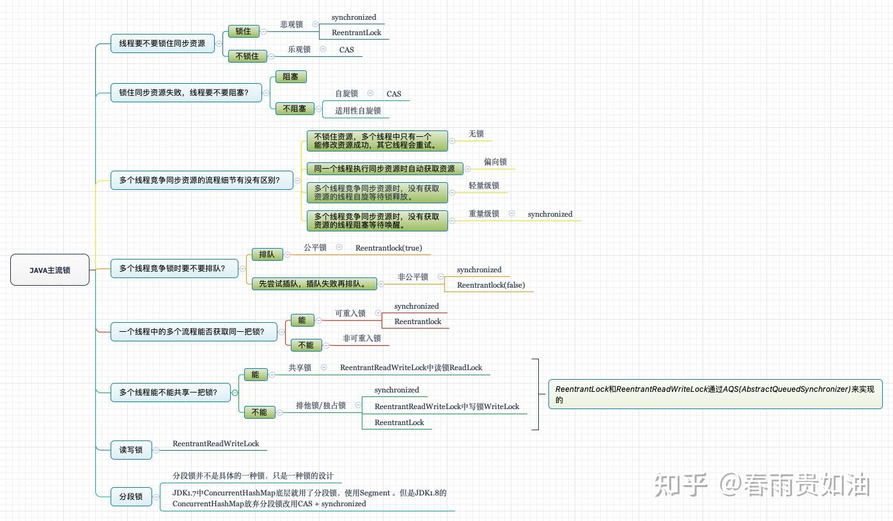
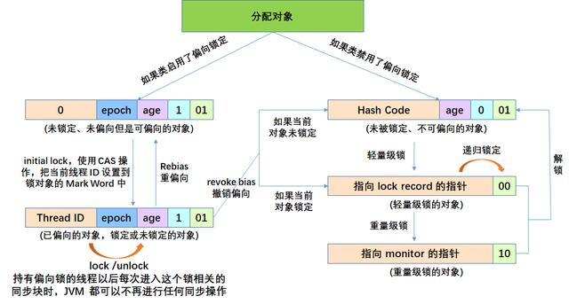

## 线程锁

## 问题分析
回答的重点是锁：JVM层面实现的锁Synchronized；java层面实现的锁Lock。

必须回答出来俩种锁的实现方式！

可以扩展点：Synchronized的锁升级过程、Lock锁的底层实现原理AQS。

### 回答的第一步(基本内容)：java线程的锁有哪些
JVM层面实现的锁Synchronized。

java层面实现的锁：基于AQS实现的各种Lock锁。

### 回答的第二步(基本内容)：Synchronized的锁机制
在对象的Markword中记录一个锁状态。

无锁，偏向锁，轻量级锁，重量级锁对应不同的锁状态。

### 回答的第三步(基本内容)：Lock锁机制（AQS）
AQS是管程在java中的实现。是JDK中大部分锁工具的核心实现框架。

AQS维护了一个state进行加锁释放锁操作：0标识无锁。通过CAS的方式获取到锁，state加一。state减到0的时候，变为无锁。

AQS内部维护了一个**同步等待队列**，他是一个双向链表，用来实现线程的排队。

AQS内部维护了多个条件队列，他是一个单向链表，用来实现线程的等待唤醒机制。

### 回答的第三步(扩展内容)：Synchronized锁升级

JVM默认有4秒的时间去开启偏向锁（延迟偏向）。

偏向锁撤销会变为无锁。

有轻微竞争会变为轻量级锁，比如俩个线程交替执行的时候。

大量竞争直接变为重量级锁，有线程等待的情况的时候。

轻量级锁一次CAS失败直接升级为重量级锁！

轻量级锁和重量级锁的解锁会直接变为无锁！

### 回答的第四步(扩展内容)：各种锁的实现原理
重入锁：同一个线程，state加一。

公平锁，非公平锁：非公平锁在进入同步队列的时候，会进行一次获取锁操作。

独占锁、互斥锁：state只能为1。

共享锁：state固定值，线程数达到这个值放行。

读写锁：维护了俩把锁，一把读锁，一把写锁。

自旋锁：循环直到获取到锁。

https://baijiahao.baidu.com/s?id=1724105860385298100&wfr=spider&for=pc

https://zhuanlan.zhihu.com/p/358618750