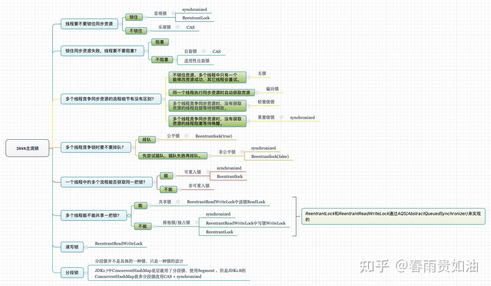
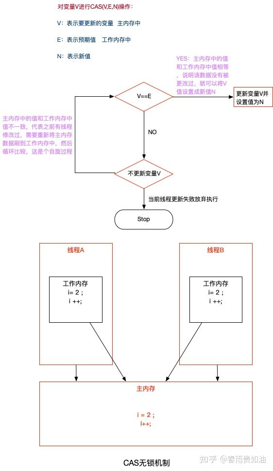
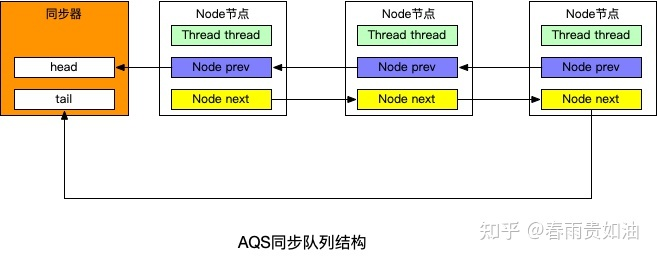

## 线程锁

## 乐观锁和悲观锁
* 1、悲观锁

（1）、概念：
  
对于同一个数据的并发操作，悲观锁认为自己在使用数据的时候一定有别的线程来修改数据，因此在获取数据的时候会先加锁，确保数据不会被别的线程修改

（2）、实现：synchronized

https://zhuanlan.zhihu.com/p/357347461

（3）、使用场景：

写操作多的场景，先加锁可以保证写操作时数据正确。

* 2、乐观锁

（1）、概念：

乐观锁认为自己在使用数据时不会有别的线程修改数据，所以不会添加锁，只是在更新数据的时候去判断之前有没有别的线程更新了这个数据。如果这个数据没有被更新，当前线程将自己修改的数据成功写入。如果数据已经被其他线程更新，则根据不同的实现方式执行不同的操作（例如报错或者自动重试）。

（2）、实现：

在Java中是通过使用无锁编程来实现，最常采用的是CAS算法，Java原子类中的递增操作就通过CAS自旋实现的。

（3）、使用场景

读操作多的场景，不加锁的特点能够使其读操作的性能大幅提升。

## 公平锁和非公平锁
* 1、公平锁

（1）、概念：

是指多个线程按照申请锁的顺序来获取锁，线程直接进入队列中排队，队列中的第一个线程才能获得锁。

（2）、优点：

公平锁的优点是等待锁的线程不会饿死。

（3）、缺点：

缺点是整体吞吐效率相对非公平锁要低，等待队列中除第一个线程以外的所有线程都会阻塞，CPU唤醒阻塞线程的开销比非公平锁大。

* 2、非公平锁

（1）、概念：

非公平锁是多个线程加锁时直接尝试获取锁，获取不到才会到等待队列的队尾等待。但如果此时锁刚好可用，那么这个线程可以无需阻塞直接获取到锁，所以有可能出现后申请锁的线程先获取锁的场景。

（2）、优点：

非公平锁的优点是可以减少唤起线程的开销，整体的吞吐效率高，因为线程有几率不阻塞直接获得锁，CPU不必唤醒所有线程。

（3）、缺点：

缺点是处于等待队列中的线程可能会饿死，或者等很久才会获得锁。

## 可重入锁和非可重入锁
可重入锁又名递归锁，是指在同一个线程在外层方法获取锁的时候，再进入该线程的内层方法会自动获取锁（前提锁对象得是同一个对象或者class），不会因为之前已经获取过还没释放而阻塞。Java中ReentrantLock和synchronized都是可重入锁，可重入锁的一个优点是可一定程度避免死锁。

## 共享锁和独占锁
独享锁是指该锁一次只能被一个线程所持有。共享锁是指该锁可被多个线程所持有。独享锁与共享锁也是通过AQS来实现的，通过实现不同的方法，来实现独享或者共享。

## （五）、锁升级（无锁-偏向锁-轻量级锁-重量级锁）
这四种锁是指锁的状态，专门针对synchronize，可参照之前的文章

https://zhuanlan.zhihu.com/p/357347461

## CAS算法
1、概念

CAS(compare and swap)比较和交换，是一种有名的无锁算法。无锁编程，即不使用锁的情况下实现多线程之间的变量同步，也就是在没有线程被阻塞的情况下实现变量的同步，所以也叫非阻塞同步（Non-blocking Synchronization）。

2、实现原理：

CAS算法涉及到三个操作数：

三个参数CAS(V,E,N)：V表示更新的变量，E表示预期值，N表示新值；
* 1、线程访问时，先会将主内存中的数据同步到线程的工作内存当中
* 2、假设线程A和线程B都有对数据进行更改，那么假如线程A先获取到执行权限
* 3、线程A先会对比工作内存当中的数据和主内存当中的数据是否一致，如果一致（V==E）则进行更新，不一致则刷新数据，重新循环判断
* 4、这时更新完毕后，线程B也要进行数据更新，主内存数据和工作内存数据做对比，如果一致则进行更新，不一致则将主内存数据重新更新到工作内存，然后循环再次对比两个内存中的数据直到一致为止。

3、缺点：

（1）、ABA问题

如果一个值原来是A，变成了B，又变成了A，那么使用CAS进行检查时会发现它的值没有发生变化，但是实际上却变化了。ABA问题的解决思路就是使用版本号。在变量前面追加上版本号，每次变量更新的时候把版本号加一，那么A－B－A 就会变成1A-2B－3A。从Java1.5开始JDK的atomic包里提供了一个类AtomicStampedReference来解决ABA问题。这个类的compareAndSet方法作用是首先检查当前引用是否等于预期引用，并且当前标志是否等于预期标志，如果全部相等，则以原子方式将该引用和该标志的值设置为给定的更新值。

（2）、循环时间长开销大。

自旋CAS（也就是不成功就一直循环执行直到成功）如果长时间不成功，会给CPU带来非常大的执行开销。

（3）、只能保证一个共享变量的原子操作

CAS 只对单个共享变量有效，当操作涉及跨多个共享变量时 CAS 无效。但是从 JDK 1.5开始，提供了AtomicReference类来保证引用对象之间的原子性，你可以把多个变量放在一个对象里来进行 CAS 操作.所以我们可以使用锁或者利用AtomicReference类把多个共享变量合并成一个共享变量来操作。

## 抽象队列同步器AQS(AbstractQueuedSynchronizer)
1、概念：

AQS 是一个集同步状态管理、线程阻塞、线程释放及队列管理功能与一身的同步框架。其核心思想是当多个线程竞争资源时会将未成功竞争到资源的线程构造为 Node 节点放置到一个双向 FIFO 队列中。被放入到该队列中的线程会保持阻塞直至被前驱节点唤醒。

## 重入锁ReentrantLock
1、概念

首先ReentrantLock是一个可重入锁，可重入简单来说就是“同一个线程对于已经获得到的锁，可以多次继续申请到该锁的使用权”。我们可以把锁看成就是“一把普通的锁”。而锁的基本特性有两个加锁和解锁。至于什么指纹解锁、人脸解锁、虹膜解锁啥的，其实也逃不出“加锁”、“解锁”，只不过是在这两个基本动作上做了一些个性化。

同样，ReentrantLock也是在锁的基础特性上加入了“可重入”，“公平”，“非公平”等特性。所以对ReentrantLock的理解也基于这几点进行展开。

2、ReentrantLock源码分析

从ReentrantLock的源码来看，实现了Lock接口。 Lock接口里面声明了锁的一些方法，具体实现在实现类里面。

**3、synchronized和ReentrantLock的区别**

（1）、底层实现

* synchronized 是JVM层面的锁，是Java关键字，通过monitor对象来完成（monitorenter与monitorexit），对象只有在同步块或同步方法中才能调用wait/notify方法。synchronized 的实现涉及到锁的升级，具体为无锁、偏向锁、自旋锁、向OS申请重量级锁;
* ReentrantLock 是从jdk1.5以来（java.util.concurrent.locks.Lock）提供的API层面的锁。 ReentrantLock实现则是通过利用CAS（CompareAndSwap）自旋机制保证线程操作的原子性和volatile保证数据可见性以实现锁的功能。

（2）、是否可手动释放

* synchronized 不需要用户去手动释放锁，synchronized 代码执行完后系统会自动让线程释放对锁的占用；
* ReentrantLock则需要用户去手动释放锁，如果没有手动释放锁，就可能导致死锁现象。一般通过lock()和unlock()方法配合try/finally语句块来完成，使用释放更加灵活。

（3）、是否可中断

* synchronized是不可中断类型的锁，除非加锁的代码中出现异常或正常执行完成；
* ReentrantLock则可以中断，可通过trylock(long timeout,TimeUnit unit)设置超时方法或者将lockInterruptibly()放到代码块中，调用interrupt方法进行中断。

（4）、是否公平锁

* synchronized为非公平锁
* ReentrantLock则即可以选公平锁也可以选非公平锁，通过构造方法new ReentrantLock时传入boolean值进行选择，为空默认false非公平锁，true为公平锁。

（5）、锁是否可绑定条件Condition

* synchronized不能绑定；
* ReentrantLock通过绑定Condition结合await()/singal()方法实现线程的精确唤醒，而不是像synchronized通过Object类的wait()/notify()/notifyAll()方法要么随机唤醒一个线程要么唤醒全部线程。

（6）、锁的对象

* synchronzied锁的是对象，锁是保存在对象头里面的，根据对象头数据来标识是否有线程获得锁/争抢锁；
* ReentrantLock锁的是线程，根据进入的线程和int类型的state标识锁的获得/争抢。

## 读写锁（ReentrantReadWriteLock）
1、概念

上面提到的synchronized关键字和ReentrantLock这些都是排它锁，即同一时刻只能有一个线程进行访问，而读写锁在同一时刻，可以允许多个读线程访问，但是在写线程访问时，读线程和写线程都会被阻塞。 读写锁维护一对锁，一个读锁（共享锁），一个写锁（排他锁），也就是多个读锁间不互斥，读锁和写锁互斥，写锁与写锁互斥，通过读写锁分离使得并发性相比于排它锁有了很大的提升。

读写锁存在的意义在于，一般情况下，读场景是远远大于写场景的。因此读大于写的场景下提供了比排它锁更高并发性和吞吐量。Java并发包中提供的读写锁实现就是 ReentrantReadWriteLock

https://zhuanlan.zhihu.com/p/358618750