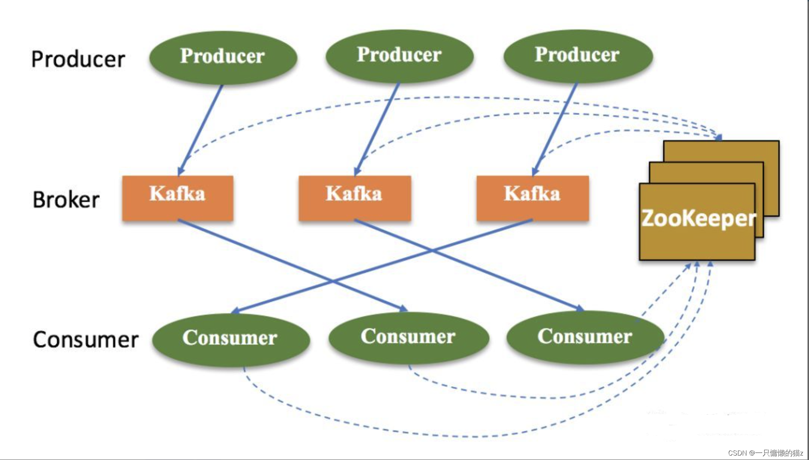

## 1 Kafka架构图

## 2 Zookeeper 在 kafka 中的具体作用
它是一个分布式协调框架。很好的将消息生产、消息存储、消息消费的过程结合在一起。在典型的Kafka集群中, Kafka通过Zookeeper管理集群配置，选举leader，以及在Consumer Group发生变化时进行rebalance。Producer使用push模式将消息发布到broker，Consumer使用pull模式从broker订阅并消费消息.

    Broker注册
    Topic注册
    生产者负载均衡
    消费者负载均衡
    分区与消费者的关系
    记录消息消费的进度Offset
    消费者注册

* 2.1 Broker注册

Broker是分布式部署并且相互之间相互独立，但是需要有一个注册中心对整个集群的Broker进行管理，此时就使用了Zookeeper。在Zookeeper上会有一个专门用来记录Broker服务器列表的节点：/brokers/ids

每个Broker在启动时，都会在Zookeeper上进行注册，即到/brokers/ids下创建属于自己的节点，如/brokers/ids/[0…N]。

Kafka使用了全局唯一的数字来指代每个Broker服务器，不同的Broker必须使用不同的Broker ID进行注册，创建完节点后，每个Broker就会将自己的IP地址和端口信息记录到该节点中去。其中，Broker创建的节点类型是临时节点，一旦Broker宕机，则对应的临时节点也会被自动删除。这样，我们就可以很方便的监控到Broker节点的变化，及时调整负载均衡等。

* 2.2 Topic注册

在kafka中，用户可以自定义多个topic，每个topic又被划分为多个分区，每个分区存储在一个独立的broker上。这些分区信息及与Broker的对应关系都是由Zookeeper进行维护。

在zookeeper中，建立专门的节点来记录这些信息，其节点路径为/brokers/topics/{topic_name}。并且topic创建的节点类型也是临时节点

* 2.3 生产者负载均衡

同一个Topic消息会被分区并将其分布在多个Broker上。由于每个Broker启动时，都会在Zookeeper上进行注册，生产者会通过该节点的变化来动态地感知到Broker服务器列表的变更，这样就可以实现动态的负载均衡。

* 2.4 消费者负载均衡

与生产者类似，Kafka中的消费者同样需要进行负载均衡来实现多个消费者合理地从对应的Broker服务器上接收消息，每个消费者分组包含若干消费者，每条消息都只会发送给分组中的一个消费者，不同的消费者分组消费自己特定的Topic下面的消息，互不干扰。
每个消费者都需要关注所属消费者分组中其他消费者服务器的变化情况，即对/consumers/[group_id]/ids节点注册子节点变化的Watcher监听，一旦发现消费者新增或减少，就触发消费者的负载均衡。还对Broker服务器变化注册监听。消费者需要对/broker/ids/[0-N]中的节点进行监听，如果发现Broker服务器列表发生变化，那么就根据具体情况来决定是否需要进行消费者负载均衡。

* 2.5 分区与消费者的关系

消费者组 Consumer group 下有多个 Consumer（消费者）。
对于每个消费者组 (Consumer Group)，Kafka都会为其分配一个全局唯一的Group ID，Group 内部的所有消费者共享该 ID。订阅的topic下的每个分区只能分配给某个 group 下的一个consumer(当然该分区还可以被分配给其他group)。同时，Kafka为每个消费者分配一个Consumer ID。
在Kafka中，规定了每个消息分区 只能被同组的一个消费者进行消费，因此，需要在 Zookeeper 上记录 消息分区 与 Consumer 之间的关系，每个消费者一旦确定了对一个消息分区的消费权力，需要将其Consumer ID 写入到 Zookeeper 对应消息分区的临时节点上，例如：
/consumers/[group_id]/owners/[topic]/[broker_id-partition_id]
其中，[broker_id-partition_id]就是一个 消息分区 的标识，节点内容就是该消息分区上消费者的Consumer ID。

* 2.6 记录消息消费的进度Offset

在消费者对指定消息分区进行消息消费的过程中，需要定时地将分区消息的消费进度Offset记录到Zookeeper上，以便在该消费者进行重启或者其他消费者重新接管该消息分区的消息消费后，能够从之前的进度开始继续进行消息消费。Offset在Zookeeper中由一个专门节点进行记录，其节点路径为:

/consumers/[group_id]/offsets/[topic]/[broker_id-partition_id]

节点内容就是Offset的值。

* 2.7 消费者注册

**注册新的消费者分组**

当新的消费者组注册到zookeeper中时，zookeeper会创建专用的节点来保存相关信息，其节点路径为 /consumers/{group_id}，其节点下有三个子节点，分别为[ids, owners, offsets]。

ids节点：记录该消费组中当前正在消费的消费者；

owners节点：记录该消费组消费的topic信息；

offsets节点：记录每个topic的每个分区的offset；

**注册新的消费者**

当新的消费者注册到zookeeper中时，会在/consumers/{group_id}/ids节点下创建临时子节点，并记录相关信息
