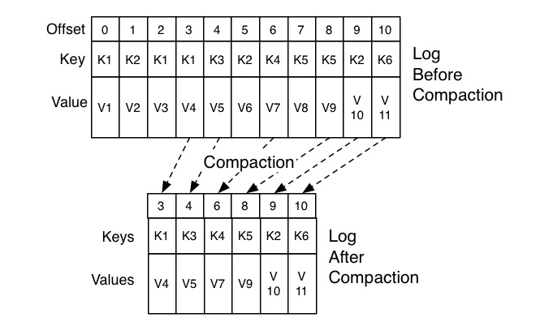

## 消费组
消费者组，即 Consumer Group，用一句话概括就是：Consumer Group 是 **Kafka 提供的可扩展且具有容错性的消费者机制**。既然是一个组，那么组内必然可以有多个消费者或消费者实例（Consumer Instance），
它们共享一个公共的 ID，这个 ID 被称为 Group ID。组内的所有消费者协调在一起来消费订阅主题（Subscribed Topics）的所有分区（Partition）。当然，每个分区只能由同一个消费者组内的一个 Consumer 实例来消费。

使用方式有如下两种：

     spring.kafka.consumer.group-id = allenGroup
     @KafkaListener(containerFactory = "ackSimpleFactory",groupId = "allenGroup1",topics = "qywx-ucm-externalUserMsg")

**Consumer Group 三个特性：**
* Consumer Group 下可以有一个或多个 Consumer 实例。这里的实例可以是一个单独的进程，也可以是同一进程下的线程。在实际场景中，使用进程更为常见一些。
* Group ID 是一个字符串，在一个 Kafka 集群中，它标识唯一的一个 Consumer Group。
* Consumer Group 下所有实例订阅的主题的单个分区，只能分配给组内的某个 Consumer 实例消费。这个分区当然也可以被其他的 Group 消费。

Kafka 仅仅使用 Consumer Group 这一种机制，却同时实现了传统消息引擎系统的两大模型：如果所有实例都属于同一个 Group，那么它实现的就是消息队列模型；如果所有实例分别属于不同的 Group，那么它实现的就是发布 / 订阅模型。

理想情况下，Consumer 实例的数量应该等于该 Group 订阅主题的分区总数。

老版本的 Consumer Group 把**位移保存在 ZooKeeper** 中。Apache ZooKeeper 是一个**分布式的协调服务框架**，Kafka 重度依赖它实现各种各样的协调管理。将位移保存在 ZooKeeper 外部系统的做法，
最显而易见的好处就是减少了 Kafka Broker 端的状态保存开销。现在比较流行的提法是将服务器节点做成无状态的，这样可以自由地扩缩容，实现超强的伸缩性。Kafka 最开始也是基于这样的考虑，
才将 Consumer Group 位移保存在独立于 Kafka 集群之外的框架中。

新版本的 Consumer Group 将位移保存在 Broker 端的内部主题中。

**Rebalance知识：**

Rebalance 本质上是一种协议，规定了一个 Consumer Group 下的所有 Consumer 如何达成一致，来分配订阅 Topic 的每个分区。

**影响Rebalance 的触发条件有：**
- 组成员数发生变更。比如有新的 Consumer 实例加入组或者离开组，抑或是有 Consumer 实例崩溃被“踢出”组。
- 订阅主题数发生变更。Consumer Group 可以使用正则表达式的方式订阅主题，比如 consumer.subscribe(Pattern.compile("t.*c")) 就表明该 Group 订阅所有以字母 t 开头、字母 c 结尾的主题。在 Consumer Group 的运行过程中，你新创建了一个满足这样条件的主题，那么该 Group 就会发生 Rebalance。
- 订阅主题的分区数发生变更。Kafka 当前只能允许增加一个主题的分区数。当分区数增加时，就会触发订阅该主题的所有 Group 开启 Rebalance。

在 Rebalance 过程中，**所有 Consumer 实例都会停止消费**，等待 Rebalance 完成。

### 关于Rebalance原理及方案
所谓协调者，在 Kafka 中对应的术语是 Coordinator，它专门为 Consumer Group 服务，负责为 Group 执行 Rebalance 以及提供位移管理和组成员管理等。

具体来讲，Consumer 端应用程序在提交位移时，其实是向 Coordinator 所在的 Broker 提交位移。同样地，当 Consumer 应用启动时，也是向 Coordinator 所在的 Broker 发送各种请求，然后由 Coordinator 负责执行消费者组的注册、成员管理记录等元数据管理操作。

Kafka 为某个 Consumer Group 确定 Coordinator 所在的 Broker 的算法有 2 个步骤。
- 第 1 步：确定由位移主题的哪个分区来保存该 Group 数据：

    partitionId=Math.abs(groupId.hashCode() % offsetsTopicPartitionCount)。
- 第 2 步：找出该分区 Leader 副本所在的 Broker，该 Broker 即为对应的 Coordinator。

Rebalance 的弊端有以下 3 点：
- Rebalance 影响 Consumer 端 TPS。这个之前也反复提到了，这里就不再具体讲了。总之就是，在 Rebalance 期间，Consumer 会停下手头的事情，什么也干不了。
- Rebalance 很慢。如果你的 Group 下成员很多，就一定会有这样的痛点。还记得我曾经举过的那个国外用户的例子吧？他的 Group 下有几百个 Consumer 实例，Rebalance 一次要几个小时。在那种场景下，Consumer Group 的 Rebalance 已经完全失控了。
- Rebalance 效率不高。当前 Kafka 的设计机制决定了每次 Rebalance 时，Group 下的所有成员都要参与进来，而且通常不会考虑局部性原理，但局部性原理对提升系统性能是特别重要的。关于第 3 点，我们

Rebalance解决方案：
- 1、订阅主题数量发生变化与订阅主题的分区数发生变化，通常都是运维的主动操作，所以它们引发的 Rebalance 大都是不可避免的。
- 2、组成员数量发生变化，对于有计划增加消费实例的，不属于要规避那类。以下是关于Group下实例减少的情况。

**实例减少产生Rebalance的过程：** 当 Consumer Group 完成 Rebalance 之后，每个 Consumer 实例都会定期地向 Coordinator 发送心跳请求，表明它还存活着。如果某个 Consumer 实例不能及时地发送这些心跳请求，Coordinator 就会认为该 Consumer 已经“死”了，从而将其从 Group 中移除，然后开启新一轮 Rebalance。
Consumer 端有个参数，叫 **session.timeout.ms**，就是被用来表征此事的。该参数的默认值是 10 秒，即如果 Coordinator 在 10 秒之内没有收到 Group 下某 Consumer 实例的心跳，它就会认为这个 Consumer 实例已经挂了。可以这么说，**session.timeout.ms 决定了 Consumer 存活性的时间间隔。**

Consumer 还提供了一个允许你控制发送心跳请求频率的参数，就是 **heartbeat.interval.ms**。这个值设置得越小，Consumer 实例发送心跳请求的频率就越高。频繁地发送心跳请求会额外消耗带宽资源，但好处是能够更加快速地知晓当前是否开启 Rebalance，因为，目前 Coordinator 通知各个 Consumer 实例开启 Rebalance 的方法，就是将 REBALANCE_NEEDED 标志封装进心跳请求的响应体中。

Consumer 端还有一个参数，用于控制 Consumer 实际消费能力对 Rebalance 的影响，即 max.poll.interval.ms 参数。它限定了 Consumer 端应用程序两次调用 poll 方法的最大时间间隔。它的默认值是 5 分钟，表示你的 Consumer 程序如果在 5 分钟之内无法消费完 poll 方法返回的消息，那么 Consumer 会主动发起“离开组”的请求，Coordinator 也会开启新一轮 Rebalance。

解决方案：
- 第一类非必要 Rebalance 是因为未能及时发送心跳，导致 Consumer 被“踢出”Group 而引发的。因此，你需要仔细地设置 session.timeout.ms 和 heartbeat.interval.ms 的值。

    设置 session.timeout.ms = 6s。
    设置 heartbeat.interval.ms = 2s。
    要保证 Consumer 实例在被判定为“dead”之前，能够发送至少 3 轮的心跳请求，即 session.timeout.ms >= 3 * heartbeat.interval.ms。
- 第二类非必要 Rebalance 是 Consumer 消费时间过长导致的。max.poll.interval.ms 参数值的设置显得尤为关键，如 max.poll.interval.ms = 7min ,消费过程消耗 8 min，产生还没消费完就Rebalance了。应设置为max.poll.interval.ms = 9min。总之，你要为你的业务处理逻辑留下充足的时间。这样，Consumer 就不会因为处理这些消息的时间太长而引发 Rebalance 了。
- 排查一下 Consumer 端的 GC 表现，比如是否出现了频繁的 Full GC 导致的长时间停顿，从而引发了 Rebalance。

## 内部主题
新版本 Consumer 的位移管理机制其实也很简单，就是将 Consumer 的位移数据作为一条条普通的 Kafka 消息，提交到 __consumer_offsets 中。可以这么说，__consumer_offsets 的主要作用是保存 Kafka 消费者的位移信息。

位移主题是一个普通的 Kafka 主题，但它的消息格式却是 Kafka 自己定义的，用户不能修改。

位移主题的 Key 中应该保存 3 部分内容：<Group ID，主题名，分区号 >。

tombstone 消息，即墓碑消息，也称 delete mark。用于删除 Group 过期位移甚至是删除 Group 的消息。一旦某个 Consumer Group 下的所有 Consumer 实例都停止了，而且它们的位移数据都已被删除时，Kafka 会向位移主题的对应分区写入 tombstone 消息，表明要彻底删除这个 Group 的信息。

通常来说，当 Kafka 集群中的第一个 Consumer 程序启动时，Kafka 会自动创建位移主题。

总结一下，如果位移主题是 Kafka 自动创建的，那么该主题的分区数是 50，副本数是 3。如下默认设置

      Broker 端参数 offsets.topic.num.partitions = 50
      Broker 端另一个参数 offsets.topic.replication.factor = 3

目前 Kafka Consumer 提交位移的方式有两种：**自动提交位移和手动提交位移**。

- 自动提交位移：Consumer 端有个参数叫 enable.auto.commit，如果值是 true，则 Consumer 在后台默默地为你定期提交位移，提交间隔由一个专属的参数 auto.commit.interval.ms 来控制。
- 手动提交位移，即设置 enable.auto.commit = false。一旦设置了 false，作为 Consumer 应用开发的你就要承担起位移提交的责任。Kafka Consumer API 为你提供了位移提交的方法，如 consumer.commitSync 等。当调用这些方法时，Kafka 会向位移主题写入相应的消息。

**Kafka 是怎么删除位移主题中的过期消息：**

答案就是 Compaction，Kafka 使用 Compact 策略来删除位移主题中的过期消息，避免该主题无限期膨胀。Compact 的过程就是扫描日志的所有消息，剔除那些过期的消息，然后把剩下的消息整理在一起。

**Kafka 提供了专门的后台线程定期地巡检待 Compact 的主题，看看是否存在满足条件的可删除数据**。这个后台线程叫 Log Cleaner。很多实际生产环境中都出现过位移主题无限膨胀占用过多磁盘空间的问题，如果你的环境中也有这个问题，我建议你去检查一下 Log Cleaner 线程的状态，通常都是这个线程挂掉了导致的。

