## Kafka副本机制
所谓的副本机制（Replication），也可以称之为备份机制，通常是指分布式系统在多台网络互联的机器上保存有相同的数据拷贝。有以下好处：
- **提供数据冗余**。即使系统部分组件失效，系统依然能够继续运转，因而增加了整体可用性以及数据持久性。
- **提供高伸缩性**。支持横向扩展，能够通过增加机器的方式来提升读性能，进而提高读操作吞吐量。
- **改善数据局部性**。允许将数据放入与用户地理位置相近的地方，从而降低系统延时。

对于 Apache Kafka 而言，目前只能享受到副本机制带来的第 1 个好处，也就是提供数据冗余实现高可用性和高持久性。

Kafka 是有主题概念的，而每个主题又进一步划分成若干个分区。副本的概念实际上是在**分区层级**下定义的，每个分区配置有若干个副本。

所谓副本（Replica），**本质就是一个只能追加写消息的提交日志。** 根据 Kafka 副本机制的定义，同一个分区下的所有副本保存有相同的消息序列，这些副本分散保存在不同的 Broker 上，从而能够对抗部分 Broker 宕机带来的数据不可用。

基于领导者的副本机制的工作原理如下图：

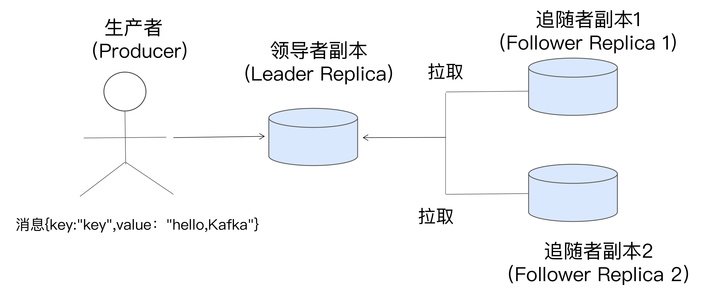

第一，在 Kafka 中，副本分成两类：领导者副本（Leader Replica）和追随者副本（Follower Replica）。每个分区在创建时都要选举一个副本，称为领导者副本，其余的副本自动称为追随者副本。

第二，Kafka 的副本机制比其他分布式系统要更严格一些。在 Kafka 中，**追随者副本是不对外提供服务的**。这就是说，任何一个追随者副本都不能响应消费者和生产者的读写请求。所有的请求都必须由领导者副本来处理，或者说，所有的读写请求都必须发往领导者副本所在的 Broker，由该 Broker 负责处理。追随者副本不处理客户端请求，它唯一的任务就是从领导者副本异步拉取消息，并写入到自己的提交日志中，从而实现与领导者副本的同步。

第三，当领导者副本挂掉了，或者说领导者副本所在的 Broker 宕机时，Kafka 依托于 ZooKeeper 提供的监控功能能够实时感知到，并立即开启新一轮的领导者选举，从追随者副本中选一个作为新的领导者。老 Leader 副本重启回来后，只能作为追随者副本加入到集群中。

这种副本机制有两个方面的好处：
- 1.方便实现“Read-your-writes”。当你使用生产者 API 向 Kafka 成功写入消息后，马上使用消费者 API 去读取刚才生产的消息。
- 2.方便实现单调读（Monotonic Reads）。就是对于一个消费者用户而言，在多次消费消息时，它不会看到某条消息一会儿存在一会儿不存在。

* In-sync Replicas（ISR）：

Kafka 引入了 In-sync Replicas，也就是所谓的 ISR 副本集合。ISR 中的副本都是与 Leader 同步的副本，相反，不在 ISR 中的追随者副本就被认为是与 Leader 不同步的。

**ISR 不只是追随者副本集合，它必然包括 Leader 副本。甚至在某些情况下，ISR 只有 Leader 这一个副本。**

这个标准就是 Broker 端参数 **replica.lag.time.max.ms** 参数值。这个参数的含义是 Follower 副本能够落后 Leader 副本的**最长时间间隔**，当前默认值是 10 秒。这就是说，只要一个 Follower 副本落后 Leader 副本的时间不连续超过 10 秒，那么 Kafka 就认为该 Follower 副本与 Leader 是同步的，即使此时 Follower 副本中保存的消息明显少于 Leader 副本中的消息。

如果这个同步过程的速度持续慢于 Leader 副本的消息写入速度，那么在 replica.lag.time.max.ms 时间后，此 Follower 副本就会被认为是与 Leader 副本不同步的，因此不能再放入 ISR 中。

**ISR 是一个动态调整的集合，而非静态不变的。**

*  Unclean 领导者选举（Unclean Leader Election）
**Kafka 把所有不在 ISR 中的存活副本都称为非同步副本**。通常来说，非同步副本落后 Leader 太多，因此，如果选择这些副本作为新 Leader，就可能出现数据的丢失。毕竟，这些副本中保存的消息远远落后于老 Leader 中的消息。在 Kafka 中，选举这种副本的过程称为 Unclean 领导者选举。Broker 端参数 **unclean.leader.election.enable** 控制是否允许 Unclean 领导者选举。

开启 Unclean 领导者选举可能会造成数据丢失，但好处是，它使得分区 Leader 副本一直存在，不至于停止对外提供服务，因此提升了**高可用性**。反之，禁止 Unclean 领导者选举的好处在于维护了**数据的一致性**，避免了消息丢失，但牺牲了高可用性。

关于是否开启 Unclean 领导者选举，建议你**不要开启**它，毕竟我们还可以通过其他的方式来提升高可用性。

## Kafka 请求是怎么被处理的
Apache Kafka 自己定义了一组请求协议，用于实现各种各样的交互操作。比如常见的 PRODUCE 请求是用于生产消息的，FETCH 请求是用于消费消息的，METADATA 请求是用于请求 Kafka 集群元数据信息的。

Kafka 共定义了多达 45 种请求格式。所有的请求都是通过 TCP 网络以 Socket 的方式进行通讯的。

Kafka 使用的是 **Reactor 模式**。

Reactor 模式是事件驱动架构的一种实现方式，特别适合应用于处理多个客户端并发向服务器端发送请求的场景。

Reactor 模式的架构如下图：

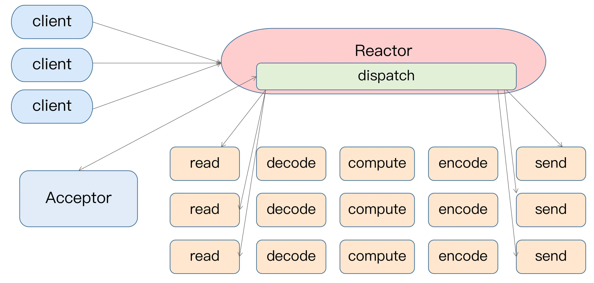

从这张图中，我们可以发现，多个客户端会发送请求给到 Reactor。Reactor 有个请求分发线程 Dispatcher，也就是图中的 Acceptor，它会将不同的请求下发到多个工作线程中处理。

Kafka 请求模式的架构图：

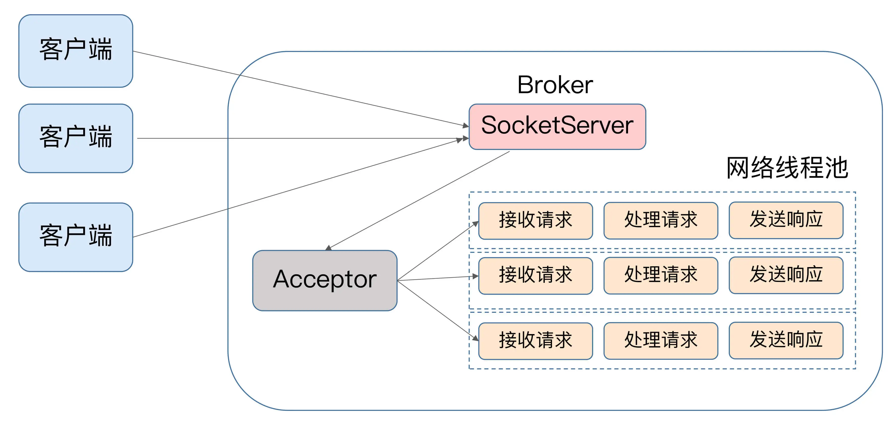

Kafka 的 Broker 端有个 SocketServer 组件，类似于 Reactor 模式中的 Dispatcher，它也有对应的 Acceptor 线程和一个工作线程池，只不过在 Kafka 中，这个工作线程池有个专属的名字，叫**网络线程池**。Kafka 提供了 Broker 端参数 **num.network.threads**，用于调整该网络线程池的线程数。其默认值是 3，**表示每台 Broker 启动时会创建 3 个网络线程，专门处理客户端发送的请求。**

实际上，Kafka 在这个环节又做了一层异步线程池的处理，我们一起来看一看下面这张图:

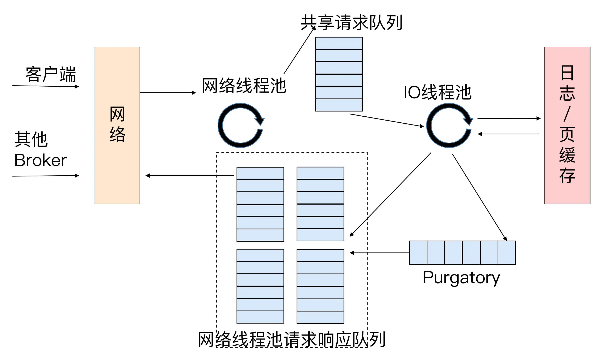

当网络线程拿到请求后，它不是自己处理，而是将请求放入到一个共享请求队列中。Broker 端还有个 IO 线程池，负责从该队列中取出请求，执行真正的处理。如果是 PRODUCE 生产请求，则将消息写入到底层的磁盘日志中；如果是 FETCH 请求，则从磁盘或页缓存中读取消息。

IO 线程池处中的线程才是执行请求逻辑的线程。Broker 端参数 **num.io.threads** 控制了这个线程池中的线程数。目前该参数**默认值是 8，表示每台 Broker 启动后自动创建 8 个 IO 线程处理请求。**

**请求队列是所有网络线程共享的，而响应队列则是每个网络线程专属的.** 这么设计的原因就在于，Dispatcher 只是用于请求分发而不负责响应回传，因此只能让每个网络线程自己发送 Response 给客户端，所以这些 Response 也就没必要放在一个公共的地方。

Purgatory 的组件，这是 Kafka 中著名的“炼狱”组件。**它是用来缓存延时请求（Delayed Request）的。所谓延时请求，就是那些一时未满足条件不能立刻处理的请求。**

Kafka 社区把 PRODUCE 和 FETCH 这类请求称为数据类请求，把 LeaderAndIsr、StopReplica 这类请求称为控制类请求。**控制类请求有这样一种能力：它可以直接令数据类请求失效！**

## 消费者组重平衡全流程解析
消费者组的重平衡流程，它的作用是让组内所有的消费者实例就消费哪些主题分区达成一致。重平衡需要借助 Kafka Broker 端的 Coordinator 组件，在 Coordinator 的帮助下完成整个消费者组的分区重分配。

Kafka Java **消费者需要定期地发送心跳请求（Heartbeat Request）到 Broker 端的协调者，以表明它还存活着。** 

在 Kafka 0.10.1.0 版本之前，发送心跳请求是在消费者主线程完成的，也就是你写代码调用 KafkaConsumer.poll 方法的那个线程。这样做有诸多弊病，最大的问题在于，消息处理逻辑也是在这个线程中完成的。因此，一旦消息处理消耗了过长的时间，心跳请求将无法及时发到协调者那里，导致协调者“错误地”认为该消费者已“死”。

重平衡的通知机制正是通过**心跳线程**来完成的。当协调者决定开启新一轮重平衡后，它会将“**REBALANCE_IN_PROGRESS**”封装进心跳请求的响应中，发还给消费者实例。当消费者实例发现心跳响应中包含了“REBALANCE_IN_PROGRESS”，就能立马知道重平衡又开始了，这就是重平衡的通知机制。

### 消费者组状态机
Kafka 为消费者组定义了 5 种状态，它们分别是：**Empty、Dead、PreparingRebalance、CompletingRebalance 和 Stable。**

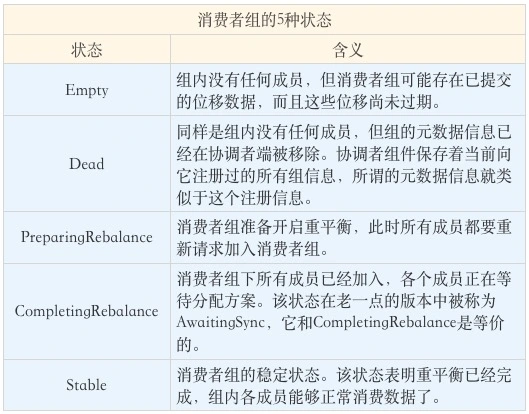

**状态机的各个状态流转:**

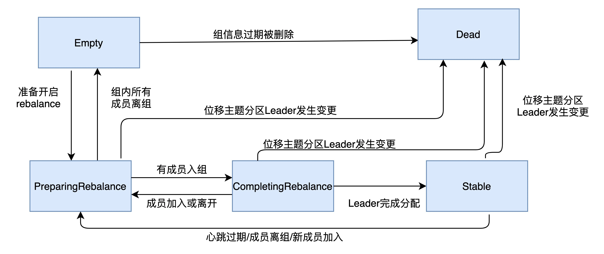

一个消费者组最开始是 Empty 状态，当重平衡过程开启后，它会被置于 PreparingRebalance 状态等待成员加入，之后变更到 CompletingRebalance 状态等待分配方案，最后流转到 Stable 状态完成重平衡。

当有新成员加入或已有成员退出时，消费者组的状态从 Stable 直接跳到 PreparingRebalance 状态，此时，所有现存成员就必须重新申请加入组。当所有成员都退出组后，消费者组状态变更为 Empty。**Kafka 定期自动删除过期位移的条件就是，组要处于 Empty 状态。因此，如果你的消费者组停掉了很长时间（超过 7 天），那么 Kafka 很可能就把该组的位移数据删除了。**

### 消费者端重平衡流程
重平衡的完整流程需要消费者端和协调者组件共同参与才能完成。

在消费者端，重平衡分为两个步骤：**分别是加入组和等待领导者消费者（Leader Consumer）分配方案**。这两个步骤分别对应两类特定的请求：**JoinGroup 请求和 SyncGroup 请求。**

当组内成员加入组时，它会向协调者发送 JoinGroup 请求。在该请求中，每个成员都要将自己订阅的主题上报，这样协调者就能收集到所有成员的订阅信息。**一旦收集了全部成员的 JoinGroup 请求后，协调者会从这些成员中选择一个担任这个消费者组的领导者。**

通常情况下，第一个发送 JoinGroup 请求的成员自动成为领导者。这里的领导者是**具体的消费者实例**，它既不是副本，也不是协调者。**领导者消费者的任务是收集所有成员的订阅信息，然后根据这些信息，制定具体的分区消费分配方案。**

选出领导者之后，**协调者会把消费者组订阅信息封装进 JoinGroup 请求的响应体中**，然后发给领导者，由领导者统一做出分配方案后，进入到下一步：**发送 SyncGroup 请求。**

在这一步中，领导者向协调者发送 SyncGroup 请求，将刚刚做出的分配方案发给协调者。值得注意的是，**其他成员也会向协调者发送 SyncGroup 请求，只不过请求体中并没有实际的内容**。这一步的主要目的是**让协调者接收分配方案**，然后统一以 SyncGroup 响应的方式分发给所有成员，这样组内所有成员就都知道自己该消费哪些分区了。

**JoinGroup 请求的处理过程：**

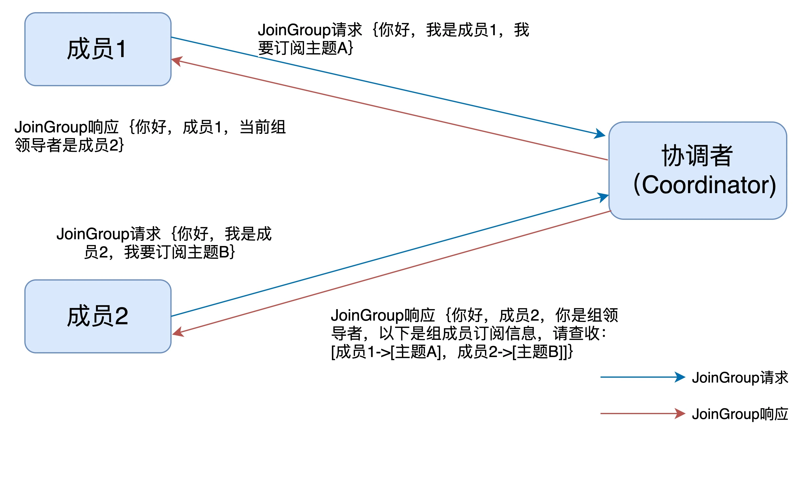

JoinGroup 请求的主要作用是**将组成员订阅信息发送给领导者消费者**，待领导者制定好分配方案后，重平衡流程进入到 SyncGroup 请求阶段。

**SyncGroup 请求的处理流程:**

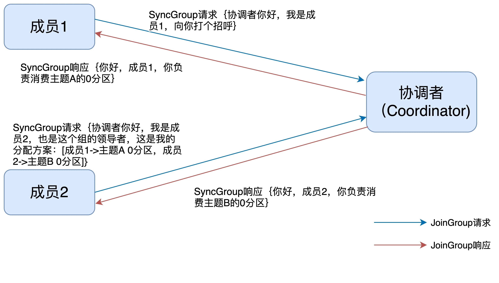

SyncGroup 请求的主要目的，**就是让协调者把领导者制定的分配方案下发给各个组内成员**。当所有成员都成功接收到分配方案后，消费者组进入到 Stable 状态，即开始正常的消费工作。

### Broker 端重平衡场景剖析
- 场景一：新成员入组。

新成员入组是指组处于 Stable 状态后，有新成员加入。当协调者收到新的 JoinGroup 请求后，它会通过心跳请求响应的方式通知组内现有的所有成员，强制它们开启新一轮的重平衡。具体的过程和之前的客户端重平衡流程是一样的。现在，我用一张时序图来说明协调者一端是如何处理新成员入组的。

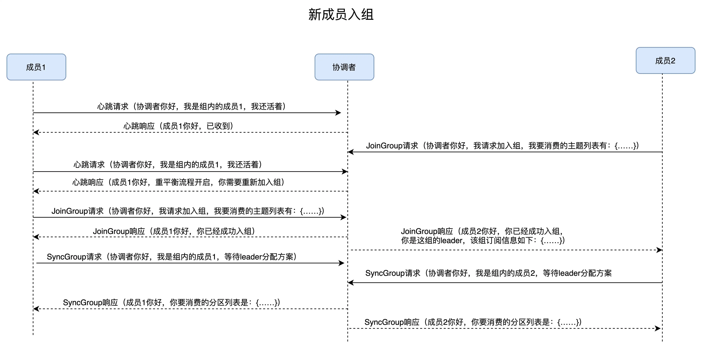

- 场景二：组成员主动离组。

何谓主动离组？就是指消费者实例所在线程或进程调用 close() 方法主动通知协调者它要退出。这个场景就涉及到了第三类请求：**LeaveGroup 请求**。协调者收到 LeaveGroup 请求后，依然会以心跳响应的方式通知其他成员，

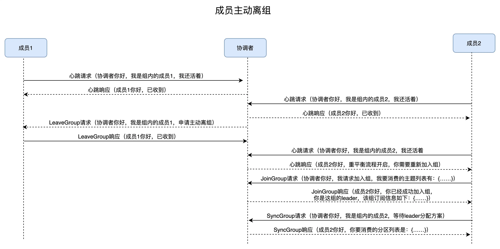

- 场景三：组成员崩溃离组。

**崩溃离组是指消费者实例出现严重故障，突然宕机导致的离组。** 它和主动离组是有区别的，因为后者是主动发起的离组，协调者能马上感知并处理。但崩溃离组是被动的，协调者通常需要等待一段时间才能感知到，这段时间一般是由消费者端参数 session.timeout.ms 控制的。也就是说，Kafka 一般不会超过 session.timeout.ms 就能感知到这个崩溃。

- 场景四：重平衡时协调者对组内成员提交位移的处理。

正常情况下，**每个组内成员都会定期汇报位移给协调者**。当重平衡开启时，协调者会给予成员一段缓冲时间，要求每个成员必须在这段时间内快速地上报自己的位移信息，然后再开启正常的 JoinGroup/SyncGroup 请求发送。

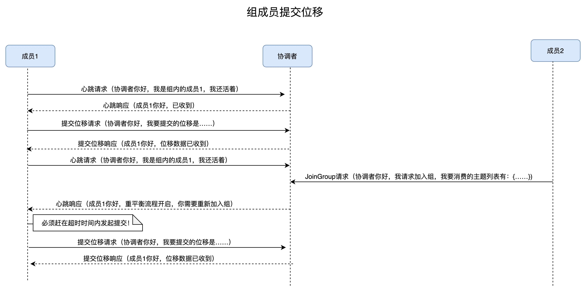

## Kafka控制器
控制器组件（Controller），是 Apache Kafka 的核心组件。它的主要作用是在 Apache ZooKeeper 的帮助下管理和协调整个 Kafka 集群。

集群中任意一台 Broker 都能充当控制器的角色，但是，在运行过程中，只能有一个 Broker 成为控制器，行使其管理和协调的职责。

activeController 的 JMX 指标，可以帮助我们实时监控控制器的存活状态。

Broker 在启动时，会尝试去 ZooKeeper 中创建 /controller 节点。Kafka 当前选举控制器的规则是：**第一个成功创建 /controller 节点的 Broker 会被指定为控制器。**

**控制器是起协调作用的组件，包含以下职责：**
- 1.主题管理（创建、删除、增加分区）

这里的主题管理，就是指控制器帮助我们完成对 Kafka 主题的创建、删除以及分区增加的操作。换句话说，当我们执行 **kafka-topics 脚本**时，大部分的后台工作都是控制器来完成的。

- 2.分区重分配

分区重分配主要是指，**kafka-reassign-partitions 脚本** 提供的对已有主题分区进行细粒度的分配功能。这部分功能也是控制器实现的。

- 3.Preferred 领导者选举

Preferred 领导者选举主要是 Kafka 为了避免部分 Broker 负载过重而提供的一种换 Leader 的方案。

- 4.集群成员管理（新增 Broker、Broker 主动关闭、Broker 宕机）

这是控制器提供的第 4 类功能，包括自动检测新增 Broker、Broker 主动关闭及被动宕机。这种自动检测是依赖于前面提到的 Watch 功能和 ZooKeeper 临时节点组合实现的。

比如，控制器组件会利用 Watch 机制检查 ZooKeeper 的 /brokers/ids 节点下的子节点数量变更。目前，当有新 Broker 启动后，它会在 /brokers 下创建专属的 znode 节点。一旦创建完毕，ZooKeeper 会通过 **Watch 机制**将消息通知推送给控制器，这样，控制器就能自动地感知到这个变化，进而开启后续的新增 Broker 作业。

侦测 Broker 存活性则是依赖于刚刚提到的另一个机制：**临时节点**。每个 Broker 启动后，会在 /brokers/ids 下创建一个临时 znode。当 Broker 宕机或主动关闭后，该 Broker 与 ZooKeeper 的会话结束，这个 znode 会被自动删除。同理，ZooKeeper 的 Watch 机制将这一变更推送给控制器，这样控制器就能知道有 Broker 关闭或宕机了，从而进行“善后”。

- 5.数据服务

控制器的最后一大类工作，就是向其他 Broker 提供数据服务。控制器上保存了最全的集群元数据信息，其他所有 Broker 会定期接收控制器发来的元数据更新请求，从而更新其内存中的缓存数据。

**控制器中到底保存了哪些数据：**

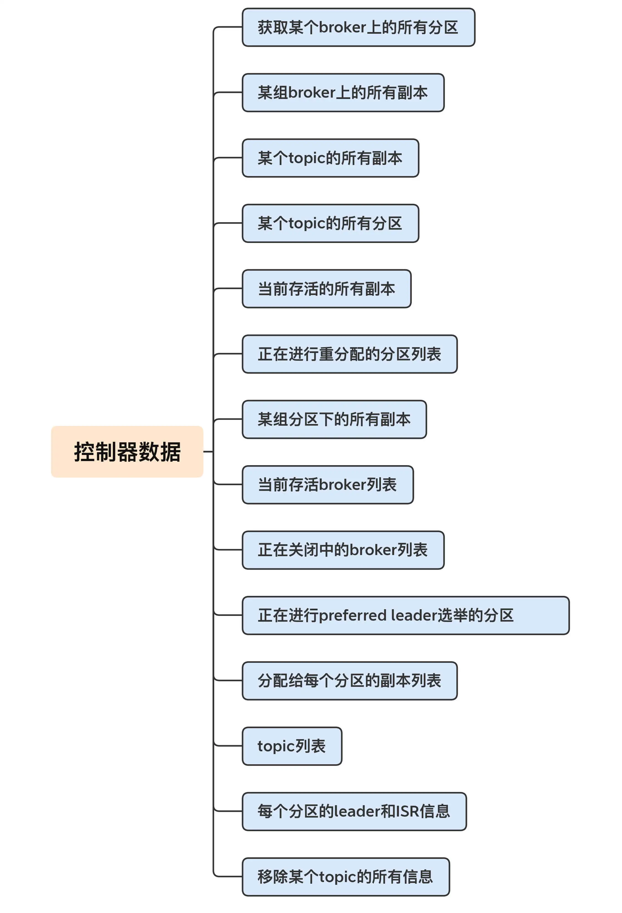

**比较重要的数据有：**
* 所有主题信息。包括具体的分区信息，比如领导者副本是谁，ISR 集合中有哪些副本等。
* 所有 Broker 信息。包括当前都有哪些运行中的 Broker，哪些正在关闭中的 Broker 等。
* 所有涉及运维任务的分区。包括当前正在进行 Preferred 领导者选举以及分区重分配的分区列表。

### 控制器故障转移（Failover）
故障转移指的是，当运行中的控制器突然宕机或意外终止时，Kafka 能够快速地感知到，并立即**启用备用控制器**来代替之前失败的控制器。这个过程就被称为 Failover，该过程是自动完成的，无需你手动干预。

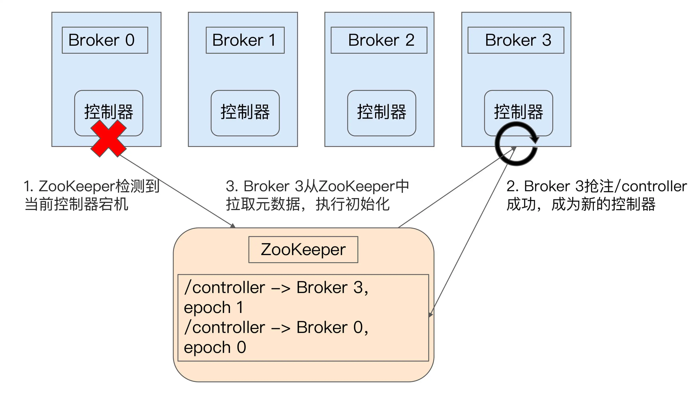

最开始时，Broker 0 是控制器。当 Broker 0 宕机后，ZooKeeper 通过 Watch 机制感知到并删除了 /controller 临时节点。之后，所有存活的 Broker 开始竞选新的控制器身份。Broker 3 最终赢得了选举，成功地在 ZooKeeper 上重建了 /controller 节点。之后，Broker 3 会从 ZooKeeper 中读取集群元数据信息，并初始化到自己的缓存中。至此，控制器的 Failover 完成，可以行使正常的工作职责了。

## 高水位和Leader Epoch
### 高水位的作用
在 Kafka 中，高水位的作用主要有 2 个。
* 定义消息可见性，即用来标识分区下的哪些消息是可以被消费者消费的。
* 帮助 Kafka 完成副本同步。

下面这张图展示了多个与高水位相关的 Kafka 术语:

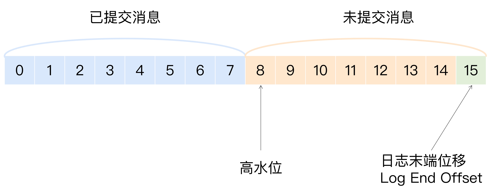

我们假设这是某个分区 Leader 副本的高水位图。首先，请你注意图中的“已提交消息”和“未提交消息”。现在，我借用高水位再次强调一下。在分区高水位以下的消息被认为是**已提交消息**，
反之就是**未提交消息**。消费者只能消费已提交消息，即图中位移小于 8 的所有消息。

**注意，** 这里我们不讨论 Kafka 事务，因为事务机制会影响消费者所能看到的消息的范围，它不只是简单依赖高水位来判断。它依靠一个名为 LSO（Log Stable Offset）的位移值来判断事务型消费者的可见性。

另外，需要关注的是，**位移值等于高水位的消息也属于未提交消息。也就是说，高水位上的消息是不能被消费者消费的。**

图中还有一个**日志末端位移**的概念，即 Log End Offset，简写是 **LEO**。它表示副本写入下一条消息的位移值。注意，数字 15 所在的方框是虚线，这就说明，这个副本当前只有 15 条消息，
位移值是从 0 到 14，下一条新消息的位移是 15。显然，介于高水位和 LEO 之间的消息就属于未提交消息。这也从侧面告诉了我们一个重要的事实，那就是：**同一个副本对象，其高水位值不会大于 LEO 值。**

**高水位和 LEO 是副本对象的两个重要属性**。Kafka 所有副本都有对应的高水位和 LEO 值，而不仅仅是 Leader 副本。只不过 Leader 副本比较特殊，Kafka 使用 Leader 副本的高水位来定义所在分区的高水位。换句话说，**分区的高水位就是其 Leader 副本的高水位。**

### 高水位更新机制
现在，我们知道了每个副本对象都保存了一组高水位值和 LEO 值，但实际上，在 Leader 副本所在的 Broker 上，还保存了其他 Follower 副本的 LEO 值。我们一起来看看下面这张图。

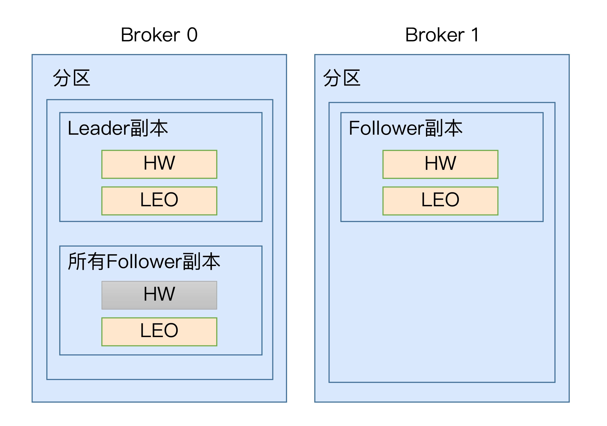

在这张图中，我们可以看到，Broker 0 上保存了某分区的 Leader 副本和所有 Follower 副本的 LEO 值，而 Broker 1 上仅仅保存了该分区的某个 Follower 副本。
Kafka 把 Broker 0 上保存的这些 Follower 副本又称为**远程副本（Remote Replica）**。Kafka 副本机制在运行过程中，会更新 Broker 1 上 Follower 副本的高水位和 LEO 值，
同时也会更新 Broker 0 上 Leader 副本的高水位和 LEO 以及所有远程副本的 LEO，**但它不会更新远程副本的高水位值**，也就是我在图中标记为灰色的部分。

为什么要在 Broker 0 上保存这些远程副本呢？其实，它们的主要作用是，**帮助 Leader 副本确定其高水位，也就是分区高水位。**

**更新机制:**

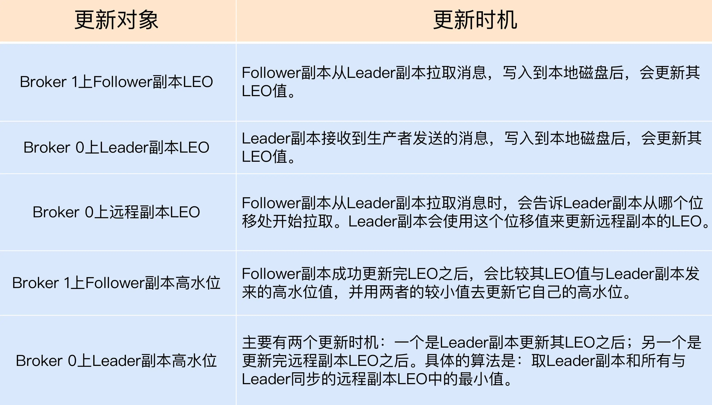

在这里，我稍微解释一下，什么叫与 **Leader 副本保持同步**。判断的条件有两个。
* 该远程 Follower 副本在 ISR 中。
* 该远程 Follower 副本 LEO 值落后于 Leader 副本 LEO 值的时间，不超过 Broker 端参数 replica.lag.time.max.ms 的值。如果使用默认值的话，就是不超过 10 秒。

这两个条件好像是一回事，因为目前某个副本能否进入 ISR 就是靠第 2 个条件判断的。但有些时候，会发生这样的情况：即 Follower 副本已经“追上”了 Leader 的进度，却不在 ISR 中，
比如某个刚刚重启回来的副本。如果 Kafka 只判断第 1 个条件的话，就可能出现某些副本具备了“进入 ISR”的资格，但却尚未进入到 ISR 中的情况。此时，分区高水位值就可能超过 ISR 中副本 LEO，
而高水位 > LEO 的情形是不被允许的。

### Leader 副本
处理生产者请求的逻辑如下：
* 1、写入消息到本地磁盘。
* 2、更新分区高水位值。

  i. 获取 Leader 副本所在 Broker 端保存的所有远程副本 LEO 值（LEO-1，LEO-2，……，LEO-n）。

  ii. 获取 Leader 副本高水位值：currentHW。

  iii. 更新 currentHW = max{currentHW, min（LEO-1, LEO-2, ……，LEO-n）}。处理 Follower 副本拉取消息的逻辑如下：读取磁盘（或页缓存）中的消息数据。使用 Follower 副本发送请求中的位移值更新远程副本 LEO 值。更新分区高水位值（具体步骤与处理生产者请求的步骤相同）。

### Follower 副本
从 Leader 拉取消息的处理逻辑如下：
* 1、写入消息到本地磁盘。
* 2、更新 LEO 值。
* 3、更新高水位值。

  i. 获取 Leader 发送的高水位值：currentHW。

  ii. 获取步骤 2 中更新过的 LEO 值：currentLEO。

  iii. 更新高水位为 min(currentHW, currentLEO)。

###3 副本同步机制解析
当生产者发送一条消息时，Leader 和 Follower 副本对应的高水位是怎么被更新的呢？我给出了一些图片，我们一一来看。

首先是初始状态。下面这张图中的 remote LEO 就是刚才的远程副本的 LEO 值。在初始状态时，所有值都是 0。

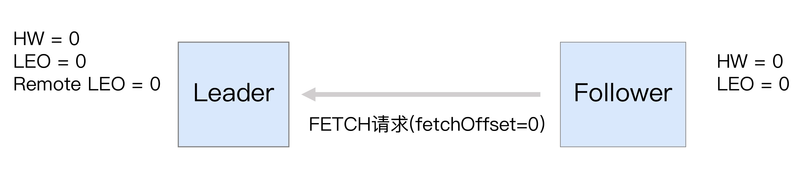

当生产者给主题分区发送一条消息后，状态变更为：

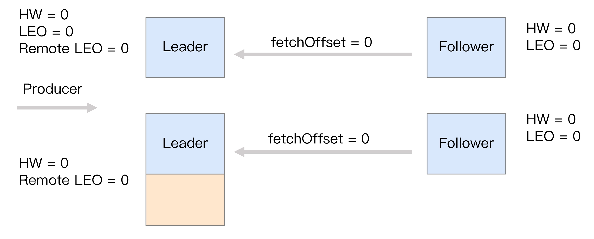

此时，Leader 副本成功将消息写入了本地磁盘，故 LEO 值被更新为 1。

Follower 再次尝试从 Leader 拉取消息。和之前不同的是，这次有消息可以拉取了，因此状态进一步变更为：

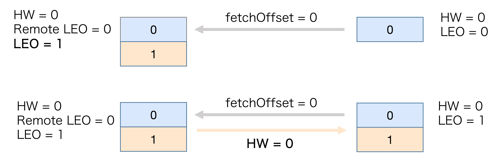

这时，Follower 副本也成功地更新 LEO 为 1。此时，Leader 和 Follower 副本的 LEO 都是 1，但各自的高水位依然是 0，还没有被更新。它们需要在下一轮的拉取中被更新，如下图所示：

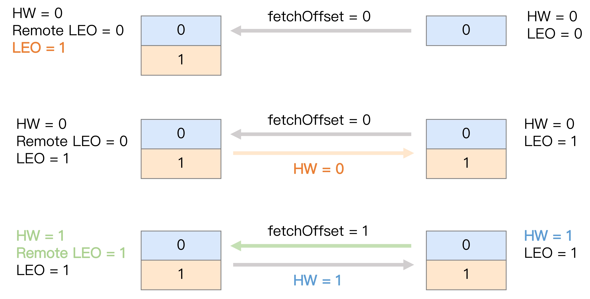

在新一轮的拉取请求中，由于位移值是 0 的消息已经拉取成功，因此 Follower 副本这次请求拉取的是位移值 =1 的消息。Leader 副本接收到此请求后，更新远程副本 LEO 为 1，
然后更新 Leader 高水位为 1。做完这些之后，它会将当前已更新过的高水位值 1 发送给 Follower 副本。Follower 副本接收到以后，也将自己的高水位值更新成 1。
至此，一次完整的消息同步周期就结束了。事实上，Kafka 就是利用这样的机制，实现了 Leader 和 Follower 副本之间的同步。

### Leader Epoch 登场
所谓 Leader Epoch，我们大致可以认为是 Leader 版本。它由两部分数据组成。
* 1、Epoch。一个单调增加的版本号。每当副本领导权发生变更时，都会增加该版本号。小版本号的 Leader 被认为是过期 Leader，不能再行使 Leader 权力。
* 2、起始位移（Start Offset）。Leader 副本在该 Epoch 值上写入的首条消息的位移。

我举个例子来说明一下 Leader Epoch。假设现在有两个 Leader Epoch<0, 0> 和 <1, 120>，那么，第一个 Leader Epoch 表示版本号是 0，这个版本的 Leader 从位移 0 开始保存消息，
一共保存了 120 条消息。之后，Leader 发生了变更，版本号增加到 1，新版本的起始位移是 120。

Kafka Broker 会在内存中为每个分区都缓存 Leader Epoch 数据，同时它还会定期地将这些信息持久化到一个 checkpoint 文件中。当 Leader 副本写入消息到磁盘时，
Broker 会尝试更新这部分缓存。如果该 Leader 是首次写入消息，那么 Broker 会向缓存中增加一个 Leader Epoch 条目，否则就不做更新。这样，每次有 Leader 变更时，
新的 Leader 副本会查询这部分缓存，取出对应的 Leader Epoch 的起始位移，以避免数据丢失和不一致的情况。

接下来，我们来看一个实际的例子，它展示的是 Leader Epoch 是如何防止数据丢失的。请先看下图。

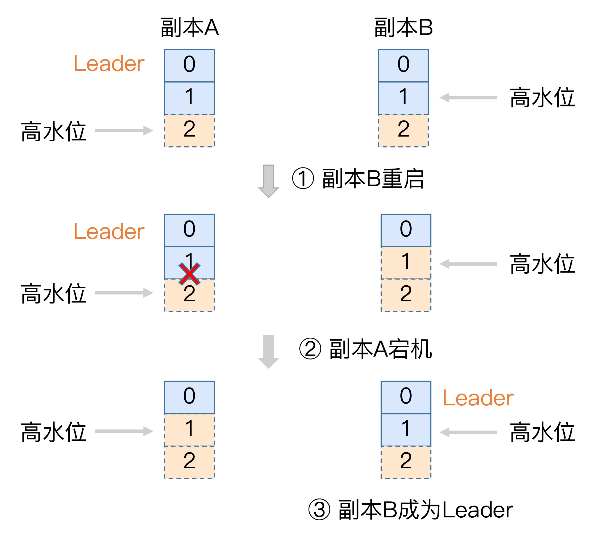

我稍微解释一下，单纯依赖高水位是怎么造成数据丢失的。开始时，副本 A 和副本 B 都处于正常状态，A 是 Leader 副本。某个使用了默认 acks 设置的生产者程序向 A 发送了两条消息，A 全部写入成功，此时 Kafka 会通知生产者说两条消息全部发送成功。

现在我们假设 Leader 和 Follower 都写入了这两条消息，而且 Leader 副本的高水位也已经更新了，但 Follower 副本高水位还未更新——这是可能出现的。还记得吧，Follower 端高水位的更新与 Leader 端有时间错配。倘若此时副本 B 所在的 Broker 宕机，当它重启回来后，副本 B 会执行日志截断操作，将 LEO 值调整为之前的高水位值，也就是 1。这就是说，位移值为 1 的那条消息被副本 B 从磁盘中删除，此时副本 B 的底层磁盘文件中只保存有 1 条消息，即位移值为 0 的那条消息。

当执行完截断操作后，副本 B 开始从 A 拉取消息，执行正常的消息同步。如果就在这个节骨眼上，副本 A 所在的 Broker 宕机了，那么 Kafka 就别无选择，只能让副本 B 成为新的 Leader，此时，当 A 回来后，需要执行相同的日志截断操作，即将高水位调整为与 B 相同的值，也就是 1。这样操作之后，位移值为 1 的那条消息就从这两个副本中被永远地抹掉了。这就是这张图要展示的数据丢失场景。

严格来说，这个场景发生的前提是 Broker 端参数 **min.insync.replicas 设置为 1**。此时一旦消息被写入到 Leader 副本的磁盘，就会被认为是“已提交状态”，但现有的时间错配问题导致 Follower 端的高水位更新是有滞后的。如果在这个短暂的滞后时间窗口内，接连发生 Broker 宕机，那么这类数据的丢失就是不可避免的。

现在，我们来看下如何利用 Leader Epoch 机制来规避这种数据丢失。我依然用图的方式来说明。

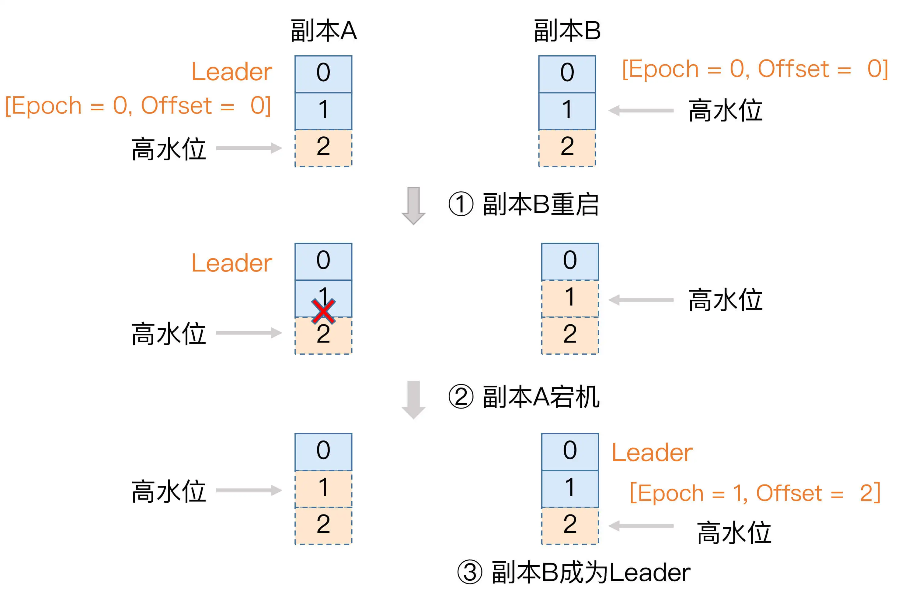

场景和之前大致是类似的，只不过引用 Leader Epoch 机制后，Follower 副本 B 重启回来后，需要向 A 发送一个特殊的请求去获取 Leader 的 LEO 值。在这个例子中，该值为 2。当获知到 Leader LEO=2 后，B 发现该 LEO 值不比它自己的 LEO 值小，而且缓存中也没有保存任何起始位移值 > 2 的 Epoch 条目，因此 B 无需执行任何日志截断操作。这是对高水位机制的一个明显改进，即副本是否执行日志截断不再依赖于高水位进行判断。

现在，副本 A 宕机了，B 成为 Leader。同样地，当 A 重启回来后，执行与 B 相同的逻辑判断，发现也不用执行日志截断，至此位移值为 1 的那条消息在两个副本中均得到保留。后面当生产者程序向 B 写入新消息时，副本 B 所在的 Broker 缓存中，会生成新的 Leader Epoch 条目：[Epoch=1, Offset=2]。之后，副本 B 会使用这个条目帮助判断后续是否执行日志截断操作。这样，通过 Leader Epoch 机制，Kafka 完美地规避了这种数据丢失场景。

极客地址：https://time.geekbang.org/column/article/112118

