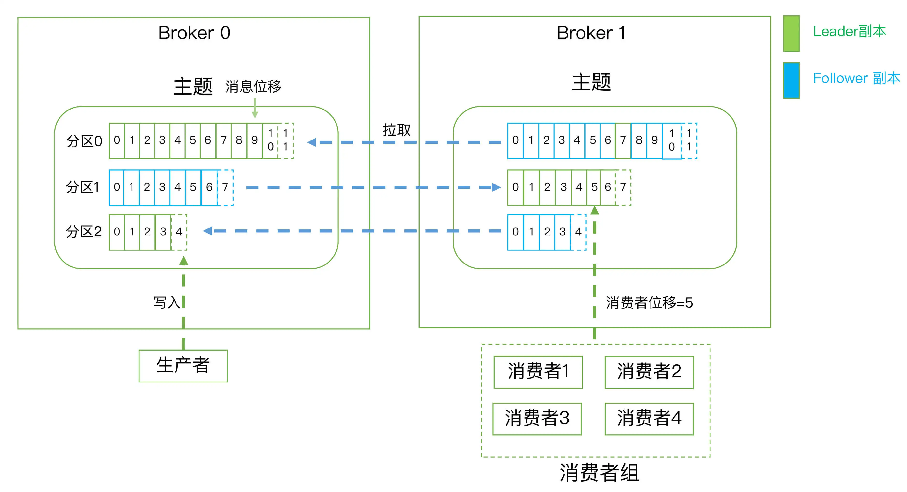

## 术语
* 消息：Record。Kafka 是消息引擎嘛，这里的消息就是指 Kafka 处理的主要对象。
* 主题：Topic。主题是承载消息的逻辑容器，在实际使用中多用来区分具体的业务。
* 分区：Partition。一个有序不变的消息序列。每个主题下可以有多个分区。 
* 消息位移：Offset。表示分区中每条消息的位置信息，是一个单调递增且不变的值。
* 副本：Replica。Kafka 中同一条消息能够被拷贝到多个地方以提供数据冗余，这些地方就是所谓的副本。副本还分为领导者副本和追随者副本，各自有不同的角色划分。副本是在分区层级下的，即每个分区可配置多个副本实现高可用。
* 生产者：Producer。向主题发布新消息的应用程序。 
* 消费者：Consumer。从主题订阅新消息的应用程序。
* 消费者位移：Consumer Offset。表征消费者消费进度，每个消费者都有自己的消费者位移。
* 消费者组：Consumer Group。多个消费者实例共同组成的一个组，同时消费多个分区以实现高吞吐。
* 重平衡：Rebalance。消费者组内某个消费者实例挂掉后，其他消费者实例自动重新分配订阅主题分区的过程。Rebalance 是 Kafka 消费者端实现高可用的重要手段。
  
最后我用一张图来展示上面提到的这些概念，希望这张图能够帮助你形象化地理解所有这些概念：

## kafka体系
Kafka体系架构=M个producer +N个broker +K个consumer+ZK集群

producer:生产者

Broker：服务代理节点，Kafka服务实例。
n个组成一个Kafka集群，通常一台机器部署一个Kafka实例，一个实例挂了其他实例仍可以使用，体现了高可用

consumer：消费者
消费topic 的消息， 一个topic 可以让若干个consumer消费，若干个consumer组成一个 consumer group ，一条消息只能被consumer group 中一个consumer消费，若干个partition 被若干个consumer 同时消费，达到消费者高吞吐量

topic ：主题

partition： 一个topic 可以拥有若干个partition（从 0 开始标识partition ），分布在不同的broker 上， 实现发布与订阅时负载均衡。producer 通过自定义的规则将消息发送到对应topic 下某个partition，以offset标识一条消息在一个partition的唯一性。
一个partition拥有多个replica，提高容灾能力。

replica 包含两种类型：leader 副本、follower副本，
leader副本负责读写请求，follower 副本负责同步leader副本消息，通过副本选举实现故障转移。
partition在机器磁盘上以log 体现，采用顺序追加日志的方式添加新消息、实现高吞吐量

理解：

Broker 服务示例 --> N个主题（topic)

topic 主题 --> n 个分区（partition）

partition 分区 --> n 个副本 （replica）

副本 replica 包含 leader 副本、follower副本。

