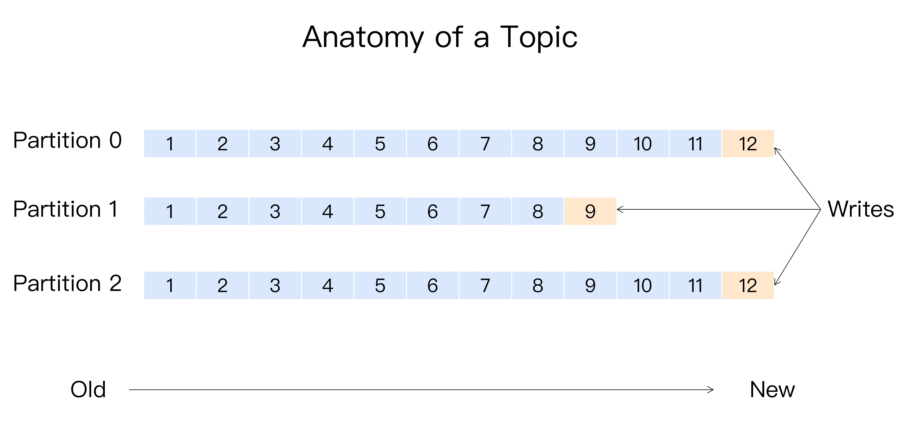

## 分区
Kafka 的消息组织方式实际上是三级结构：主题 - 分区 - 消息。主题下的每条消息只会保存在某一个分区中，而不会在多个分区中被保存多份。其实分区的作用就是提供负载均衡的能力，或者说对数据进行分区的主要原因，就是为了实现系统的高伸缩性（Scalability）。

所谓分区策略是决定生产者将消息发送到哪个分区的算法。

**轮询策略** 也称 Round-robin 策略，即顺序分配。轮询策略是 Kafka Java 生产者 API 默认提供的分区策略。轮询策略有非常优秀的负载均衡表现，它总是能保证消息最大限度地被平均分配到所有分区上，故默认情况下它是最合理的分区策略，也是我们最常用的分区策略之一。

**随机策略** 也称 Randomness 策略。所谓随机就是我们随意地将消息放置到任意一个分区上，如下面这张图所示。

本质上看随机策略也是力求将数据均匀地打散到各个分区，但从实际表现来看，它要逊于轮询策略，所以如果追求数据的均匀分布，还是使用轮询策略比较好。事实上，随机策略是老版本生产者使用的分区策略，在新版本中已经改为轮询了。

**按消息键保序策略** 也称 Key-ordering 策略。一旦消息被定义了 Key，那么你就可以保证同一个 Key 的所有消息都进入到相同的分区里面，由于每个分区下的消息处理都是有顺序的，故这个策略被称为按消息键保序策略，如下图所示。

Kafka 默认分区策略实际上同时实现了两种策略：如果指定了 Key，那么默认实现按消息键保序策略；如果没有指定 Key，则使用轮询策略。

基于**地理位置的分区策略**。当然这种策略一般只针对那些大规模的 Kafka 集群，特别是跨城市、跨国家甚至是跨大洲的集群。

注意：若实现自定义策略，实现 这个接口：Partitioner

##压缩算法
压缩（compression），它秉承了用时间去换空间的经典 trade-off 思想，具体来说就是用 CPU 时间去换磁盘空间或网络 I/O 传输量，希望以较小的 CPU 开销带来更少的磁盘占用或更少的网络 I/O 传输。

在 Kafka 中，压缩可能发生在两个地方：**生产者端和 Broker 端**。

配置方式：

    Properties props = new Properties();
    props.put("bootstrap.servers", "localhost:9092");
    props.put("acks", "all");
    props.put("key.serializer", "org.apache.kafka.common.serialization.StringSerializer");
    props.put("value.serializer", "org.apache.kafka.common.serialization.StringSerializer");
    // 开启GZIP压缩
    props.put("compression.type", "gzip");
    
    Producer<String, String> producer = new KafkaProducer<>(props);
它表明该 Producer 的压缩算法使用的是 GZIP。这样 Producer 启动后生产的每个消息集合都是经 GZIP 压缩过的，故而能很好地节省网络传输带宽以及 Kafka Broker 端的磁盘占用。

注：Broker 端指定了和 Producer 端最好使用同一种压缩算法。

有两种例外情况就可能让 Broker 重新压缩消息：Broker 端指定了和 Producer 端不同的压缩算法；Broker 端发生了消息格式转换。

Kafka中：**Producer 端压缩、Broker 端保持、Consumer 端解压缩。**

但对于 Kafka 而言，它们的性能测试结果却出奇得一致，即在吞吐量方面：LZ4 > Snappy > zstd 和 GZIP；而在压缩比方面，zstd > LZ4 > GZIP > Snappy。

如果客户端机器 CPU 资源有很多富余，强烈建议开启 zstd 压缩，这样能极大地节省网络资源消耗。

## 数据丢失情况
* 1、生产者程序丢失数据

目前 Kafka Producer 是异步发送消息的，也就是说如果你调用的是 producer.send(msg) 这个 API，那么它通常会立即返回，但此时你不能认为消息发送已成功完成。

存在的原因：网络抖动，导致消息压根就没有发送到 Broker 端；或者消息本身不合格导致 Broker 拒绝接收（比如消息太大了，超过了 Broker 的承受能力）；Broker 都宕机

发送丢失的解决方案：Producer 永远要使用带有回调通知的发送 API，也就是说不要使用 producer.send(msg)，而要使用 producer.send(msg, callback)

* 2、消费者程序丢失数据

Consumer 端丢失数据主要体现在 Consumer 端要消费的消息不见了。Consumer 程序有个“位移”的概念，表示的是这个 Consumer 当前消费到的 Topic 分区的位置。下面这张图来自于官网，它清晰地展示了 Consumer 端的位移数据。

解决方案：要对抗这种消息丢失，办法很简单：**维持先消费消息（阅读），再更新位移（书签）的顺序即可**。这样就能最大限度地保证消息不丢失。即是处理完业务逻辑再提交位移。

**总结：**

* 不要使用 producer.send(msg)，而要使用 producer.send(msg, callback)。记住，一定要使用带有回调通知的 send 方法。
* 设置 acks = all。acks 是 Producer 的一个参数，代表了你对“已提交”消息的定义。如果设置成 all，则表明所有副本 Broker 都要接收到消息，该消息才算是“已提交”。这是最高等级的“已提交”定义。
* 设置 retries 为一个较大的值。这里的 retries 同样是 Producer 的参数，对应前面提到的 Producer 自动重试。当出现网络的瞬时抖动时，消息发送可能会失败，此时配置了 retries > 0 的 Producer 能够自动重试消息发送，避免消息丢失。
* 设置 unclean.leader.election.enable = false。这是 Broker 端的参数，它控制的是哪些 Broker 有资格竞选分区的 Leader。如果一个 Broker 落后原先的 Leader 太多，那么它一旦成为新的 Leader，必然会造成消息的丢失。故一般都要将该参数设置成 false，即不允许这种情况的发生。
* 设置 replication.factor >= 3。这也是 Broker 端的参数。其实这里想表述的是，最好将消息多保存几份，毕竟目前防止消息丢失的主要机制就是冗余。
* 设置 min.insync.replicas > 1。这依然是 Broker 端参数，控制的是消息至少要被写入到多少个副本才算是“已提交”。设置成大于 1 可以提升消息持久性。在实际环境中千万不要使用默认值 1。
* 确保 replication.factor > min.insync.replicas。如果两者相等，那么只要有一个副本挂机，整个分区就无法正常工作了。我们不仅要改善消息的持久性，防止数据丢失，还要在不降低可用性的基础上完成。推荐设置成 replication.factor = min.insync.replicas + 1。
* 确保消息消费完成再提交。Consumer 端有个参数 enable.auto.commit，最好把它设置成 false，并采用手动提交位移的方式。就像前面说的，这对于单 Consumer 多线程处理的场景而言是至关重要的。

## 拦截器
基本思想就是允许应用程序在不修改逻辑的情况下，动态地实现一组可插拔的事件处理逻辑链。它能够在主业务操作的前后多个时间点上插入对应的“拦截”逻辑。Kafka **拦截器分为生产者拦截器和消费者拦截器。** 生产者拦截器允许你在发送消息前以及消息提交成功后植入你的拦截器逻辑；而消费者拦截器支持在消费消息前以及提交位移后编写特定逻辑。

Kafka 拦截器可以应用于包括客户端监控、端到端系统性能检测、消息审计等多种功能在内的场景。

