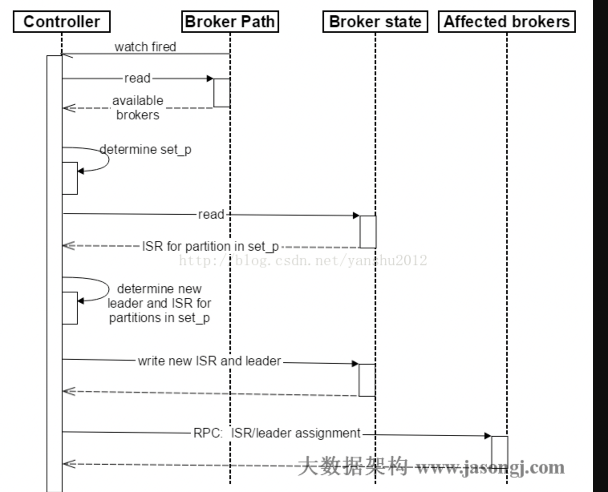
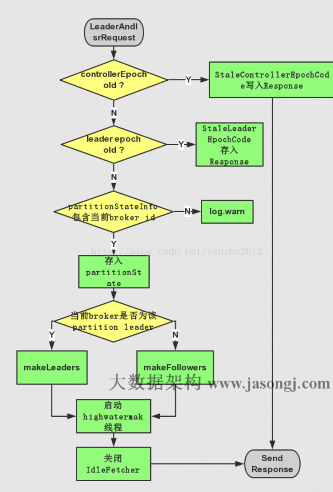

kafka在所有broker中选出一个controller，所有Partition的Leader选举都由controller决定。controller会将Leader的改变直接通过RPC的方式（比Zookeeper Queue的方式更高效）通知需为此作出响应的Broker。同时controller也负责增删Topic以及Replica的重新分配。

## 当有broker fari over controller的处理过程如下：

1.Controller在Zookeeper注册Watch，一旦有Broker宕机（这是用宕机代表任何让系统认为其die的情景，包括但不限于机器断电，网络不可用，GC导致的Stop The World，进程crash等），其在Zookeeper对应的znode会自动被删除，Zookeeper会fire Controller注册的watch，Controller读取最新的幸存的Broker

2.Controller决定set_p，该集合包含了宕机的所有Broker上的所有Partition

3.对set_p中的每一个Partition

3.1 从/brokers/topics/[topic]/partitions/[partition]/state读取该Partition当前的ISR

3.2 决定该Partition的新Leader。如果当前ISR中有至少一个Replica还幸存，则选择其中一个作为新Leader，新的ISR则包含当前ISR中所有幸存的Replica（选举算法的实现类似于微软的PacificA）。否则选择该Partition中任意一个幸存的Replica作为新的Leader以及ISR（该场景下可能会有潜在的数据丢失）。如果该Partition的所有Replica都宕机了，则将新的Leader设置为-1。

3.3 将新的Leader，ISR和新的leader_epoch及controller_epoch写入/brokers/topics/[topic]/partitions/[partition]/state。注意，该操作只有其version在3.1至3.3的过程中无变化时才会执行，否则跳转到3.1

4. 直接通过RPC向set_p相关的Broker发送LeaderAndISRRequest命令。Controller可以在一个RPC操作中发送多个命令从而提高效率。

## LeaderAndIsrRequest响应过程

1.若请求中controllerEpoch小于当前最新的controllerEpoch，则直接返回ErrorMapping.StaleControllerEpochCode。

2.对于请求中partitionStateInfos中的每一个元素，即（(topic, partitionId), partitionStateInfo)：

  2.1 若partitionStateInfo中的leader epoch大于当前ReplicManager中存储的(topic, partitionId)对应的partition的leader epoch，则：

  2.1.1 若当前brokerid（或者说replica id）在partitionStateInfo中，则将该partition及partitionStateInfo存入一个名为partitionState的HashMap中

  2.1.2否则说明该Broker不在该Partition分配的Replica list中，将该信息记录于log中

2.2否则将相应的Error code（ErrorMapping.StaleLeaderEpochCode）存入Response中

3.筛选出partitionState中Leader与当前Broker ID相等的所有记录存入partitionsTobeLeader中，其它记录存入partitionsToBeFollower中。

4.若partitionsTobeLeader不为空，则对其执行makeLeaders方。

5.若partitionsToBeFollower不为空，则对其执行makeFollowers方法

6.若highwatermak线程还未启动，则将其启动，并将hwThreadInitialized设为true。

7.关闭所有Idle状态的Fetcher。

**LeaderAndIsrRequest处理过程如下图所示**

对于收到的LeaderAndIsrRequest，Broker主要通过ReplicaManager的becomeLeaderOrFollower处理，流程如下：

如何处理所有Replica都不工作

上文提到，在ISR中至少有一个follower时，Kafka可以确保已经commit的数据不丢失，但如果某个Partition的所有Replica都宕机了，就无法保证数据不丢失了。这种情况下有两种可行的方案：

1.等待ISR中的任一个Replica“活”过来，并且选它作为Leader

2.选择第一个“活”过来的Replica（不一定是ISR中的）作为Leader

这就需要在可用性和一致性当中作出一个简单的折衷。如果一定要等待ISR中的Replica“活”过来，那不可用的时间就可能会相对较长。而且如果ISR中的所有Replica都无法“活”过来了，或者数据都丢失了，这个Partition将永远不可用。选择第一个“活”过来的Replica作为Leader，而这个Replica不是ISR中的Replica，那即使它并不保证已经包含了所有已commit的消息，它也会成为Leader而作为consumer的数据源（前文有说明，所有读写都由Leader完成）。Kafka0.8.*使用了第二种方式。根据Kafka的文档，在以后的版本中，Kafka支持用户通过配置选择这两种方式中的一种，从而根据不同的使用场景选择高可用性还是强一致性。 unclean.leader.election.enable 参数决定使用哪种方案，默认是true，采用第二种方案

https://blog.csdn.net/yanshu2012/article/details/54894629