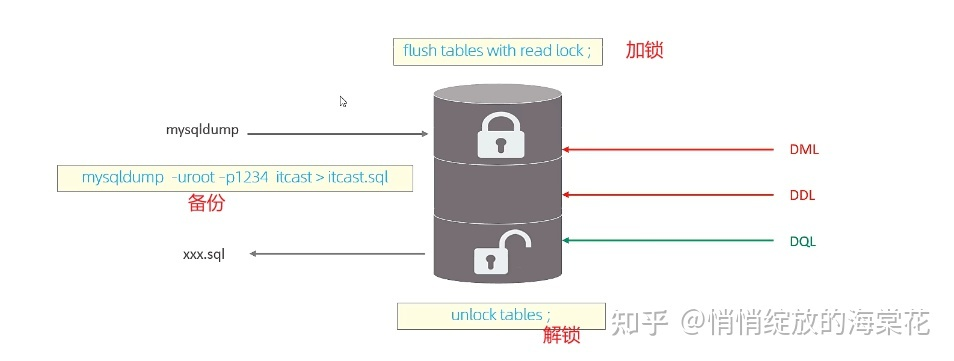
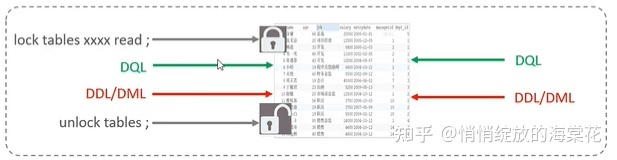
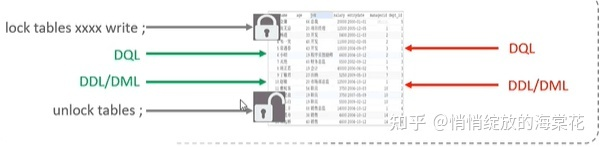
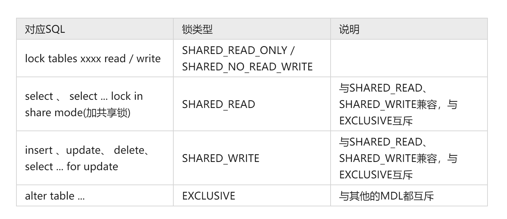
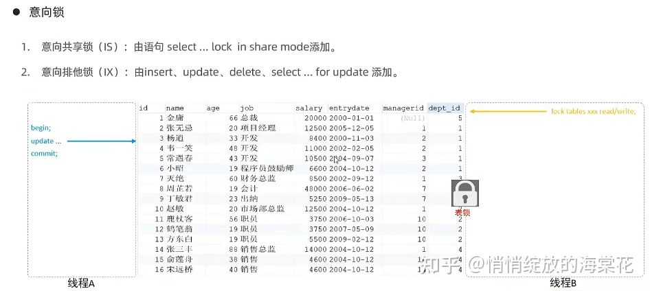
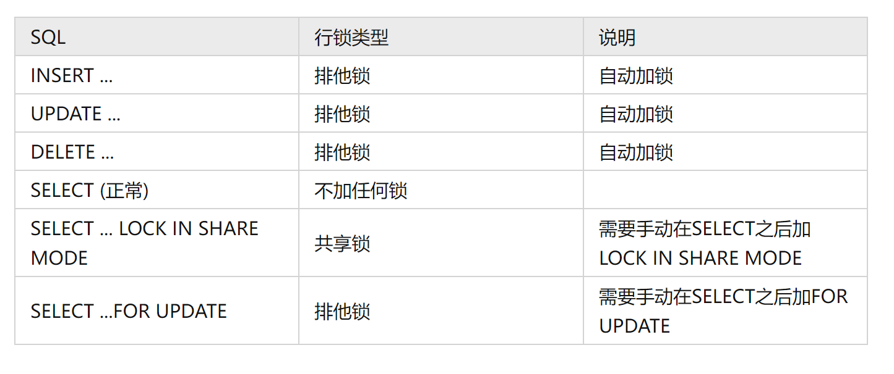

## MySQL中的锁-全局锁、表级锁和行级锁
分类

MySQL中的锁，按照锁的粒度分，分为以下三类:

1、全局锁：锁定数据库中的所有表。

2、表级锁：每次操作锁住整张表。

3、行级锁：每次操作锁住对应的行数据。

### 1、全局锁
全局锁就是对整个数据库实例加锁，加锁后整个实例就处于只读状态，后续的DML的写语句，DDL语句，已及更新操作的事务提交语句都将被阻塞。

其典型的使用场景是做全库的逻辑备份，对所有的表进行锁定，从而获取一致性视图，保证数据的完整性。

     -- 添加全局锁的命令
    flush tables with read lock;
    -- 全局锁解锁
    unlock tables ;

    # 数据库备份命令
    mysqldump [-h127.0.0.1 -P3306] -uroot –p1234 itcast > D:/itcast.sql
    # 说明： -h和-P默认就是本地IP和3306端口

**全局锁的问题？**

数据库中加全局锁，是一个比较重的操作，存在以下问题：、

1、如果在主库上备份，那么在备份期间都不能执行更新，业务基本上就得停摆；

2、如果我们的数据库不是单机版的，而是主从结构，而且还做了读写分离，这时在写入操作的时候是不会阻塞的，因为我们是写入主库;我们可以从从库上进行备份，但在备份期间从库不能执行主库同步过来的二进制日志（binlog），会导致主从延迟；

**解决方案：**

在InnoDB引擎中，我们可以在备份时加上参数 --single-transaction 参数来完成不加锁的一致性数据备份

    mysqldump --single-transaction -uroot –p1234 itcast > itcast.sql

### 2、表级锁
表级锁，每次操作锁住整张表。锁定粒度大，发生锁冲突的概率最高，并发度最低。应用在MyISAM、InnoDB、BDB等存储引擎中。

对于表级锁，主要分为以下三类:

    1、表锁
    2、元数据锁（ meta data lock，MDL)
    3、意向锁

* 表锁

对于表锁，分为两类:

    1、表共享读锁（ read lock)
    2、表独占写锁（ write lock)

语法:

    1、加锁: lock tables表名... read /write。
    2、释放锁: unlock tables /客户端断开连接。

表共享锁的锁力度如下：

说明：

如上图：当一个客户端给一个表添加了表共享锁（读锁，read lock）时，在这和客户端释放锁之前，当前客户端和其他客户端都可以读取当前表中的数据，同时都不能修改当前表中的数据。直到释放锁才能修改。

表独占锁的锁力度如下：

说明：

如上图：当一个客户端给一个表添加了表独占锁（写锁，write lock）时，在这和客户端释放锁之前，当前客户端可以对加锁的表进行查询操作和编辑操作，但是其他客户端既不能查询也不能编辑。

* 元数据锁（ meta data lock,MDL）

MDL加锁过程是系统自动控制，无需显式使用，在访问一张表的时候会自动加上。MDL锁主要作用是维护表元数据的数据一致性，在表上有活动事务的时候，不可以对元数据进行写入操作。为了避免DML（增删改查）与DDL（修改表结构）冲突，保证读写的正确性。

在MySQL5.5中引入了MDL，当对一张表进行增删改查的时候，加MDL读锁(共享);当对表结构进行变更操作的时候，加MDL写锁(排他)。

说明：当在客户端1 开启事务（begin）后，然后select、update、delete等锁类型 SHARED_READh或者为SHARED_WRITE的语句时，在客户端 2执行alter语句就会进入阻塞状态。

获取当前数据库的元数据锁SQL

    select object_type,object_schema,object_name,lock_type,lock_duration from performance_schema.metadata_locks;

* 意向锁

1、意向共享锁 (IS)∶与表锁共享锁( read）兼容，与表锁排它锁(write）互斥。 2、意向排他锁（IK)︰与表锁共享锁(read)及排它锁（write）都互斥。意向锁之间不会互斥。

说明：

线程A对以上数据中的一条要通过主键进行修改时，会自动的给某一条数据添加一个行锁，这是并发访问，线程B要对这个表添加表锁，当然了，肯定不能直接添加。添加表锁之前会进行如下操作。

没有意向锁的情况下：会逐行判断当前表是否存在行锁，影响性能。

有意向锁的情况下：在有意向锁是，在添加行锁时就会给表添加意向锁，在添加表锁时，会判断添加的意向锁和表锁是否冲突。

可以通过以下SQL，查看意向锁及行锁的加锁情况：

    select object_schema,object_name,index_name,lock_type,lock_mode,lock_data from performance_schema.data_locks;

### 3、行级锁
行级锁，每次操作锁住对应的行数据。锁定粒度最小，发生锁冲突的概率最低，并发度最高。应用在InnoDB存储引擎中。

InnoDB的数据是基于索引组织的，行锁是通过对索引上的索引项加锁来实现的，而不是对记录加的锁。对于行级锁，主要分为以下三类:
* 行锁〈Record Lock)∶锁定单个行记录的锁，防止其他事务对此行进行update和delete。在RC、RR隔离级别下都支持。
* 间隙锁(Gap Lock):锁定索引记录间腺(不含该记录)，确保索引记录间隙不变，防止其他事务在这个间隙进行insert，产生幻读。在R隔离级别下都支持。
* 临键锁(Next-Key Lock):行锁和间隙锁组合，同时锁住数据，并锁住数据前面的间隙Gap。在RR隔离级别下支持。

InnoDB实现了以下两种类型的行锁:
* 共享锁(S)∶允许一个事务去读一行，阻止其他事务获得相同数据集的排它锁。
* 排他锁（X)∶允许获取排他锁的事务更新数据，阻止其他事务获得相同数据集的共享锁和排他锁。 公

行锁中，共享锁与共享锁不互斥，共享锁与排它锁之间互斥；排它锁与排它锁之间互斥

InnoDB引擎中，执行SQL时的加行锁情况：

默认情况下，InnoDB在REPEATABLE READ（RR）事务隔离级别运行，InnoDB使用next-key（临键）锁进行搜索和索引扫描，以防止幻读。

* 针对唯一索引进行检索时，对已存在的记录进行等值匹配时，将会自动优化为行锁。
* InnoDB的行锁是针对于索引加的锁，不通过索引条件检索数据，那么InnoDB将对表中的所有记录加锁，此时就会升级为表锁。

有关间隙锁锁临键锁的说明（防止幻读）：
* 索引上的等值查询(唯一索引)，给不存在的记录加锁时,优化为间隙锁。
* 索引上的等值查询(普通索引)，向右遍历时最后一个值不满足查询需求时，next-key lock退化为间隙锁。
* 索引上的范围查询(唯一索引)--会访问到不满足条件的第一个值为止。

具体说明：

    -- 首先，准备一张表，id为主键，id分别为 1,3,10,15
    mysql> select * from user_innodb;
    +----+----------+------+
    | id | username | age  |
    +----+----------+------+
    |  1 | 张三     |    1 |
    |  3 | 李四     |    4 |
    | 10 | 王五     |    9 |
    | 15 | 赵六     |   15 |
    +----+----------+------+
    4 rows in set (0.00 sec)

    -- 对于1、索引上的等值查询(唯一索引)，给不存在的记录加锁时,优化为间隙锁。
 
    -- 说明，当开启事务后，如果 此时执行 下面update语句
    update user_innodb set username = '王五' where id = 7
    -- 因为不存在 id = 7 的数据，这是就会给 id = 2 到 id = 9（不包含 4和 10）之间加间隙锁，此时其他客户端想insert （或 update 或 delete）id在2到9之间的数据就会进入阻塞状态。

    -- 对于2、索引上的等值查询(普通索引)，向右遍历时最后一个值不满足查询需求时，next-key lock退化为间隙锁。
    -- 首先创建一个 非唯一的普通索引 比如 age
    mysql> create index idx_user_age on user_innodb(age);
    Query OK, 0 rows affected (0.09 sec)
    Records: 0  Duplicates: 0  Warnings: 0
 
    -- 查看索引
    mysql> show index from user_innodb;
    +-------------+------------+--------------+--------------+-------------+-----------+-------------+----------+--------+------+------------+---------+---------------+---------+
    | Table       | Non_unique | Key_name     | Seq_in_index | Column_name | Collation | Cardinality | Sub_part | Packed | Null | Index_type | Comment | Index_comment | Visible |
    +-------------+------------+--------------+--------------+-------------+-----------+-------------+----------+--------+------+------------+---------+---------------+---------+
    | user_innodb |          0 | PRIMARY      |            1 | id          | A         |           3 |     NULL |   NULL |      | BTREE      |         |               | YES     |
    | user_innodb |          1 | idx_user_age |            1 | age         | A         |           4 |     NULL |   NULL | YES  | BTREE      |         |               | YES     |
    +-------------+------------+--------------+--------------+-------------+-----------+-------------+----------+--------+------+------------+---------+---------------+---------+
    2 rows in set (0.09 sec)

    -- 首先开启事务
    -- 当执行下列语句时，若执行的是 select * from user_innodb where age = 4; 不会加锁
    select * from user_innodb where age = 4 lock in share mode;
    
    -- 查看锁的情况，与表锁中查看意向锁的SQL一致
    mysql> select object_schema,object_name,index_name,lock_type,lock_mode,lock_data from performance_schema.data_locks;
    mysql> select object_schema,object_name,index_name,lock_type,lock_mode,lock_data from performance_schema.data_locks;
    +---------------+-------------+--------------+-----------+-----------+-----------+
    | object_schema | object_name | index_name   | lock_type | lock_mode | lock_data |
    +---------------+-------------+--------------+-----------+-----------+-----------+
    | heima_learn   | user_innodb | NULL         | TABLE     | IS        | NULL      |
    | heima_learn   | user_innodb | idx_user_age | RECORD    | S         | 4, 3      |
    | heima_learn   | user_innodb | PRIMARY      | RECORD    | S         | 3         |
    | heima_learn   | user_innodb | idx_user_age | RECORD    | S,GAP     | 9, 10     |
    +---------------+-------------+--------------+-----------+-----------+-----------+
  
    -- 因为 age 是一个普通索引，可能会出现重复的数据，所以说此时会加 3 个共享锁
    -- 第一个  | S         | 4, 3      |
    -- 这个index_name =idx_user_age，lock_mode中没有GAP  (这里的 4, 3 指的是主键 age 的值为 4，id的值为 3) 的临键锁，表示数据 id = 3 的临键锁，值id = 2,3
   
    -- 第二个 | S         | 3         |
    -- 第二个的 index_name 为 PRIMARY，表示 给id = 3 (age = 4)的数据加了行锁
   
    -- 第三个 | S,GAP     | 9, 10     |
    -- 这里(9 代表 age = 9, 10 代表 id = 10) index_name = idx_user_age，在 lock_mode 存在 GAP，表示是一个间隙锁，锁住的数据为 id = 4 到 id = 9。
   
    -- 这么做的操作就是为了防止出现 幻读

    -- 对于3、索引上的范围查询(唯一索引)--会访问到不满足条件的第一个值为止。

    -- 重新开启事务
    -- 执行下列语句
    select * from user_innodb where id >= 10 lock in share mode;
    
    -- 查看锁的情况
    mysql> select object_schema,object_name,index_name,lock_type,lock_mode,lock_data from performance_schema.data_locks;
    +---------------+-------------+------------+-----------+-----------+------------------------+
    | object_schema | object_name | index_name | lock_type | lock_mode | lock_data              |
    +---------------+-------------+------------+-----------+-----------+------------------------+
    | heima_learn   | user_innodb | NULL       | TABLE     | IS        | NULL                   |
    | heima_learn   | user_innodb | PRIMARY    | RECORD    | S         | 10                     |
    | heima_learn   | user_innodb | PRIMARY    | RECORD    | S         | supremum pseudo-record |
    | heima_learn   | user_innodb | PRIMARY    | RECORD    | S         | 15                     |
    +---------------+-------------+------------+-----------+-----------+------------------------+
    4 rows in set (0.00 sec)
   
    -- 可以看出加了，id = 10的行锁，id = 15及id > 10 到 id = 15的临键锁，id = 15 及id > 15 的临键锁
  
    -- 当继续执行下面SQL时
    select * from user_innodb where id >= 9 lock in share mode;
    
    -- 查看锁的情况
    mysql> select object_schema,object_name,index_name,lock_type,lock_mode,lock_data from performance_schema.data_locks;
    +---------------+-------------+------------+-----------+-----------+------------------------+
    | object_schema | object_name | index_name | lock_type | lock_mode | lock_data              |
    +---------------+-------------+------------+-----------+-----------+------------------------+
    | heima_learn   | user_innodb | NULL       | TABLE     | IS        | NULL                   |
    | heima_learn   | user_innodb | PRIMARY    | RECORD    | S         | 10                     |
    | heima_learn   | user_innodb | PRIMARY    | RECORD    | S         | supremum pseudo-record |
    | heima_learn   | user_innodb | PRIMARY    | RECORD    | S         | 10                     |
    | heima_learn   | user_innodb | PRIMARY    | RECORD    | S         | 15                     |
    +---------------+-------------+------------+-----------+-----------+------------------------+
    --可以看出，此时的锁的情况是 id = 10的行锁，id = 10 到 id > 10 的临键锁，id = 15 的行锁

https://zhuanlan.zhihu.com/p/536860495