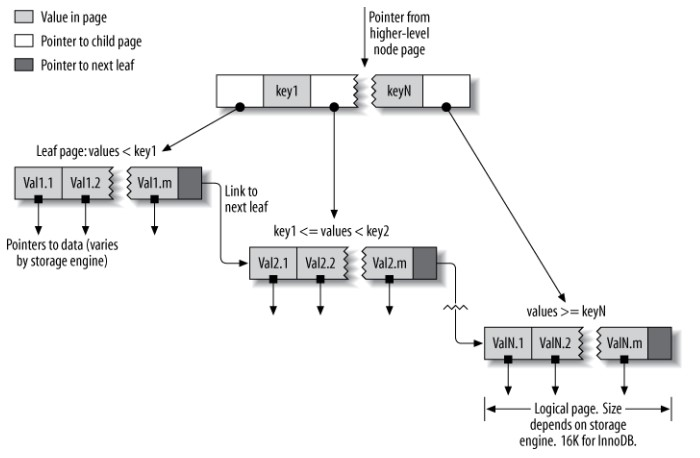
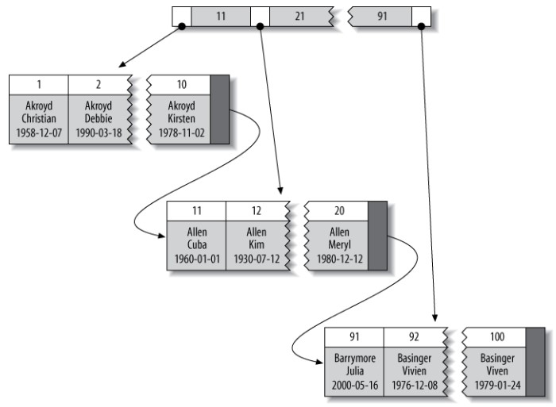

## 概述
 索引的类型和存储引擎有关，每种存储引擎所支持的索引类型不一定完全相同。MySQL 索引可以从存储方式、逻辑角度和实际使用的角度来进行分类。

## 存储方式区分
  根据存储方式的不同，MySQL 中常用的索引在物理上分为  **B—(+)树索引和 HASH 索引**两类，两种不同类型的索引各有其不同的适用范围。
  
  **1) B-树索引**
  

  B-树索引又称为 BTREE 索引，目前大部分的索引都是采用 B-树索引来存储的。
  
  B-树索引是一个典型的数据结构，其包含的组件主要有以下几个：
  * **叶子节点**：包含的条目直接指向表里的数据行。叶子节点之间彼此相连，一个叶子节点有一个指向下一个叶子节点的指针。
  * **分支节点**：包含的条目指向索引里其他的分支节点或者叶子节点。
  * **根节点**：一个 B-树索引只有一个根节点，实际上就是位于树的最顶端的分支节点。
  
  基于这种树形数据结构，表中的每一行都会在索引上有一个对应值。因此，在表中进行数据查询时，可以根据索引值一步一步定位到数据所在的行。
  
  B-树索引可以进行全键值、键值范围和键值前缀查询，也可以对查询结果进行 ORDER BY 排序。但 B-树索引必须遵循左边前缀原则，要考虑以下几点约束：
  * 查询必须从索引的最左边的列开始。
  * 查询不能跳过某一索引列，必须按照从左到右的顺序进行匹配。
  * 存储引擎不能使用索引中范围条件右边的列。
  
  **2) 哈希索引**

  基于哈希表实现，优点是查找非常快。哈希（Hash）一般翻译为“散列”，也有直接音译成“哈希”的，就是把任意长度的输入（又叫作预映射，pre-image）通过散列算法变换成固定长度的输出，该输出就是散列值。哈希索引只包含哈希值和行指针，而不存储字段值，所以不能使用索引中的值来避免读取行。
  
  **哈希索引也称为散列索引或 HASH 索引**。MySQL 目前仅有 MEMORY 存储引擎和 HEAP 存储引擎支持这类索引。其中，MEMORY 存储引擎可以支持 B-树索引和 HASH 索引，且将 HASH 当成默认索引。

  InnoDB 引擎有一个特殊的功能叫“自适应哈希索引”，当某个索引值被使用的非常频繁时，会在 B+Tree 索引之上再创建一个哈希索引，这样就让 B+Tree 索引具有哈希索引的一些优点，比如快速的哈希查找。

  HASH 索引不是基于树形的数据结构查找数据，而是根据索引列对应的哈希值的方法获取表的记录行。哈希索引的最大特点是访问速度快，但也存在下面的一些缺点：
  * MySQL 需要读取表中索引列的值来参与散列计算，散列计算是一个比较耗时的操作。也就是说，相对于 B-树索引来说，建立哈希索引会耗费更多的时间。
  * 不能使用 HASH 索引分组与排序。
  * HASH 索引只支持等值比较，如“=”“IN()”或“<=>”。即是只支持精确查找，无法用于部分查找和范围查找；
  * HASH 索引不支持键的部分匹配，因为在计算 HASH 值的时候是通过整个索引值来计算的。
  * 如果哈希冲突很多，查找速度会变得很慢。

  **3）聚簇索引**

聚簇索引并不是一种索引类型，而是一种数据存储方式。

术语“聚簇”表示数据行和相邻的键值紧密地存储在一起，InnoDB 的聚簇索引在同一个结构中保存了 B+Tree 索引和数据行。

因为无法把数据行存放在两个不同的地方，所以一个表只能有一个聚簇索引。

**优点**

1. 可以把相关数据保存在一起，减少 I/O 操作。例如电子邮件表可以根据用户 ID 来聚集数据，这样只需要从磁盘读取少数的数据也就能获取某个用户的全部邮件，如果没有使用聚聚簇索引，则每封邮件都可能导致一次磁盘 I/O。
2. 数据访问更快。

**缺点**

1. 聚簇索引最大限度提高了 I/O 密集型应用的性能，但是如果数据全部放在内存，就没必要用聚簇索引。
2. 插入速度严重依赖于插入顺序，按主键的顺序插入是最快的。
3. 更新操作代价很高，因为每个被更新的行都会移动到新的位置。
4. 当插入到某个已满的页中，存储引擎会将该页分裂成两个页面来容纳该行，页分裂会导致表占用更多的磁盘空间。
5. 如果行比较稀疏，或者由于页分裂导致数据存储不连续时，聚簇索引可能导致全表扫描速度变慢。

## 逻辑区分
   根据索引的具体用途，MySQL 中的索引在逻辑上分为以下 5 类：
   
   **1) 普通索引**
   
   普通索引是 MySQL 中最基本的索引类型，它没有任何限制，唯一任务就是加快系统对数据的访问速度。
   
   普通索引允许在定义索引的列中插入重复值和空值。
   
   创建普通索引时，通常使用的关键字是 INDEX 或 KEY。
   
   例 1
   
   下面在 tb_student 表中的 id 字段上建立名为 index_id 的索引。
   
       CREATE INDEX index_id ON tb_student(id);
       
   **2) 唯一索引**
   
   唯一索引与普通索引类似，不同的是创建唯一性索引的目的不是为了提高访问速度，而是为了**避免数据出现重复**。
   
   唯一索引列的值**必须唯一，允许有空值**。如果是组合索引，则列值的组合必须唯一。
   
   创建唯一索引通常使用 **UNIQUE** 关键字。
   
   例 2
   
   下面在 tb_student 表中的 id 字段上建立名为 index_id 的索引，SQL 语句如下：
     
       CREATE UNIQUE INDEX index_id ON tb_student(id);
       
  其中，id 字段可以有唯一性约束，也可以没有。
  
  **3) 主键索引**
  
  顾名思义，主键索引就是专门为**主键字段**创建的索引，也属于索引的一种。
  
  主键索引是一种特殊的唯一索引，不允许值重复或者值为空。
  
  创建主键索引通常使用 PRIMARY KEY 关键字。不能使用 CREATE INDEX 语句创建主键索引。
  
     ALTER TABLE `table_name` ADD PRIMARY KEY ( `column` ) 
  
  **4) 空间索引**
  
  空间索引是对**空间数据类型**的字段建立的索引，使用 **SPATIAL** 关键字进行扩展。
  
  创建空间索引的列必须将其声明为 NOT NULL，空间索引只能在存储引擎为 MyISAM 的表中创建。
  
  空间索引主要用于地理空间数据类型 GEOMETRY。对于初学者来说，这类索引很少会用到。必须使用 GIS 相关的函数来维护数据。
  
  例 3
  
  下面在 tb_student 表中的 line 字段上建立名为 index_line 的索引，SQL 语句如下：
  
     CREATE SPATIAL INDEX index_line ON tb_student(line);
     
 其中，tb_student 表的存储引擎必须是 MyISAM，line 字段必须为空间数据类型，而且是非空的。
 
 **5) 全文索引**
 
 全文索引主要用来查找文本中的关键字，只能在 **CHAR、VARCHAR 或 TEXT** 类型的列上创建。在 MySQL 中只有 MyISAM 存储引擎支持全文索引。
 
 全文索引允许在索引列中插入重复值和空值。
 
 不过对于大容量的数据表，生成全文索引非常消耗时间和硬盘空间。
 
 创建全文索引使用 FULLTEXT 关键字。
 
    ALTER TABLE `table_name` ADD FULLTEXT ( `column`) 
 
 例 4
 
 在 tb_student 表中的 info 字段上建立名为 index_info 的全文索引，SQL 语句如下：
  
    CREATE FULLTEXT INDEX index_info ON tb_student(info);
    
  其中，index_info 的存储引擎必须是 MyISAM，info 字段必须是 CHAR、VARCHAR 和 TEXT 等类型。
  
## 实际使用区分

 索引在逻辑上分为以上 5 类，但在实际使用中，索引通常被创建成**单列索引和组合索引**。
 
 **1）单列索引**
 
 单列索引就是索引只包含原表的一个列。在表中的单个字段上创建索引，单列索引只根据该字段进行索引。
 
 单列索引可以是普通索引，也可以是唯一性索引，还可以是全文索引。只要保证该索引只对应一个字段即可。
 
 例 5
 
 下面在 tb_student 表中的 address 字段上建立名为 index_addr 的单列索引，address 字段的数据类型为 VARCHAR(20)，索引的数据类型为 CHAR(4)。SQL 语句如下：
 
    CREATE INDEX index_addr ON tb_student(address(4));
    
  这样，查询时可以只查询 address 字段的前 4 个字符，而不需要全部查询。
  
  **2）多列索引**
  
  组合索引也称为**复合索引或多列索引**。相对于单列索引来说，组合索引是将原表的**多个列**共同组成一个索引。多列索引是在表的多个字段上创建一个索引。
  该索引指向创建时对应的多个字段，可以通过这几个字段进行查询。但是，只有查询条件中使用了这些字段中**第一个字段**时，索引才会被使用。
  
  例如，在表中的 id、name 和 sex 字段上建立一个多列索引，那么，只有查询条件使用了 **id** 字段时，该索引才会被使用。
  
  例 6
  
  下面在 tb_student 表中的 name 和 address 字段上建立名为 index_na 的索引，SQL 语句如下：
    
      CREATE INDEX index_na ON tb_student(name,address);
      
  该索引创建好了以后，查询条件中必须有 name 字段才能使用索引。
  
  提示：一个表可以有多个单列索引，但这些索引不是组合索引。一个组合索引实质上为表的查询提供了多个索引，以此来加快查询速度。比如，在一个表中创建了一个组合索引(c1，c2，c3)，
  在实际查询中，系统用来实际加速的索引有三个：单个索引(c1)、双列索引(c1，c2)和多列索引(c1，c2，c3)。
  
   **3) 覆盖索引**

   覆盖索引是select的数据列只用从索引中就能够取得，不必读取数据行，换句话说查询列要被所建的索引覆盖。

**优点**

1. 因为索引条目通常远小于数据行的大小，所以若只读取索引，能大大减少数据访问量。
2. 一些存储引擎（例如 MyISAM）在内存中只缓存索引，而数据依赖于操作系统来缓存。因此，只访问索引可以不使用系统调用（通常比较费时）。
3. 对于 InnoDB 引擎，若二级索引能够覆盖查询，则无需访问聚簇索引。

