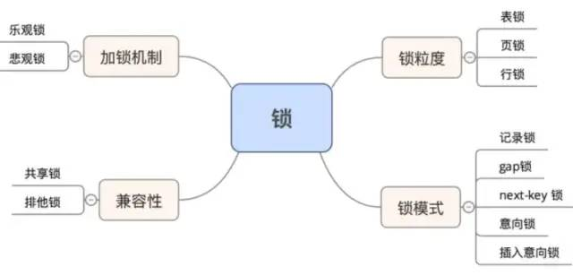

## 加锁的目的：
数据库是一个多用户使用的共享资源。当多个用户并发地存取数据时，在数据库中就会产生多个事务同时存取同一数据的情况。若对并发操作不加控制就可能会读取和存储不正确的数据，破坏数据库的一致性。锁是用于管理对公共资源的并发控制。也就是说在并发的情况下，会出现资源竞争，所以需要加锁。

加锁解决了 多用户环境下保证数据库完整性和一致性。

使用锁的对象是事务，事务用来锁定数据库的对象是表、页、行。并且一般锁定的对象仅在事务commit或rollback后进行释放（不同事务隔离级别释放的时间可能不同）。

## 锁的分类

首先对mysql锁进行划分：
* 按照锁的粒度划分：行锁、表锁、页锁
* 按照锁的使用方式划分：共享锁、排它锁（悲观锁的一种实现）
* 还有两种思想上的锁：悲观锁、乐观锁。
* InnoDB中有几种行级锁类型：Record Lock、Gap Lock、Next-key Lock

MySQL的锁机制最显著的特点是**不同的存储引擎支持不同的锁机制**。比如，MyISAM和MEMORY存储引擎采用的是表级锁（table-level locking）；BDB存储引擎采用的是页面锁（page-level locking），但也支持表级锁；InnoDB存储引擎既支持行级锁（row-level locking），也支持表级锁，但默认情况下是采用行级锁。

### 1.行锁
行级锁是Mysql中锁定粒度最细的一种锁，表示只针对当前操作的行进行加锁。**行级锁能大大减少数据库操作的冲突。其加锁粒度最小，但加锁的开销也最大。有可能会出现死锁的情况。** 行级锁按照使用方式分为共享锁和排他锁。

**共享锁用法（S锁 读锁）：**

若事务T对数据对象A加上S锁，则事务T可以读A但不能修改A，其他事务只能再对A加S锁，而不能加X锁，直到T释放A上的S锁。这保证了其他事务可以读A，但在T释放A上的S锁之前不能对A做任何修改。

    select ... lock in share mode;

共享锁就是允许多个线程同时获取一个锁，一个锁可以同时被多个线程拥有。

**排它锁用法（X 锁 写锁）：**

若事务T对数据对象A加上X锁，事务T可以读A也可以修改A，其他事务不能再对A加任何锁，直到T释放A上的锁。这保证了其他事务在T释放A上的锁之前不能再读取和修改A。

    select ... for update

排它锁，也称作独占锁，一个锁在某一时刻只能被一个线程占有，其它线程必须等待锁被释放之后才可能获取到锁。

MySQL的行锁是在引擎层由各个引擎自己实现的。但并不是所有的引擎都支持行锁，比如 MyISAM引擎就不支持行锁。不支持行锁意味着并发控制只能使用表锁，对于这种引擎的表，同 一张表上任何时刻只能有一个更新在执行，这就会影响到业务并发度。InnoDB是支持行锁的， 这也是MyISAM被InnoDB替代的重要原因之一。

**解决幻读：**

MVCC加上间隙锁的方式
   * 在快照读读情况下，mysql通过mvcc来避免幻读。
   * 在当前读读情况下，mysql通过next-key来避免幻读。锁住某个条件下的数据不能更改。

快照读：简单的select操作，属于快照读，不加锁。

    select * from table where ?;

当前读：特殊的读操作，插入/更新/删除操作，属于当前读，需要加锁。

    select * from table where ? lock in share mode;
    select * from table where ? for update;
    insert into table values (…);
    update table set ? where ?;
    delete from table where ?;

### 2.表锁
表级锁是mysql锁中粒度最大的一种锁，表示当前的操作对整张表加锁，**资源开销比行锁少，不会出现死锁的情况，但是发生锁冲突的概率很大**，因为同 一张表上任何时刻只能有一个更新在执行。被大部分的mysql引擎支持，**MyISAM和InnoDB都支持表级锁，但是InnoDB默认的是行级锁。**

表级锁按照使用方式也可分为**共享锁和排他锁。**

共享锁用法：

    LOCK TABLE table_name [ AS alias_name ] READ

排它锁用法：

    LOCK TABLE table_name [AS alias_name][ LOW_PRIORITY ] WRITE

解锁用法：

    unlock tables;

### 3.页锁
页级锁是MySQL中锁定粒度**介于行级锁和表级锁中间的一种锁。** 表级锁速度快，但冲突多，行级冲突少，但速度慢。所以取了折衷的页级，一次锁定相邻的一组记录。BDB存储引擎支持页级锁

**全局锁**

除了行锁，表锁，页锁外，这里还补充一种全局锁，这种锁的范围最大。
全局锁就是对整个数据库实例加锁。MySQL提供了一个加全局读锁的方法，命令是 Flush tables with read lock (FTWRL)。当你需要让整个库处于只读状态的时候，可以使用这个命 令，之后其他线程的以下语句会被阻塞：数据更新语句（数据的增删改）、数据定义语句（包括 建表、修改表结构等）和更新类事务的提交语句。

**全局锁的典型使用场景是，做全库逻辑备份。 全 也就是把整库每个表都select出来存成文本。**

## 乐观锁和悲观锁
### 1、悲观锁
在关系数据库管理系统里，**悲观并发控制**（又名“悲观锁”，Pessimistic Concurrency Control，缩写“PCC”）是一种并发控制的方法。它可以阻止一个事务以影响其他用户的方式来修改数据。**如果一个事务执行的操作对某行数据应用了锁，那只有当这个事务把锁释放，其他事务才能够执行与该锁冲突的操作**。悲观并发控制主要**用于数据争用激烈的环境**，以及发生并发冲突时使用锁保护数据的成本要低于回滚事务的成本的环境中。

悲观锁，正如其名，它指的是对数据被外界（包括本系统当前的其他事务，以及来自外部系统的事务处理）修改持保守态度(悲观)，因此，**在整个数据处理过程中，将数据处于锁定状态**。 悲观锁的实现，往往依靠数据库提供的锁机制 （也只有数据库层提供的锁机制才能真正保证数据访问的排他性，否则，即使在本系统中实现了加锁机制，也无法保证外部系统不会修改数据）

mysql中实现悲观锁的具体流程：

    在对任意记录进行修改前，先尝试为该记录加上排他锁（exclusive locking）
    如果加锁失败，说明该记录正在被修改，那么当前查询可能要等待或者抛出异常。 具体响应方式由开发者根据实际需要决定。
    如果成功加锁，那么就可以对记录做修改，事务完成后就会解锁了。
    其间如果有其他对该记录做修改或加排他锁的操作，都会等待我们解锁或直接抛出异常。

总而言之就是一句话：**mysql中悲观锁的实现是通过排他锁来实现的**

排它锁的原理：一个锁在某一时刻只能被一个线程占有，其它线程必须等待锁被释放之后才可能获取到锁或者进行数据的操作。

**悲观锁的优点和不足：**

悲观锁实际上是采取了“先取锁在访问”的策略，为数据的处理安全提供了保证，但是在效率方面，由于额外的加锁机制产生了额外的开销，并且增加了死锁的机会。并且降低了并发性；当一个事务加锁一行数据的时候，其他事务必须等待该事务提交之后，才能操作这行数据。

### 2、乐观锁
在关系数据库管理系统里，**乐观并发控制**（又名“乐观锁”，Optimistic Concurrency Control，缩写“OCC”）是一种并发控制的方法。它假设多用户并发的事务在处理时不会彼此互相影响，各事务能够在不产生锁的情况下处理各自影响的那部分数据。在提交数据更新之前，每个事务会先检查在该事务读取数据后，有没有其他事务又修改了该数据。如果其他事务有更新的话，正在提交的事务会进行回滚。

乐观锁（ Optimistic Locking ） 相对悲观锁而言，乐观锁假设认为数据一般情况下不会造成冲突，所以在数据进行提交更新的时候，才会正式对数据的冲突与否进行检测，如果发现冲突了，则让返回用户错误的信息，让用户决定如何去做。

相对于悲观锁，在对数据库进行处理的时候，**乐观锁并不会使用数据库提供的锁机制。一般的实现乐观锁的方式就是记录数据版本。**

**mysql实现乐观锁一般来说有2种方式：**

1.使用数据版本（Version）记录机制实现，这是乐观锁最常用的一种实现方式。

一般是通过为数据库表增加一个数字类型的 “version” 字段来实现。当读取数据时，将version字段的值一同读出，数据每更新一次，对此version值加一。

当提交更新的时候，判断数据库表对应记录的当前版本信息与第一次取出来的version值进行比对，如果数据库表当前版本号与第一次取出来的version值相等，就进行更新操作，否则认为是过期数据，正在提交的事务会进行回滚。

2.第二种实现方式和第一种差不多，同样是在需要乐观锁控制的table中增加一个字段，名称无所谓，字段类型使用时间戳（timestamp）, 和上面的version类似，也是在更新提交的时候检查当前数据库中数据的时间戳和自己更新前取到的时间戳进行对比，如果一致就更新，否则就是版本冲突。

乐观锁的优点和不足：

乐观并发控制相信事务之间的数据竞争(data race)的概率是比较小的，因此尽可能直接做下去，直到提交的时候才去锁定，所以不会产生任何锁和死锁。但如果直接简单这么做，还是有可能会遇到不可预期的结果，例如两个事务都读取了数据库的某一行，经过修改以后写回数据库，这时就遇到了问题。

### 乐观锁和MVCC的区别？
在数据库中，并发控制是指在多个用户/进程/线程同时对数据库进行操作时，如何保证事务的一致性和隔离性的，同时最大程度地并发。

当多个用户/进程/线程同时对数据库进行操作时，会出现3种冲突情形：

* 读-读，不存在任何问题
* 读-写，有隔离性问题，可能遇到脏读（会读到未提交的数据） ，幻影读等。
* 写-写，可能丢失更新

要解决冲突，一种办法是是锁，即基于锁的并发控制，比如2PL两阶段锁协议，这种方式开销比较高，而且无法避免死锁。而基于无锁的并发控制有两种方式：就是MVCC多版本并发控制和OCC乐观并发控制，这两种方式分别解决上面的第2,3种情况。

**多版本并发控制（MVCC）** 是一种用来解决读-写冲突的无锁并发控制，也就是为事务分配单向增长的时间戳，为每个修改保存一个版本，版本与事务时间戳关联，读操作只读该事务开始前的数据库的快照。 这样在读操作不用阻塞写操作，写操作不用阻塞读操作的同时，避免了脏读和不可重复读

**乐观并发控制（OCC）** 是一种用来解决写-写冲突的无锁并发控制，认为事务间争用没有那么多，所以先进行修改，在提交事务前，检查一下事务开始后，有没有新提交改变，如果没有就提交，如果有就放弃并重试。乐观并发控制类似自旋锁。乐观并发控制适用于低数据争用，写冲突比较少的环境。

多版本并发控制可以结合基于锁的并发控制来解决写-写冲突，即MVCC+2PL，也可以结合乐观并发控制来解决写-写冲突。

https://blog.csdn.net/m0_45861545/article/details/121825980