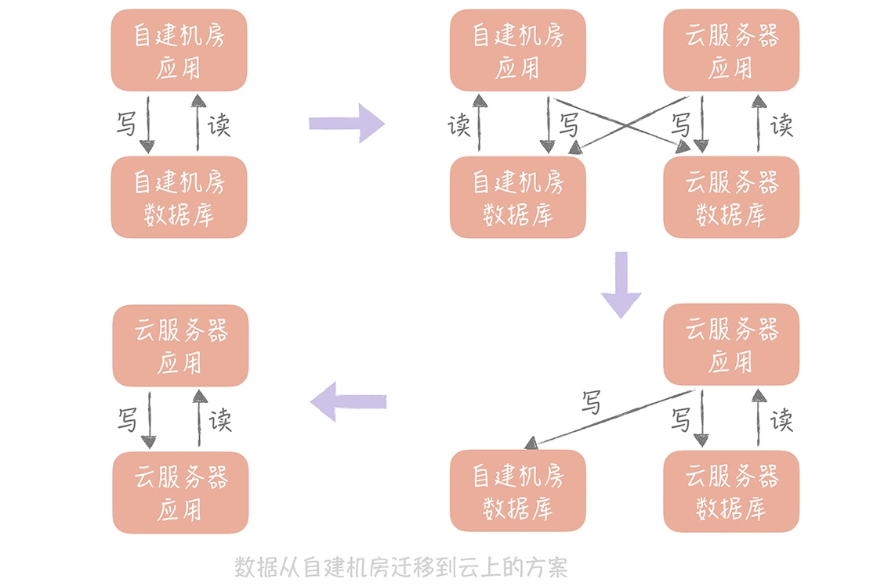

## 自建服务器与云服务器数据迁移
### 如何平滑地迁移数据库中的数据
迁移过程也需要满足以下几个目标：
* 迁移应该是在线的迁移，也就是在迁移的同时还会有数据的写入；
* 数据应该保证完整性，也就是说在迁移之后需要保证新的库和旧的库的数据是一致的；
* 迁移的过程需要做到可以回滚，这样一旦迁移的过程中出现问题，可以立刻回滚到源库不会对系统的可用性造成影响。

## “双写”方案
第一种方案我称之为双写，其实说起来也很简单，它可以分为以下几个步骤：

考虑的一个重要的因素是：自建机房到云上的专线的带宽和延迟，你需要尽量减少跨专线的读操作，所以在切换读流量的时候你需要保证自建机房的应用服务器读取本机房的数据库，云上的应用服务器读取云上的数据库。这样在完成迁移之前，只要将自建机房的应用服务器停掉并且将写入流量都切到新库就可以了。

数据迁移方案：

这种方式的好处是：迁移的过程可以随时回滚，将迁移的风险降到了最低。劣势是：时间周期比较长，应用有改造的成本。

## 级联同步方案
在自建机房准备一个备库，在云上环境上准备一个新库，通过级联同步的方式在自建机房留下一个可回滚的数据库，具体的步骤如下：
* 先将新库配置为旧库的从库，用作数据同步；
* 再将一个备库配置为新库的从库，用作数据的备份；
* 等到三个库的写入一致后，将数据库的读流量切换到新库；
* 然后暂停应用的写入，将业务的写入流量切换到新库（由于这里需要暂停应用的写入，所以需要安排在业务的低峰期）。

级联迁移方案：

这种方案的回滚方案也比较简单，可以先将读流量切换到备库再暂停应用的写入，将写流量切换到备库，这样所有的流量都切换到了备库，也就是又回到了自建机房的环境，就可以认为已经回滚了。

上面的级联迁移方案可以应用在将 MySQL 从自建机房迁移到云上的场景，也可以应用在将 Redis 从自建机房迁移到云上的场景，如果你有类似的需求可以直接拿来应用。

这种方案优势是简单易实施，在业务上基本没有改造的成本；缺点是在切写的时候需要短暂的停止写入，对于业务来说是有损的，不过如果在业务低峰期来执行切写，可以将对业务的影响降至最低。

## 数据迁移时如何预热缓存
数据的写入流程是写入 Master、Slave 和所有的副本组，而在读取数据的时候，会先读副本组的数据，如果读取不到再到 Master 和 Slave 里面加载数据，再写入到副本组中。那么，我们就可以在云上部署一个副本组，这样，云上的应用服务器读取云上的副本组，如果副本组没有查询到数据，就可以从自建机房部署的主从缓存上加载数据，回种到云上的副本组上。

当云上部署的副本组足够热之后，也就是缓存的命中率达到至少 90%，就可以将云机房上的缓存服务器的主从都指向这个副本组，这时迁移也就完成了。

改造后的方案对读写缓存的方式进行改造，步骤是这样的：
* 在云上部署多组 mc 的副本组，自建机房在接收到写入请求时，会优先写入自建机房的缓存节点，异步写入云上部署的 mc 节点；
* 在处理自建机房的读请求时，会指定一定的流量（比如 10%）优先走云上的缓存节点，这样虽然也会走专线穿透回自建机房的缓存节点，但是流量是可控的；
* 当云上缓存节点的命中率达到 90% 以上时，就可以在云上部署应用服务器，让云上的应用服务器完全走云上的缓存节点就可以了。

