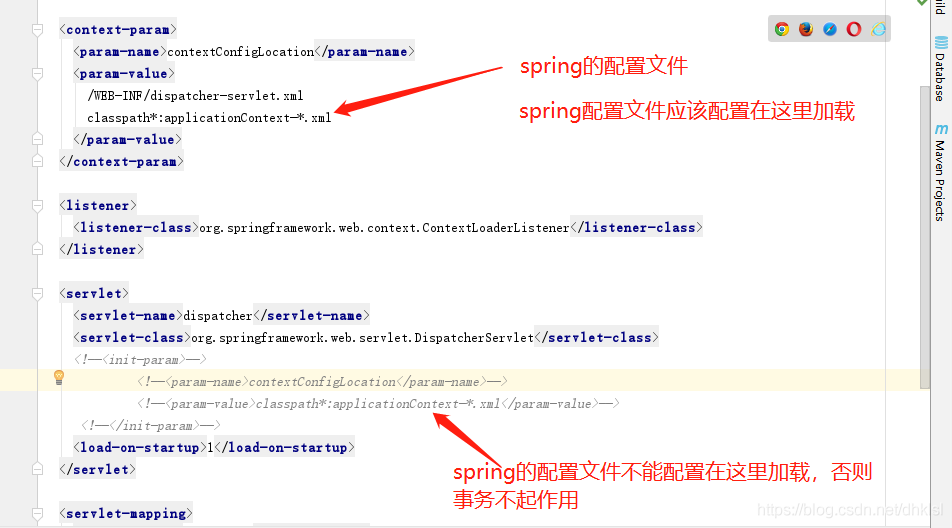

## 事务不生效的原因
1、spring的事务注解@Transactional只能放在**public修饰的方法**上才起作用，如果放在其他非public（private，protected）方法上，虽然不报错，但是事务不起作用

2、如果采用spring+spring mvc，则context:component-scan**重复扫描问题**可能会引起事务失败。（需要spring管理）

     如果spring和mvc的配置文件中都扫描了service层，那么事务就会失效。

     原因：因为按照spring配置文件的加载顺序来讲，先加载springmvc配置文件，再加载spring配置文件，我们的事务一般都在srping配置文件中进行配置，
     如果此时在加载srpingMVC配置文件的时候，把servlce也给注册了，但是此时事务还没加载，也就导致后面的事务无法成功注入到service中。
     所以把对service的扫描放在spring配置文件中或是其他配置文件中。

3、如使用mysql且引擎是MyISAM，则事务会不起作用，原因是MyISAM不支持事务，可以改成InnoDB引擎

4、 @Transactional 注解开启配置，必须放到listener里加载，如果放到DispatcherServlet的配置里，事务也是不起作用的。

5、Spring团队建议在具体的类（或类的方法）上使用 @Transactional 注解，而不要使用在类所要实现的任何接口上。在接口上使用 @Transactional 注解，只能当你设置了基于接口的代理时它才生效。因为注解是 不能继承 的，这就意味着如果正在使用基于类的代理时，那么事务的设置将不能被基于类的代理所识别，而且对象也将不会被事务代理所包装。

6、在业务代码中如果抛出**RuntimeException**异常，事务回滚；但是抛出Exception，事务不回滚；

    // @Service
    public class OrderServiceImpl implements OrderService {
    
        @Transactional
        public void updateOrder(Order order) {
            try {
                // update order
            } catch {
                throw new Exception("更新错误");
            }
        }
    
    }
这样事务也是不生效的，因为默认回滚的是：RuntimeException，如果你想触发其他异常的回滚，需要在注解上配置一下，如：

@Transactional(rollbackFor = Exception.class)

这个配置仅限于 Throwable 异常类及其子类。

7、如果在加有事务的方法内，使用了try...catch..语句块对异常进行了捕获，而catch语句块没有throw  new RuntimeExecption异常，事务也不会回滚

    // @Service
    public class OrderServiceImpl implements OrderService {
    
        @Transactional
        public void updateOrder(Order order) {
            try {
                // update order
            } catch {
     
            }
        }
    
    }
把异常吃了，然后又不抛出来，事务怎么回滚吧！

8、在类A里面有方法a 和方法b， 然后方法b上面用 @Transactional加了方法级别的事务，在方法a里面 调用了方法b， 方法b里面的事务不会生效。原因是在同一个类之中，方法互相调用，**切面无效** ，而不仅仅是事务。这里事务之所以无效，是因为spring的事务是通过aop实现的。

    来看两个示例：
    @Service
    public class OrderServiceImpl implements OrderService {

        public void update(Order order) {
            updateOrder(order);
        }
     
        @Transactional
        public void updateOrder(Order order) {
            // update order
        }
    }
update方法上面没有加 @Transactional 注解，调用有 @Transactional 注解的 updateOrder 方法，updateOrder 方法上的事务管用吗？

再来看下面这个例子：

    @Service
    public class OrderServiceImpl implements OrderService {
    
        @Transactional
        public void update(Order order) {
            updateOrder(order);
        }
     
        @Transactional(propagation = Propagation.REQUIRES_NEW)
        public void updateOrder(Order order) {
            // update order
        }
    
    }
这次在 update 方法上加了 @Transactional，updateOrder 加了 REQUIRES_NEW 新开启一个事务，那么新开的事务管用么？

这两个例子的答案是：不管用！

因为它们发生了**自身调用，就调该类自己的方法，而没有经过 Spring 的代理类**，**默认只有在外部调用事务才会生效**，这也是老生常谈的经典问题了。

9、 数据源没有配置事务管理器

    @Bean
    public PlatformTransactionManager transactionManager(DataSource dataSource) {
        return new DataSourceTransactionManager(dataSource);
    }

如上面所示，当前数据源若没有配置事务管理器，那也是白搭！

    https://www.cnblogs.com/cuilp3000/p/15356686.html
    https://blog.csdn.net/dhklsl/article/details/88354216?spm=1001.2101.3001.6650.1&utm_medium=distribute.pc_relevant.none-task-blog-2%7Edefault%7ECTRLIST%7Edefault-1-88354216-blog-123693455.pc_relevant_multi_platform_whitelistv1&depth_1-utm_source=distribute.pc_relevant.none-task-blog-2%7Edefault%7ECTRLIST%7Edefault-1-88354216-blog-123693455.pc_relevant_multi_platform_whitelistv1&utm_relevant_index=2