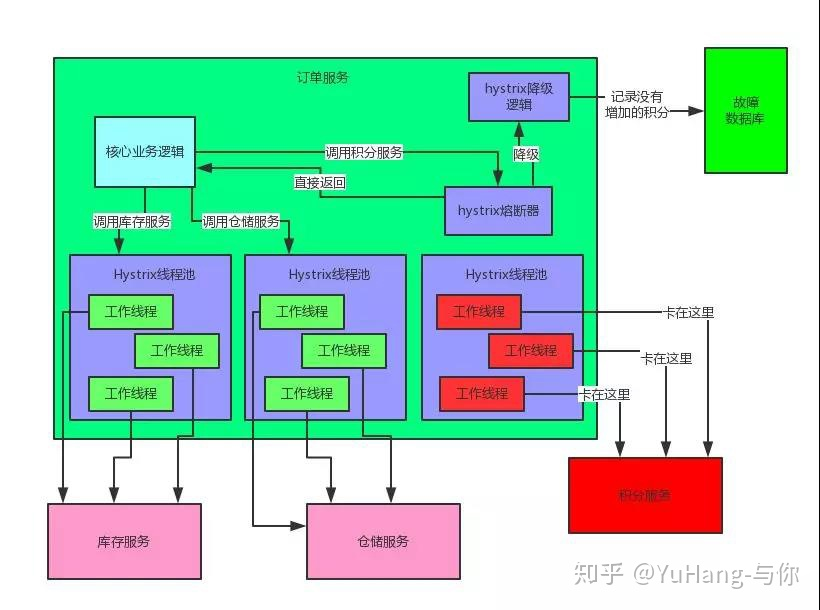
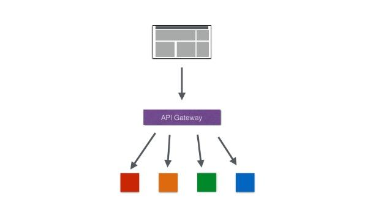
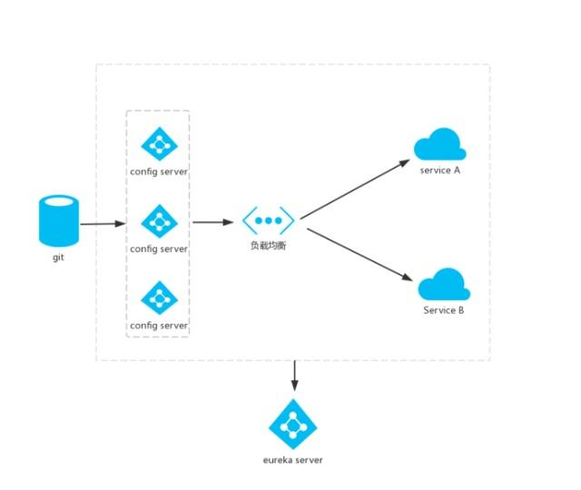

## 一、常见组件
* Eureka：注册中心
* Zuul、Gateway：网关
* Ribbon：负载均衡
* Feign：服务调用
* Hystrix或Resilience4j：熔断器
### 1.1 Eureka：注册中心
作用：实现服务治理（服务注册与发现）

简介：Spring Cloud Eureka是Spring Cloud Netflix项目下的服务治理模块。

由两个组件组成：Eureka服务端和Eureka客户端。

Eureka服务端用作服务注册中心。支持集群部署。

Eureka客户端是一个java客户端，用来处理服务注册与发现。

在应用启动时，Eureka客户端向服务端注册自己的服务信息，同时将服务端的服务信息缓存到本地。客户端会和服务端周期性的进行心跳交互，以更新服务租约和服务信息。

### 1.2 Feign服务调用
Feign是一个组件可实现自动拼接服务地址

* 首先，如果你对某个接口定义了@FeignClient注解，Feign就会针对这个接口创建一个动态代理.
* 接着你要是调用那个接口，本质就是会调用 Feign创建的动态代理.
* Feign的动态代理会根据你在接口上的@RequestMapping等注解，来动态构造出你要请求的服务的地址.
* 最后针对这个地址，发起请求、解析响应.

### 1.3 Ribbon负载均衡
主要提供客户侧的软件负载均衡算法。

* 根据服务名到Eureka服务中获取服务地址列表， 再根据或利用Ribbon负载均衡算法从地址列表中获取一个服务地址并访问
* Ribbon的负载均衡默认使用的最经典的Round Robin轮询算法。还有随机算法

此外，Ribbon是和Feign以及Eureka紧密协作，完成工作的，具体如下：

* 首先Ribbon会从 Eureka Client里获取到对应的服务注册表，也就知道了所有的服务都部署在了哪些机器上，在监听哪些端口号。
* 然后Ribbon就可以使用默认的Round Robin算法，从中选择一台机器
* Feign就会针对这台机器，构造并发起请求。

### 1.4 Hystrix熔断器
* 可以在调用服务的时候，在服务出现异常时进行服务熔断和降级避免一直长时间等待服务返回结果而出现雪崩效应
* 它会为每一个依赖服务创建一个独立的线程池，这样就算某个依赖服务出现延迟过高的情况，也只是对该依赖服务的调用产生影响，而不会拖慢其他的依赖服务

熔断：当发现有服务卡死不能工作的时候，熔断器会对他进行熔断，比如这5分钟对这个服务的请求就直接返回了，不要去走网络请求卡几秒钟，这个过程就是溶断！

降级：就是当服务被熔断后，每次调用这个服务，你就写到单独的数据库中，等这个服务修复后，你手工的添加到业务的数据库中。这个过程就是降级！

雪崩：如果单个服务出现问题，调用这个服务就会出现线程阻塞，此时若有大量的请求涌入，Servlet容器的线程资源会被消耗完毕，导致服务瘫痪。服务与服务之间的依赖性，故障会传播，会对整个微服务系统造成灾难性的严重后果，这就是服务故障的“雪崩”效应。

### 1.5 Zuul网关
* 这个组件是负责网络路由的
* 不用去关心后端有几百个服务，就知道有一个网关，所有请求都往网关走，网关会根据请求中的一些特征，将请求转发给后端的各个服务。
* 还有很多好处，比如可以做统一的降级、限流、认证授权、安全，等等。

### 1.6 Config

作用：配置管理

简介：SpringCloud Config提供服务器端和客户端。服务器存储后端的默认实现使用git，因此它轻松支持标签版本的配置环境，以及可以访问用于管理内容的各种工具。

这个还是静态的，得配合Spring Cloud Bus实现动态的配置更新。

## 二、总结
* Eureka：各个服务启动时，Eureka Client都会将服务注册到Eureka Server，并且Eureka Client还可以反过来从Eureka Server拉取注册表，从而知道其他服务在哪里
* Ribbon：服务间发起请求的时候，基于Ribbon做负载均衡，从一个服务的多台机器中选择一台
* Feign：基于Feign的动态代理机制，根据注解和选择的机器，拼接请求URL地址，发起请求
* Hystrix：发起请求是通过Hystrix的线程池来走的，不同的服务走不同的线程池，实现了不同服务调用的隔离，避免了服务雪崩的问题
* Zuul：如果前端、移动端要调用后端系统，统一从Zuul网关进入，由Zuul网关转发请求给对应的服务

https://blog.csdn.net/centrl/article/details/115898650