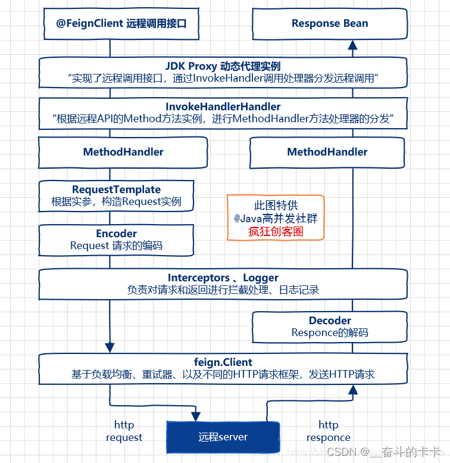

## 调用原理解析
Feign远程调用，核心就是通过一系列的封装和处理，将以JAVA注解的方式定义的远程调用API接口，最终转换成HTTP的请求形式，然后将HTTP的请求的响应结果，解码成JAVA Bean，放回给调用者。Feign远程调用的基本流程，大致如下图所示。

## 常用注解
@EnableDiscoveryClient

@EnableFeignClients

https://blog.csdn.net/weixin_42039228/article/details/123714356