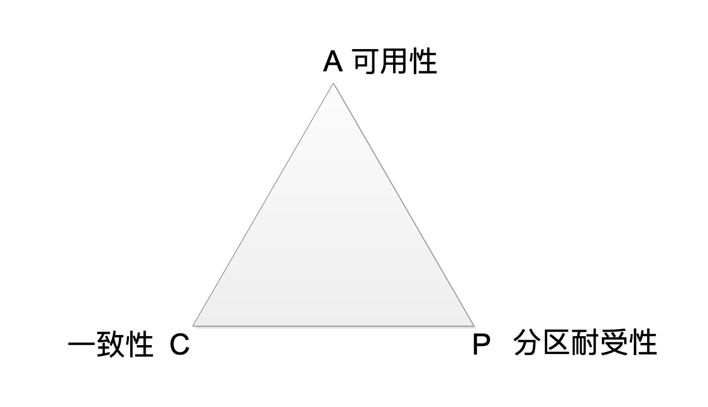
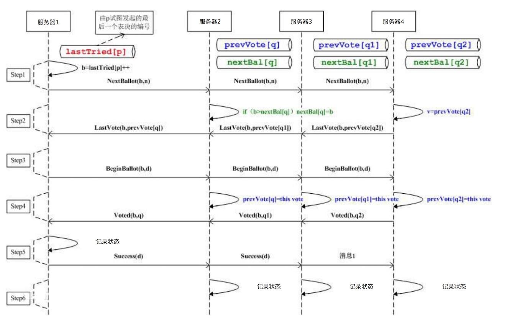
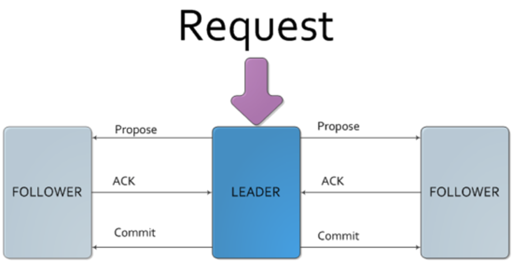
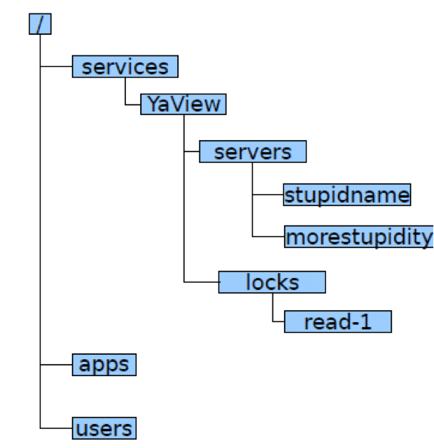

## 分布式一致性原理
CAP 原理认为，一个提供数据服务的分布式系统无法同时满足数据一致性（Consistency）、可用性（Availibility）、分区耐受性（Patition Tolerance）这三个条件，如下图所示。

**一致性**是说，每次读取的数据都应该是最近写入的数据或者返回一个错误（Every read receives the most recent write or an error），而不是过期数据，也就是说，数据是一致的。

**可用性**是说，每次请求都应该得到一个响应，而不是返回一个错误或者失去响应，不过这个响应不需要保证数据是最近写入的（Every request receives a (non-error) response, without the guarantee that it contains the most recent write），也就是说系统需要一直都是可以正常使用的，不会引起调用者的异常，但是并不保证响应的数据是最新的。

**分区耐受性**是说，即使因为网络原因，部分服务器节点之间消息丢失或者延迟了，系统依然应该是可以操作的（The system continues to operate despite an arbitrary number of messages being dropped (or delayed) by the network between nodes）。

## ZAB 算法与 ZooKeeper 架构
ZooKeeper 主要提供数据的一致性服务，其实现分布式系统的状态一致性依赖一个叫 Paxos 的算法。Paxos 算法在多台服务器通过内部的投票表决机制决定一个数据的更新与写入。Paxos 的基本思路请看下面的图。

ZAB 的算法:

ZAB 算法的目的，同样是在多台服务器之间达成一致，**保证这些服务器上存储的数据是一致的**。ZAB 算法的主要特点在于：需要在这些服务器中选举一个 Leader，所有的写请求都必须提交给 Leader。由 Leader 服务器向其他服务器（Follower）发起 Propose，通知所有服务器：我们要完成一个写操作请求，大家检查自己的数据状态，是否有问题。

如果所有 Follower 服务器都回复 Leader 服务器 ACK，即没有问题，那么 Leader 服务器会向所有 Follower 发送 Commit 命令，要求所有服务器完成写操作。这样包括 Leader 服务器在内的所有 ZooKeeper 集群服务器的数据，就都更新并保持一致了。如果有两个客户端程序同时请求修改同一个数据，因为必须要经过 Leader 的审核，而 Leader 只接受其中一个请求，数据也会保持一致。

ZooKeeper 通过一种树状结构记录数据：

